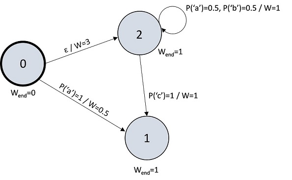
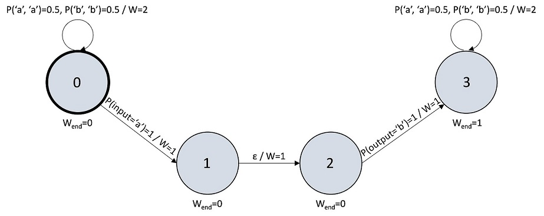
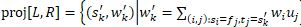

[Infer.NET development](index.md)

## String inference API design

[comment]: # a bit outdated

### Introduction

The purpose of this document is to describe the way inference over sequences such as strings or lists is implemented in Infer.NET.

Four types of entities are involved in performing inference over sequences, namely _automaton functions, automata, transducers and sequence manipulators_. For each of these entity types there exists a base class providing an interface and core functionality for an arbitrary class of sequences, as well as derived classes customized for a particular sequence type, like strings or lists. The purpose of each type and the nature of interactions between them is explained in the following sections of this document.

The definitions of a weighted state automaton and weighted finite state transducer given in this doc may be slightly different from those you can find in your favorite textbook on the topic, but a) they should be equivalent b) the definitions given in the document match our implementation much better.

### Sequence Manipulators

Sequence manipulators are used to abstract basic operations on a sequence type. We didn't use a common base type for sequences instead because we wanted inference to be able to operate on existing .NET sequence types, like `System.String` or `System.Collections.Generic.List<T>`. Each sequence manipulator implements the `ISequenceManipulator<TSequence, TElement>` interface defined as follows:

```csharp
public interface ISequenceManipulator<TSequence, TElement>
    where TSequence : class, IEnumerable<TElement>
{
    /// <summary>
    /// Converts a given collection of elements to a sequence.
    /// </summary>
    /// <param name="elements">The collection of elements to convert to a sequence.</param>
    /// <returns>The sequence containing the elements.</returns>
    TSequence ToSequence(IEnumerable<TElement> elements);

    /// <summary>
    /// Gets the length of a given sequence.
    /// </summary>
    /// <param name="sequence">The sequence.</param>
    /// <returns>The length of the sequence.</returns>
    int GetLength(TSequence sequence);

    /// <summary>
    /// Gets the element at a given position in a given sequence.
    /// </summary>
    /// <param name="sequence">The sequence.</param>
    /// <param name="index">The position.</param>
    /// <returns>The element at the given position in the sequence.</returns>
    TElement GetElement(TSequence sequence, int index);

    /// <summary>
    /// Checks if given sequences are equal.
    /// Sequences are considered equal if they contain the same elements in the same order.
    /// </summary>
    /// <param name="sequence1">The first sequence.</param>
    /// <param name="sequence2">The second sequence.</param>
    /// <returns><see langword="true"/> if the sequences are equal, <see langword="false"/> otherwise.</returns>
    bool SequencesAreEqual(TSequence sequence1, TSequence sequence2);

    /// <summary>
    /// Creates a sequence by copying the first sequence and then appending the second sequence to it.
    /// </summary>
    /// <param name="sequence1">The first sequence.</param>
    /// <param name="sequence2">The second sequence.</param>
    /// <returns>The created sequence.</returns>
    TSequence Concat(TSequence sequence1, TSequence sequence2);
}
```
 
### Automaton Functions & Automata

Distributions over sequences are defined by properly normalized weighted finite state automata (WFSA). In the code we represented WFSA using two concepts: automata and automaton functions. In the following sections of this document we will explain what a WFSA is, why this representation was chosen and how we use it to represent probability distributions.

#### What Is a Weighted Finite State Automaton?

A weighted finite state automaton is a directed graph with additional information associated with every node, which we will call a state, and edge, which we will call a transition. In particular, each state has a so-called _ending weight_, and each transition has a weight and, optionally, a distribution over sequence elements. If a transition has no element distribution, it is called an _epsilon transition_. Every automaton also has a designated _start state_.




An example of a weighted finite state automaton is given in the figure above. Here we have 3 states: 0, 1 and 2. State 0 is the start state. States 1 and 2 have the ending weight of 1, while the ending weight of state 0 is zero. There exists an epsilon transition between states 0 and 2 with the weight of 3 and two regular transitions labelled with point mass element distributions between states 0 and 1 and 2 and 1. There is also a self-loop on state 2 labelled with the uniform distribution over 'a' and 'b'.

We call a series of transitions in an automaton a path if the source state of the first transition in the series is the start state. The _weight of a path for sequence_ `s` is defined as follows:

*   If the number of non-epsilon transitions in the path is not equal to the length of the sequence, the weight is zero.
*   Otherwise, the weight is equal to the product of
    *   The weights of all transitions of the path;
    *   The ending weight of the last state of the path;
    *   Probability that the element distribution of i-th non-epsilon transition of the path gives to the i-th element of s (for all i).

We call a path _valid_ for sequence s if it's weight for that sequence is not zero. The following table shows the weight and validity for all paths for the sequence "a":

| Path for sequence "a" | Weight                                                            | Validity of path |
|--------------------------------------------------------------------------------------------------------------|
| 0 → 1                 | 1 * 0.5 * 1 = 0.5                                                 | Valid            |
| 0 → 2 → 2             | 3 * 0.5 * 1 * 1 = 1.5                                             | Valid            |
| 0 → 2 → 1             | 3 * 0 * 1 * 1 = 0 (there's no mass on "a" between states 2 and 1) | Not Valid        |

Essentially, each transition of a valid path corresponds to a particular position in the sequence. Traversing a non-epsilon edge advances the position by 1, while traversing an epsilon transition preserves the position. And in order to compute the weight of the path we weight each transition according to the corresponding symbol of the sequence.

The _value_ of a weighted finite state automaton on a sequence is defined as the sum of the weights of all valid paths for that sequence. For example, here are the values of our example automaton on several sequences:

|Sequence | Weight |
|------------------|
| ""      | 3.0    |
| "a"     | 2.0    |
| "b"     | 1.5    |
| "bb"    | 0.75   |
| "c"	  | 3      |
| "abac"  | 0.375  |

A table like that with all possible sequences in the first column is called a _weighted regular language_ induced by a weighted finite state automaton.

If the values of an automaton are non-negative, and the sum of the values over all possible sequences is 1, it is essentially defining a probability distribution over sequences. The reason this formalism was chosen to represent such distributions in Infer.NET is that weighted finite state automata are closed under multiplication, which is a necessary requirement to fulfil if one wants to use them as messages in EP or VMP framework. WFSA also provide simple ways to perform other operations useful for doing inference, such as summation (extensively used in inference with gates). Finally, a lot of message operators for WFSA have simple implementation in terms of weighted finite state transducers (see the corresponding section).

### Automaton Function

An automaton function is a mapping from sequences to non-negative real values as defined by a weighted finite state automaton, with some additional operations on it. In our current implementation all transition weights must be non-negative, but this limitation is likely to be relaxed in the future because negative weights play an important role in implementing some operations.

The set of supported operations on an automaton function includes the following:

*   basic arithmetic operations such as sum or product (of functions);
*   concatenation of the weighted regular languages defined by a given pair of functions;
*   attempting to normalize function values (make them sum to 1 over all sequences) if possible;
*   manipulating raw structure: adding new states and transitions, modifying weights
*   inspecting the structure: obtaining the epsilon-closure of a state or the condensation of an automaton graph.

All the core functionality is provided by the class with the following signature:

```csharp
[Serializable]
public abstract partial class AutomatonFunction<TSequence, TElement, TElementDistribution, TSequenceManipulator, TThis>
    where TSequence : class, IEnumerable<TElement>
    where TElementDistribution : class, IDistribution<TElement>, SettableToProduct<TElementDistribution>, SettableToWeightedSumExact<TElementDistribution>, CanGetLogAverageOf<TElementDistribution>, SettableToPartialUniform<TElementDistribution>, new()
    where TSequenceManipulator : ISequenceManipulator<TSequence, TElement>, new()
    where TThis : AutomatonFunction<TSequence, TElement, TElementDistribution, TSequenceManipulator, TThis>, new()
{
...
}
```

The generic parameters of this class are bound by the derived classes and, thus, are not directly exposed to a user. The first two parameters, `TSequence` and `TElement`, define the type of sequences the automaton function is operating on. The third parameter, `TElementDistribution`, defines the type of a distribution over sequence elements that can be associated with an edge. The `TSequenceManipulator` parameter specifies the manipulator for instances of `TSequence`. The last parameter, `TThis`, specifies the type of a concrete class that is supposed to be used by an API user. It is needed for two reasons: to be able to define factory methods for the automaton function in the base class, as well as to simplify the signatures of member functions taking other automaton functions as an argument.

Here is an example of the definition of a derived class:

```csharp
public class StringAutomatonFunction :
        AutomatonFunction<string, char, DiscreteChar, StringManipulator, StringAutomatonFunction>
{
...
}
```

[comment]: # TODO: write about the way an automaton is stored internally: states, transitiona, indices and all that.

### Automaton

An automaton is an implementation of `IDistribution` over a sequence type that uses AutomatonFunction to store the mapping from sequences to probabilities. The connection between an automaton and an automaton function is similar to the one between `Discrete` and `Vector` classes in Infer.NET: `Discrete` uses `Vector` to store probabilities, keeps its values normalized and uses arithmetic operations defined on it to perform various operations on the distribution.

[comment]: # jpg: the analogy to Discrete and Vector classes is a very helpful one, but for the analogy to be correct an edge in AutomatonFunction should not be labeled with a distribution over symbols but should instead be labeled with the symbol domain (or with a Vector of weights over that domain rather than a distribution) - i.e. the allowable symbols for the edge. I assume that this has been thought through, but it would be helpful to understand this design decision

More precisely, the normalization contract defined by an automaton is as follows:

*   If it represents a proper distribution, it is always normalized
*   If it represents an improper distribution such as the uniform distribution over all sequences, it acts as an unnormalized function. This behavior is consistent with other Infer.NET distributions which can be improper, like `Gaussian` or `Gamma`.

When the distribution is a point mass, `Automaton` doesn't represent it using `AutomatonFunction`, but instead stores the point mass explicitly. It helps performance since some operations are able to handle this special case more efficiently.

As is the case with automaton functions, all core functionality is provided by the base class, and the derived classes simply bind the generic arguments and provide additional functionality like type-specific factory methods. Here is the signature of the `Automaton` class:

```csharp
[Serializable]
public abstract class Automaton<TSequence, TElement, TElementDistribution, TSequenceManipulator, TWeightFunction, TThis> :
    IDistribution<TSequence>,
    SettableTo<TThis>,
    SettableToProduct<TThis>,
    SettableToRatio<TThis>,
    SettableToPower<TThis>,
    CanGetLogAverageOf<TThis>,
    CanGetLogAverageOfPower<TThis>,
    CanGetAverageLog<TThis>,
    SettableToWeightedSumExact<TThis>,
    SettableToPartialUniform<TThis>,
    CanGetLogNormalizer,
    Sampleable<TSequence>
    where TSequence : class, IEnumerable<TElement>
    where TSequenceManipulator : ISequenceManipulator<TSequence, TElement>, new()
    where TElementDistribution : class, IDistribution<TElement>, SettableToProduct<TElementDistribution>, SettableToWeightedSumExact<TElementDistribution>, CanGetLogAverageOf<TElementDistribution>, SettableToPartialUniform<TElementDistribution>, Sampleable<TElement>, new()
    where TWeightFunction : AutomatonFunction<TSequence, TElement, TElementDistribution, TSequenceManipulator, TWeightFunction>, new()
    where TThis : Automaton<TSequence, TElement, TElementDistribution, TSequenceManipulator, TWeightFunction, TThis>, new()
{
...
}
```

The generic parameters of the class have the same meaning as the parameters of `AutomatonFunction`. The only new parameter is `TWeightFunction`, which specifies the type of an automaton function that will be used to store probabilities, i.e. `StringAutomatonFunction` for `StringAutomaton`.

### Automata API usage examples

Here is a set of small examples to give you a taste of what the API looks like.

#### Explicit construction of an automaton function representing the weighted automaton we've seen in the section on WFSA

```csharp
StringAutomatonFunction func = StringAutomatonFunction.Zero();
StringAutomatonFunction.Node node0 = func.AddNode();
StringAutomatonFunction.Node node1 = func.AddNode();
StringAutomatonFunction.Node node2 = func.AddNode();
func.Start = node0;
node1.EndLogWeight = node2.EndLogWeight = Math.Log(1.0);
node0.AddEpsilonEdge(Math.Log(3.0), node2);
node0.AddEdge(DiscreteChar.PointMass('a'), Math.Log(0.5), node1);
node2.AddEdge(DiscreteChar.PointMass('c'), Math.Log(1.0), node1);
node2.AddEdge(DiscreteChar.OneOf('a', 'b'), Math.Log(1.0), node2);

// Prints the table from the section on WFSA
foreach (var str in new[] { string.Empty, "a", "b", "bb", "c", "abac" })
{
    Console.WriteLine("\"{0}\"\t{1}", str, func.GetValue(str));
}
```

#### Construction of an automaton function using factory methods and operations only

Recall that the Sum and Product operations refer to the point-wise sum and product of the functions. So

```
(f+g)(sequence) = f(sequence) + g(sequence)
(f*g)(sequence) = f(sequence) * g(sequence)
```

```csharp
// func1("a") = func1("abfrjhf") = func1(any lowercase string) = 1.0
var func1 = StringAutomatonFunction.Constant(1.0, DiscreteChar.Lower());

// func2("abc") = func2("def") = 2.0, func2(anything else) = 0.0
var func2 = StringAutomatonFunction.ConstantOn(2.0, "abc", "def");

// func3("abc") = func3("def") = 3.5, func3(any other lowercase string) = 1.5
var func3 = StringAutomatonFunction.Sum(func1.Scale(1.5), func2);

// func4("abc") = func4("def") = 7.0, func4(any other string) = 0.0
var func4 = func3.Product(func2);
```

[comment]: # jpg: This definition of product is different from the more general definition of product of automata formed by the Cartesian product of states and of symbols - this seems like an intersection (in the same link). Perhaps this merits some comment? Should we rename this operation to avoid confusion?
[comment]: # should use operator overloading here:  func4 = func3*func2


#### Construction of a uniform distribution over all strings that are case-invariant matches of a template

```csharp
StringAutomaton result = StringAutomaton.Empty();
foreach (var ch in template)
{
    char upper = char.ToUpperInvariant(ch);
    char lower = char.ToLowerInvariant(ch);
    if (upper == lower)
    {
        result.AppendInPlace(ch);
    }
    else
    {
        result.AppendInPlace(DiscreteChar.OneOf(lower, upper));
    }
}
```

### Transducers

In the automata theory weighted finite state transducers (WFST) can be viewed either as a generalization of an automaton that can take more than one argument, or as a class of operations transforming one weighted finite state automaton into another. It turns out that many message operators for operations on sequences can be easily implemented in terms of WFST. In this section we will explain what a weighted finite state transducer is, show examples of doing BP message computations using a WFST and explain how is this mapped to our implementation.

### Weighted finite state transducer

#### Definition

The definition of a weighted finite state transducer is similar to the one of a weighted finite state automaton. The difference is that transducer edges are labelled with a distribution not over sequence elements, but pairs of _input_ and _output_ elements. Also, the distribution over input or output can be missing, which gives raise to additional types of epsilon edges. So, in total a transducer can have 4 types of edges:

| Has input	| Has output | Name                | Distribution     |
|-----------------------------------------------------------------|
| Yes       | Yes        | Normal edge         | P(input, output) |
| No        | Yes        | Input-epsilon edge  | P(output)        |
| Yes       | No         | Output-epsilon edge | P(input)         |
| No        | No         | Epsilon edge        | None             |

An example of a weighted finite state transducer is given in the figure below.



This transducer has 2 normal self-loops on nodes 0 and 3, an output-epsilon edge between nodes 0 and 1, an input-epsilon edge between nodes 2 and 3, and an epsilon edge between nodes 1 and 2.

As it was the case with automata, you can think of each edge of a path in a transducer graph as having the corresponding positions in two sequences. Traversing normal edge advances both positions, traversing input-epsilon edge advances position in the second one, while traversing output-epsilon edge advances position in the first. Traversing epsilon edge keeps the positions intact. This view makes it straightforward to extend the concepts of a valid path weight and a value to a weighted finite state transducer, so we are not going to define them in this document.

Here are the values of the example transducer above on a number of sequence pairs:

| "a"   | "b"    | 1 |
| ""    | ""     | 0 |
| "bba" | "bbb"  | 1 |
| "aba" | "bba"  | 1 |
| "aba" | "abb"  | 1 |
| "aba" | "abba" | 0 |

Such table, filled for all possible sequence pairs, is called a _weighted regular relation_ induced by a weighted finite state transducer. The relation induced by our example transducer gives the value of 1 to the pairs of sequences such that

*   Both sequences are of the same positive length and consist only of symbols 'a' and 'b';
*   Sequences are equal at every position except one where the first sequence has symbol 'a' and the second one has symbol 'b'.

#### Projection

A weighted regular language can be projected onto a weighted regular relation to obtain another weighted regular language. Given a language L=\{\(s<sub>i</sub>, w<sub>i</sub>\)\} and a relation R=\{\(f<sub>j</sub>, t<sub>j</sub>, u<sub>j</sub>\)\}, the projection is defined as



That is, to determine the weight of sequence s′<sub>k</sub> in the resulting language we take all entries in the relation where the second sequence is s′<sub>k</sub>, multiply relation entry weight by the weight of the first sequence in the input language and sum over all such entries.

There exists a fast polynomial algorithm that builds an automaton corresponding to the projection result given an automaton for the input language and a transducer for the regular relation.

Let's consider an example. The projection of the regular language assigning the weight of 1/3 to sequences "", "aba" and "aab", and zero to all other sequences onto the relation induced by the example transducer is the regular language assigning the weight of 1/3 to "bba" and "bab", and 2/3 to "abb" (because "abb" can be obtained by replacing one 'a' with 'b' in both "aba" and "aab").

This example has an interesting interpretation of the projection results. If the input language is a (possibly unnormalized) probability distribution, than the output language is an unnormalized distribution defined by the following sampling procedure:

*   sample a sequence from the distribution induced by the input language;
*   If the sequence has zero length, or has symbols other than 'a' or 'b', reject it;
*   otherwise randomly replace one occurrence of 'a' with 'b' and output the sequence.

So, the projection is essentially a forward message that the factor "randomly replace one occurrence of 'a' with 'b', given that the input is a non-empty sequence of 'a' and 'b' characters" sends in the belief propagation framework.

It turns out that both forward and backward message computations can be performed by a projection on a certain weighted regular relation for many operations on sequences. Examples of such operations include concatenation, substring, substring replacement and trimming. Moreover, the corresponding transducers can usually be built by combining together 3 primitive building blocks, namely _Copy_, _Consume_ and _Produce_. These building blocks can be illustrated on our example transducer:

*   Node 0 with its self-loop can be viewed as copying any sequence of 'a' and 'b' from input to output, leaving its weight intact (note the weight of 2 which cancels the probability of 0.5). Node 0 together with node 3 are examples of a Copy primitive.
*   Nodes 0 and 1 with an output-epsilon edge connecting them make a Consume primitive that converts every allowed input sequence (only "a" in this case) into an empty output sequence, which weight is the sum of the allowed input sequence weights.
*   Nodes 2 and 3 with an input-epsilon edge connecting them form a Produce primitive, which makes allowed output sequences (again, only "a" in this case) out of an empty input sequence.

Primitives can be combined together with epsilon edges as illustrated by the edge between the nodes 1 and 2.

The theory behind implementing BP message operators via transducers is explained in greater depth in [this document](String Inference.md).

### The Transducer class

Weighted finite state transducers are implemented by means of the `TransducerBase` class. All concrete transducer implementations must derive from one of its two children, which are both called `Transducer` but have different sets of generic parameters. One serves as the base class for transducers that operate on pairs of sequences of different types, while another restricts the sequence types to be the same. Internally, `TransducerBase` is implemented using an instance of `AutomatonFunction` defined on sequences of pairs of input and output elements.

The set of operations implemented by the `TransducerBase` class includes the following:

*   Projection of a given automaton, automaton function or a sequence onto the weighted regular relation represented by the transducer (results in an automaton function).
*   Creation of primitive transducers like _Consume_ or _Produce_.
*   Combination of transducers: summing or concatenating weighted regular relations.

The version of `Transducer` that restricts sequence types to be the same additionally provides functionality like transposing a transducer in-place, or creating a copying transducer, that is, operations that don't make sense if the sequence types differ.

The definition of `TransducerBase` looks as follows:

```csharp
public abstract class TransducerBase<TSrcSequence, TSrcElement, TSrcElementDistribution, TSrcSequenceManipulator, TSrcFunction, TDestSequence, TDestElement, TDestElementDistribution, TDestSequenceManipulator, TDestFunction, TPairDistribution, TThis>
    where TSrcElementDistribution : class, IDistribution<TSrcElement>, CanGetLogAverageOf<TSrcElementDistribution>, SettableToProduct<TSrcElementDistribution>, SettableToWeightedSumExact<TSrcElementDistribution>, SettableToPartialUniform<TSrcElementDistribution>, Sampleable<TSrcElement>, new()
    where TDestElementDistribution : class, IDistribution<TDestElement>, CanGetLogAverageOf<TDestElementDistribution>, SettableToProduct<TDestElementDistribution>, SettableToWeightedSumExact<TDestElementDistribution>, SettableToPartialUniform<TDestElementDistribution>, Sampleable<TDestElement>, new()
    where TSrcSequence : class, IEnumerable<TSrcElement>
    where TDestSequence : class, IEnumerable<TDestElement>
    where TSrcSequenceManipulator : ISequenceManipulator<TSrcSequence, TSrcElement>, new()
    where TDestSequenceManipulator : ISequenceManipulator<TDestSequence, TDestElement>, new()
    where TSrcFunction : AutomatonFunction<TSrcSequence, TSrcElement, TSrcElementDistribution, TSrcSequenceManipulator, TSrcFunction>, new()
    where TDestFunction : AutomatonFunction<TDestSequence, TDestElement, TDestElementDistribution, TDestSequenceManipulator, TDestFunction>, new()
    where TPairDistribution : PairDistributionBase<TSrcElement, TSrcElementDistribution, TDestElement, TDestElementDistribution, TPairDistribution>, new()
    where TThis : TransducerBase<TSrcSequence, TSrcElement, TSrcElementDistribution, TSrcSequenceManipulator, TSrcFunction, TDestSequence, TDestElement, TDestElementDistribution, TDestSequenceManipulator, TDestFunction, TPairDistribution, TThis>, new()
{
...
}
```

The meaning of its generic parameters is the same as it was for the `AutomatonFunction` and `Automaton` classes, except that transducers have two sets of generic parameters: for input and for output sequences. The only previously unseen entity is `TPairDistribution`. This is the type of a distribution over pairs of elements that is being used by the `AutomatonFunction` hidden inside a transducer. The two versions of `Transducer` bind this parameter to their own type of element pair distribution, which must derive from `PairDistributionBase`, a base class that provides the majority of functionality. 

This is the signature of `Transducer` for sequences of different types:

```csharp
public abstract class Transducer<TSrcSequence, TSrcElement, TSrcElementDistribution, TSrcSequenceManipulator, TSrcFunction, TDestSequence, TDestElement, TDestElementDistribution, TDestSequenceManipulator, TDestFunction, TThis> :
TransducerBase<TSrcSequence, TSrcElement, TSrcElementDistribution, TSrcSequenceManipulator, TSrcFunction, TDestSequence, TDestElement, TDestElementDistribution, TDestSequenceManipulator, TDestFunction, PairDistribution<TSrcElement, TSrcElementDistribution, TDestElement, TDestElementDistribution>, TThis>
    where TSrcElementDistribution : class, IDistribution<TSrcElement>, CanGetLogAverageOf<TSrcElementDistribution>, SettableToProduct<TSrcElementDistribution>, SettableToWeightedSumExact<TSrcElementDistribution>, SettableToPartialUniform<TSrcElementDistribution>, Sampleable<TSrcElement>, new()
    where TDestElementDistribution : class, IDistribution<TDestElement>, CanGetLogAverageOf<TDestElementDistribution>, SettableToProduct<TDestElementDistribution>, SettableToWeightedSumExact<TDestElementDistribution>, SettableToPartialUniform<TDestElementDistribution>, Sampleable<TDestElement>, new()
    where TSrcSequence : class, IEnumerable<TSrcElement>
    where TDestSequence : class, IEnumerable<TDestElement>
    where TSrcSequenceManipulator : ISequenceManipulator<TSrcSequence, TSrcElement>, new()
    where TDestSequenceManipulator : ISequenceManipulator<TDestSequence, TDestElement>, new()
    where TSrcFunction : AutomatonFunction<TSrcSequence, TSrcElement, TSrcElementDistribution, TSrcSequenceManipulator, TSrcFunction>, new()
    where TDestFunction : AutomatonFunction<TDestSequence, TDestElement, TDestElementDistribution, TDestSequenceManipulator, TDestFunction>, new()
    where TThis : Transducer<TSrcSequence, TSrcElement, TSrcElementDistribution, TSrcSequenceManipulator, TSrcFunction, TDestSequence, TDestElement, TDestElementDistribution, TDestSequenceManipulator, TDestFunction, TThis>, new()
{
...
}
```

And this is the version of `Transducer` that restricts input and output sequence types to be the same:

```csharp
public abstract class Transducer<TSequence, TElement, TElementDistribution, TSequenceManipulator, TFunction, TThis> :
TransducerBase<TSequence, TElement, TElementDistribution, TSequenceManipulator, TFunction, TSequence, TElement, TElementDistribution, TSequenceManipulator, TFunction, PairDistribution<TElement, TElementDistribution>, TThis>
    where TElementDistribution : class, IDistribution<TElement>, CanGetLogAverageOf<TElementDistribution>, SettableToProduct<TElementDistribution>, SettableToWeightedSumExact<TElementDistribution>, SettableToPartialUniform<TElementDistribution>, Sampleable<TElement>, new()
    where TSequence : class, IEnumerable<TElement>
    where TSequenceManipulator : ISequenceManipulator<TSequence, TElement>, new()
    where TFunction : AutomatonFunction<TSequence, TElement, TElementDistribution, TSequenceManipulator, TFunction>, new()
    where TThis : Transducer<TSequence, TElement, TElementDistribution, TSequenceManipulator, TFunction, TThis>, new()
{
...
}
```

Finally, here is an example of a derived class binding the generic parameters:

```csharp
public class StringTransducer :
    Transducer<string, char, DiscreteChar, StringManipulator, StringAutomatonFunction, StringTransducer>
{
...
}
```

### Transducer API usage examples

#### Concatenation factor message operator

```csharp
public static StringAutomaton Str1AverageConditional(StringAutomaton concat, StringAutomaton str2)
{
    StringTransducer transducer = StringTransducer.Copy();
    transducer.AppendInPlace(StringTransducer.Consume(str2.GetProbabilityFunction()));
    return StringAutomaton.FromWorkspace(transducer.ProjectSource(concat));
}
```

#### Substring factor message operator

```csharp
public static StringAutomaton SubAverageConditional(StringAutomaton str, int start, int length)
{
    if (str.IsPointMass)
    {
        return SubAverageConditional(str.Point, start, length);
    }

    var anyChar = StringAutomatonFunction.ConstantOnElement(1.0, DiscreteChar.Any());
    var transducer = StringTransducer.Consume(StringAutomatonFunction.Repeat(anyChar, minTimes: start, maxTimes: start));
    transducer.AppendInPlace(StringTransducer.Copy(StringAutomatonFunction.Repeat(anyChar, minTimes: length, maxTimes: length)));
    transducer.AppendInPlace(StringTransducer.Consume(StringAutomatonFunction.Constant(1.0)));

    return StringAutomaton.FromWorkspace(transducer.ProjectSource(str));
}
```

[comment]: # TODO: describe extensions to the modelling API