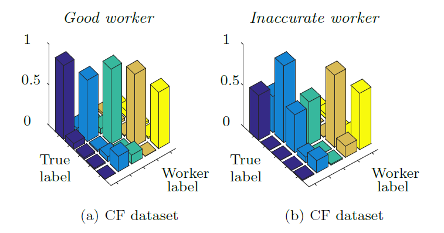
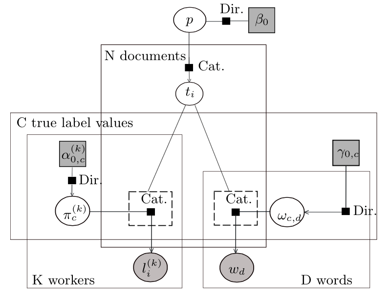
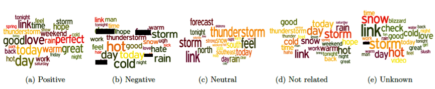
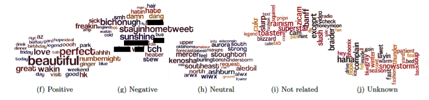

[Infer.NET user guide](index.md) : [Tutorials and examples](Infer.NET tutorials and examples.md)

## BCCWords: Bayesian Text Sentiment Analysis using Crowdsourced Annotations

How do we build an automated tool for text sentiment analysis that learns from crowdsourced human annotations? This is the challenge addressed by the Bayesian Classifier Combination with Words (BCCWords) model presented in the paper: 

_Edwin Simpson, Matteo Venanzi, Steven Reece, Pushmeet Kohli, John Guiver, Stephen Roberts and Nicholas R. Jennings, (2015) Language Understanding in the Wild: Combining Crowdsourcing and Machine Learning. In, 24th International World Wide Web Conference (WWW 2015)_

The problem involves classifying the sentiment of a large corpus, i.e., hundreds of thousands, of text snippets, e.g., tweets, using only a small set of crowdsourced sentiment labels provided by human annotators. In particular, this problem is relevant to various text mining tasks such as weather sentiment classification from twitter and disaster response applications, e.g., the Ushahidi-Haiti project where 40000 emergency reports were received in the first week from victims of the 2010 Haiti earthquake. 

There are three key aspects of this problem that are relevant to the design of a crowdsourced data driven model for tweet classification. Firstly, each annotator may have different reliabilities of labelling tweets correctly depending on the content of the tweet. In fact, interpreting sentiment or relevance of a piece of text is highly subjective and, along with variations in annotators' skill levels, it can result in disagreement amongst the annotators. Secondly, typically there are so many tweets that a small number of dedicated expert labellers will be overwhelmed as was the case during the Haiti earthquake. As a result, the human labels may or may not cover the whole set of tweets, so we may have tweets with only one label or multiple, perhaps conflicting, labels, or none. Thirdly, each distinct term of the dictionary has different probabilities to appear in tweets of different sentiment classes. For example, the terms "Good" and "Nice" are more likely to be used for tweets with a positive sentiment. Thus, we must be able to provide reliable classifications of each tweet by leveraging the language model inferred from the aggregated crowdsourced labels to classify the entire corpus (i.e., tweet set). 

To solve this problem, BCCWords extends the core structure the Bayesian Classifier Combination model (BCC) for aggregating crowdsourced labels, which was described on this other [page](Community-Based Bayesian Classifier Combination.md), to add a new feature relating to learning language models for automated text classification. In detail, BCC represents the reliability of each annotator through a confusion matrix expressing the labelling probabilities for each possible sentiment class. Here are examples of confusion matrices for two annotators rating tweets in five sentiment classes [neutral, positive, not related, unknown] from the CrowdFlower (CF) dataset described in the paper: 



As in BCC, we also have K workers classifying N tweets among C possible sentiment classes. In addition, we represent the set of D words including all the words that appear in the tweets (after applying stemming and removing stop words). These counts are shown in the corresponding plates (the rectangles) of the factor graph illustrated below; arrows are included to show the generative flow. 



In Infer.NET, these counts are represented by ranges: 

```csharp
Range n = new Range(N);
Range k = new Range(K);
Range c = new Range(C);
Range d = new Range(D);   
```

Next, to deal with sparsity in the set of worker's labels and the tweets' brevity (typically workers judge only a small subset of tweets and each tweet contains only a small subset of words from the whole dictionary), we use two extra ranges, kn and nw, to represent the subset of tweets labelled by k and the subset of words contained in n, respectively. Thus, after creating the two arrays of tweet counts and word counts, i.e, WorkerTweetCount, WordCount, we initialise these ranges as follows: 

```csharp
VariableArray<int> WorkerTaskCount = Variable.Array<int>(k);
VariableArray<int> WordCount = Variable.Array<int>(n); 
Range kn = new Range(WorkerTaskCount[k]);
Range nw = new Range(WordCount[n]); 
```

In BCCWords, we assume that the observed worker's labels are randomly drawn from the categorical distributions with parameters specified by the rows of the worker's confusion matrix, `WorkerConfusionMatrix[k]`. This assumption is also common to BCC. However, the key feature of BCCWords is to assume that the observed tweet's words are randomly drawn from a categorical distribution with parameters conditioned on the tweet's true sentiment class, ProbWord. Here, both WorkerConfusionMatrix and ProbWord are latent variables so they are intialised with conjugate Dirichlet prior distributions. In Infer.NET, this process can be coded as follows: 

```csharp
WorkerConfusionMatrix = Variable.Array(Variable.Array<Vector>(c), k) ;
WorkerConfusionMatrix[k]= Variable<Vector>.Random(ConfusionMatrixPrior[k]); 
var ProbWord = Variable.Array<Vector>(c) ;
ProbWord = Variable<Vector>.Random(ProbWordPrior).ForEach(c); 
using (Variable.ForEach(k))
{ 
var tweetTrueLabel = Variable.Subarray(TweetTrueLabel, WorkerTaskIndex[k]);
    trueLabel.SetValueRange(c);

    using (Variable.ForEach(kn))
    {
        // Label inference
        using (Variable.Switch(tweetTrueLabel[kn]))
        {
            WorkerLabel[k][kn] = Variable.Discrete(WorkerConfusionMatrix[k][trueLabel[kn]]);
          }
    }
    // Words inference 
    using (Variable.ForEach(n))
    {
        using (Variable.Switch(tweetTrueLabel[n]))
        {
            Words[n][nw] = Variable.Discrete(ProbWord[TrueLabel[n]]).ForEach(nw);
        }
    }
} 
```

Then, we can observe the worker's labels and the tweet's words encoded in 2D jagged arrays. Specifically, the first array, WorkerLabel, is indexed by worker and the rows are the worker's label. The second array, Words, is indexed by tweet and the rows are indices of words in the dictionary: 

```csharp
int[][] workerLabel;
int[][] words;  
WorkerLabel.ObservedValue = workerLabel;
Words.ObservedValue = words;  
```

We can query the Infer.NET inference engine to obtain the posterior probabilities of the tweet's true label and the words in each class as follows: 

```csharp
Discrete[] TweetTrueLabel = Engine.Infer<Discrete[]>(TrueLabel);
Dirichlet[][] WorkerConfusionMatrix = Engine.Infer<Dirichlet[][]>(WorkerConfusionMatrix);
Dirichlet[] ProbWordPosterior = Engine.Infer<Dirichlet[]>(ProbWord); 
```

In this way, we can obtain the estimated confusion matrix of each worker, the true label of each tweet and the word probabilities of each sentiment class. 

We have applied BCCWords to the CrowdFlower dataset containing up to five weather sentiment annotations for tens of thousands of tweets annotated by thousands of workers. The model correctly found the correlation between positive, negative, neutral words in the related sentiment class. We can see this in the word clouds below*. These show the most probable words in each class with word size proportional to the estimated probability of the word conditioned on the true label:  



_*The black boxes hide some swear words that were inferred by BCCWords within the feature set for the tweets with negative sentiment._

We can also identify the most discriminative words in each class by normalizing the word probabilities in each class by the total probability of the word across all the classes. In this way, we obtain a new set of word clouds with the most discriminative words: 



These word clouds shows that the words "beautiful" and "perfect" are more discriminative for positive tweets, while the words “stayinghometweet” and “dammit” are more likely to occur in negative tweets. Notice that the word clouds of the neutral and "not related class" mostly contain random words and are thus not related to a particular sentiment class. We also found that some words like “complain”, “snowstorm” and “warm” do not necessarily imply a particular positive or negative sentiment as their interpretation is highly context dependent and therefore most of the annotators classified the relative tweets as "unknown". You can find out more about the classification accuracy of BCCWords and its ability to exploit the language model to predict labels for the entire set of tweets in the paper. 

The source code is in the [CrowdsourcingWithWords](https://github.com/dotnet/infer/blob/master/src/Examples/CrowdsourcingWithWords/CrowdsourcingWithWords.cs) project.