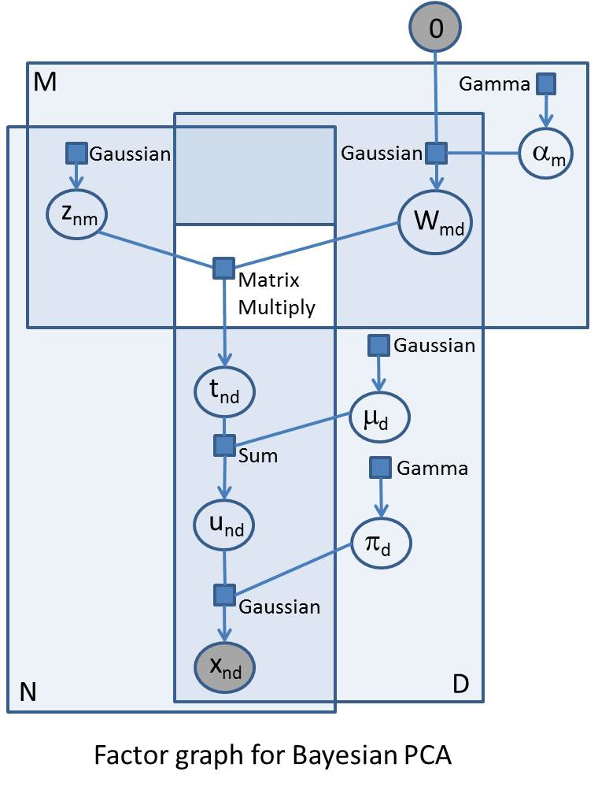

---
layout: default 
--- 
[Infer.NET user guide](index.md) : [Tutorials and examples](Infer.NET tutorials and examples.md)

## Bayesian Principal Component Analysis

This example provides an implementation of Bayesian principal components analysis as described, for example, in Chris Bishop's book [Pattern Recognition and Machine Learning](http://research.microsoft.com/people/cmbishop/PRML). The code is provided in the [**Examples** **Browser**](The examples browser.md). Most of you will be familiar with standard [Principal Component Analysis](http://en.wikipedia.org/wiki/Principal_components_analysis) which is a widely used technique for dimensionality reduction. Given an observation space of dimension _`D`_ we would like to find a latent space of lower dimension _`M`_ (the 'principal space') which captures most of the data. The mapping from principal space to observation space is via a linear mapping represented by a mixing matrix _`W`_. PCA can be formulated in probabilistic way ('probabilistic PCA') and this in itself gives many benefits as itemised in Bishop. If in addition we adopt a Bayesian approach to inferring _`W`_, we can also determine the optimal value for _`M`_ using 'automatic relevance determination' (ARD).

A fully Bayesian treatment of probabilistic PCA (including ARD) is quite complex and it might take several weeks of work to implement an efficient deterministic inference algorithm. In Infer.NET, defining the model is 20 to 25 lines of code and a few hours' work. Below is a factor graph for Bayesian PCA. Factor graphs are a way to represent probabilistic models, and can be useful if you are going to build models in Infer.NET. If you can draw a factor graph, you should be able to code up the model in Infer.NET (subject to the currently available distributions, factors, and message operators). As a reminder, the first thing to note is that the variables in the problem are represented as circles/ovals, and the factors (functions, distributions, or constraints) are represented as small squares labelled by the type of factor. Each factor is only ever attached to its variables and each variable is only ever attached to its factors. The big enclosing rectangles represent 'plates' and show replications of variables and factors across arrays. Factor graphs are important both because they provide a clarifying visualisation of complex probabilistic models and because of the close relationship with the underlying inference and sampling algorithms (particularly those based on local message passing). The probabilistic model is defined as the product of all the factors.

 

The accompanying factor graph shows PCA as a generative model for randomly generating the _`N`_ observations - these observations can be represented as an _NxD_ array, and so are represented in the factor graph in the intersection of two plates of size _`N`_ and _`D`_ respectively. All indices are explicitly shown in the factor graph to make the comparison with the code clearer. The generative process starts at the top left where, for each observation and for each component in latent space, we sample from a standard Gaussian to give an _NxM_ array _`Z`_ (with elements _z<sub>nm</sub>_). In the top right we have the matrix variable _`W`_ (elements _w<sub>md</sub>_) which maps latent space to observation space - so this will be an _MxD_ matrix which will post-multiply _`Z`_. We have specified a maximum _`M`_ in advance, but what we really want to do is learn the 'true' number of components that explain the data, and we do this by drawing the rows of _`W`_ from a zero-mean Gaussian whose precisions _`a`_ (elements _a<sub>m</sub>_) we are going to learn. If the precision on a certain row becomes very large (i.e. the variance becomes very small) then the row has negligible effect on the mapping and the effective dimension of the principal space is reduced by the number of such rows. The elements of a are drawn from a common Gamma prior.

The _MatrixMultiply_ factor multiplies the _`Z`_ with _`W`_; as this factor takes two double arrays of variables, it sits outside the plates (this is shown in the diagram as a white 'hole' in the plates). The result of this factor is an _`NxD`_ matrix variable _`T`_ (elements _t<sub>nd</sub>_). We then add a bias vector variable _`m`_ (elements _m<sub>d</sub>_ drawn from identical Gaussian priors) to each row of _`T`_ to give matrix variable _`U`_ (elements _u<sub>nd</sub>_). Finally, the matrix _`X`_ of observations vector is generated by drawing from Gaussians with mean _`U`_ and precision given by the vector variable _`p`_ (elements _p<sub>d</sub>_ drawn from identical Gamma priors). The elements in this final array of Gaussian factors are the likelihood factors and represent the likelihood of the observations conditional on the parameters of the model. These parameters are _`W`_, _`m`_ and _`p`_ which we want to infer.

The full code for this example provides a class (_`BayesianPCA`_) for constructing a general Bayesian PCA model for which we can specify priors and data at inference time. There is also some example code for running inference and extracting marginals. One important aspect of running inference on this model is that we initially need to break symmetries in the model by initialising the _`W`_ marginals to random values using the _`InitialiseTo()`_ method - for another example of this see the Mixture of Gaussians tutorial. The key aspects of the model are captured in the following few lines of C# code which, as you can hopefully see, directly matches the factor graph. 
```csharp
// Mixing matrix  
vAlpha = Variable.Array<double>(rM).Named("Alpha");  
vW = Variable.Array<double>(rM, rD).Named("W");  
vAlpha[rM] = Variable.Random<double, Gamma>(priorAlpha).ForEach(rM);  
vW[rM, rD] = Variable.GaussianFromMeanAndPrecision(0, vAlpha[rM]).ForEach(rD);  
// Latent variables are drawn from a standard Gaussian  
vZ = Variable.Array<double>(rN, rM).Named("Z");  
vZ[rN, rM] = Variable.GaussianFromMeanAndPrecision(0.0, 1.0).ForEach(rN, rM);  
// Multiply the latent variables with the mixing matrix... 
vT = Variable.MatrixMultiply(vZ, vW).Named("T");  
// ... add in a bias ... 
vMu = Variable.Array<double>(rD).Named("mu");  
vMu[rD] = Variable.Random<double, Gaussian>(priorMu).ForEach(rD);  
vU = Variable.Array<double>(rN, rD).Named("U");  
vU[rN, rD] = vT[rN, rD] + vMu[rD];  
// ... and add in some observation noise ... 
vPi = Variable.Array<double>(rD).Named("pi");  
vPi[rD] = Variable.Random<double, Gamma>(priorPi).ForEach(rD);  
// ... to give the likelihood of observing the data  
vData[rN, rD] = Variable.GaussianFromMeanAndPrecision(vU[rN, rD], vPi[rD]);
```
In order to test out this model, the test program generates 1000 data points from a model with _`M`_=3, _`D`_= 10\. _`M`_ is given a value of 6 to see if the inference could correctly determine the number of components. Here is the print-out from a run. Only three of the rows of _`W`_ have significant non-zero entries, and the bias and noise vectors are successfully inferred.

| | | | | | | | | | | |
|----------|
| Mean absolute means of rows of W: | 0.24 | 0.25 | 0.02 | 0.02 | 0.17 | 0.00 | | | | |
| True bias:  | -0.95 | 0.75 | -0.20 | 0.20  | 0.30  | -0.35 | 0.65 | 0.20 | 0.25  | 0.40  |
| Inferred:   | -0.94 | 0.72 | -0.22 | 0.21  | 0.31  | -0.36 | 0.65 | 0.18 | 0.25  | 0.42  |
| True noise: | 8.00  | 9.00 | 10.00 | 11.00 | 10.00 | 9.00  | 8.00 | 9.00 | 10.00 | 11.00 |
| Inferred:   | 7.93  | 9.16 | 10.67 | 10.30 | 10.19 | 8.54  | 7.54 | 7.97 | 10.50 | 9.20  |

​The full C# code can be viewed in the [file](Bayesian PCA.md).
