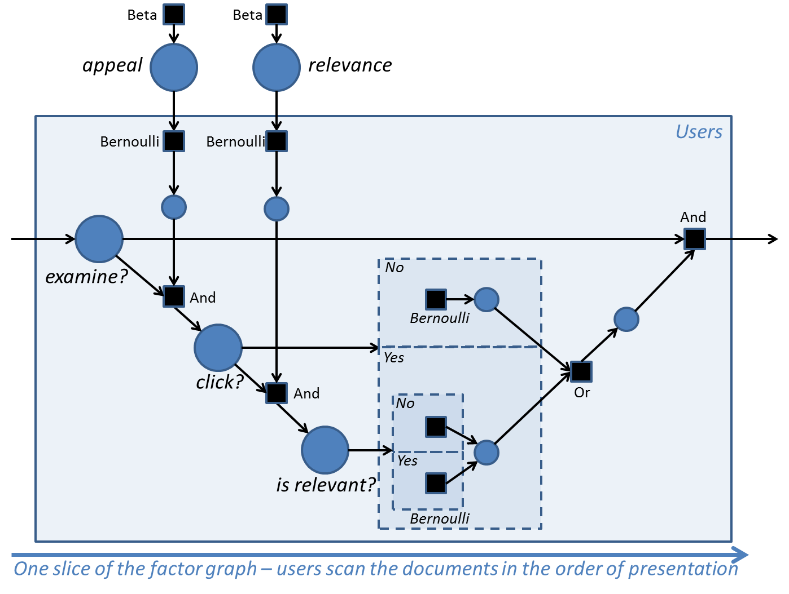

---
layout: default 
--- 
[Infer.NET user guide](index.md) : [Tutorials and examples](Infer.NET tutorials and examples.md)

Page 1 \| [Page 2](Click through model definition.md)

## Click through model example

The Visual Studio solution and source for this example can be found in the [src\\Examples\\ClickThroughModel](https://github.com/dotnet/infer/tree/master/src/Examples/ClickThroughModel). The code illustrates how to solve a problem in web search: inferring the relevance of documents from the sequence of clicks made by users on the results page.

#### Files in ClickThroughModel.sln

```
Form.cs The main user interface class  
Inference.cs Class for performing inference using Infer.Net
UserData.cs Class for storing user inputs
```

#### Problem:

Here we consider the problem of joint inference of relevance and quality of document snippets by using only search engine click logs. Click logs record the user behavior in response to the retrieved ranked list of documents for every query placed. For each user session, this corresponds to an ordered list of documents on which the user has made a click. Thus, the logs provide implicit feedback about both the summary quality and the relevance of the documents. In this work, our goal is to use click through data to, both, detect quality of document summaries and to infer the relevance of the document.

#### Approach:

We propose a graphical model that describes the underlying user behaviour in a typical query session. Our probabilistic model directly models user clicks, thereby disentangling summary and relevance; Note that summary is document-specific while a document's relevance to a query depends on other documents. By considering the effects of presence of one document in the ranking with the others, we can obtain information that disentangles summary from relevance.

Given a dataset of homogenous population of users (a given query is non-ambiguous with respect to a particular information need)  with their click behaviours on the entire ranking of the documents, we infer the user specific examination behaviour of the documents, and the global quality of the summary and the relevance of the documents by posing as a problem of inference in this user model.

#### User model:


The figure above shows an example of typical user behaviour during a search session. The user sequentially scans the ranked results retrieved by the search engine until their information need is met or they have lost patience. An important implication of sequential scanning is that if the user hasn’t examined the current document (didn’t read the summary), then they will not examine any of the future documents. The user sequentially examines the retrieved results and clicks on a document if its summary appeals to them. On the click, they get to read the document’s content and decide if the document is relevant. If the document is relevant, they may still examine more documents (but with a smaller probability); if the document is not relevant they may examine more documents with a larger probability. In either case, the user may also choose to quit the session.

### Probabilistic model:



The above figure shows one slice of the probability model corresponding to the state transition diagram representing user behaviour. This diagram uses factor graph notation. The main variables of interest are shown as large circles. Secondary variables are shown as smaller circles, and factors are shown as squares and are labeled with their function. The parts of the model which are conditioned on the _click_ and _isRelevant_ random variables are shown within dashed rectangles (this is 'gate' notation). For each user, the only observation is their set of clicks. Given this, we perform probabilistic inference to infer the marginal posterior distributions over the latent variables.

Our goal here is to describe how we can use Infer.NET to specify the conditional probability  associated with each variable, and perform inference on the model. The logic which describes whether a user will go on and examine the next document (shown in the dashed rectangles) is conditioned on whether the user clicked on the current document or not, and if they did, whether the document was relevant or not - for the purpose of simplifying this example, the parameters corresponding to these three conditions are assumed to be specified by the user, and so don't appear as variables in the diagram. 

The solution file associated with this example has the graphical user interface that allows playing with the model, and creating synthetic data. In the next section, we describe how the GUI can be used:

#### Running the model:

The Figure below shows the graphical user interface. The interaction with the interface happens in two panels:


Panel titled “User model: state transition diagram”: The track-bars in this panel are used to specify the model parameters that reflects the probability of taking a particular action based on previous actions. For instance, the first track-bar on the top right is used to specify P(examiner=true|examiner-1=true, clickr-1=false)

Panel titled ‘Clicks received for 2 documents’: In this panel, the user can simulate data that corresponds to user behaviour. Each trackbar represents one of the 4 possible ways a user can make clicks on the two documents. The value of the trackbar specifies the number of users with a particular click behaviour. For clarity, the interface is designed for retrieval of 2 documents by the search query, but the underlying implementation is valid for any number of documents; though we need to modify the static variable nRanks in the code. Note that, we use threads so that the model automatically performs inference as the value on any trackbar is changed.

#### Interesting experiments to run

Try setting the count of users in the left hand column to 0, and keep the other user counts at their initial value of 50. This means that no users click on the first document and then decide to look at the second document also. This is strong evidence that the first document is relevant. However, the fact that many users bypass the first document and immediately click on the second document (as in column 3) is evidence that the first document has a poor snippet - these conclusions are born out by the inference. Now play with column 3 and see what happens for example when you bring it down to 0 or put it up to 100. You should see the snippet appeal for the second document vary accordingly.

The model is defined on the next page.

<br/>
Page 1 \| [Page 2](Click through model definition.md)
