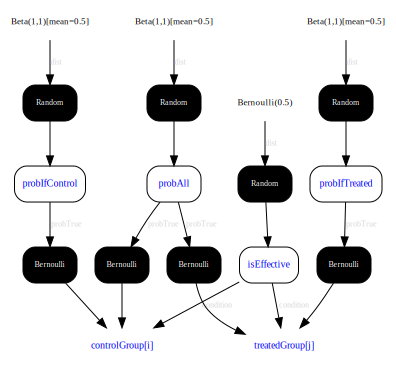

---
layout: default 
--- 
[Infer.NET user guide](index.md) : [Tutorials and examples](Infer.NET tutorials and examples.md)

## Tutorial 5: Clinical trial

This tutorial shows how to do Bayesian model selection in Infer.NET to determine if a new medical treatment is effective. We will construct two models, corresponding to an effective or ineffective treatment, and use model selection to determine the posterior probability of each, given some fictional clinical trial data.

You can run the code in this tutorial either using the [Examples Browser](The examples browser.md) or by opening the Tutorials solution in Visual Studio and uncommenting the line to execute [ClinicalTrial.cs](https://github.com/dotnet/infer/blob/master/src/Tutorials/ClinicalTrial.cs).  Code is also available in [F#](https://github.com/dotnet/infer/blob/master/test/TestFSharp/ClinicalTrial.fs) and [Python](https://github.com/dotnet/infer/blob/master/test/TestPython/test_tutorials.py).

### A healthy challenge

The data in this tutorial consists of the outcomes for individuals who took part in a fictional clinical trial. Each individual was either given the new treatment or given a placebo (individuals given a placebo are in the control group). A good outcome is indicated by **true** and a bad one by **false**. Here is the data:

```csharp
// Data from clinical trial  
VariableArray<bool> controlGroup =
    Variable.Observed(new bool[] { false, false, true, false, false });
VariableArray<bool> treatedGroup =
    Variable.Observed(new bool[] { true, false, true, true, true });
Range i = controlGroup.Range; Range j = treatedGroup.Range;
```

Notice that we have also set up a couple of ranges **i** and **j**, which range over the people in the control group and in the treated group respectively. We'll use these later.

To determine whether the treament is effective, we will build two models of this data: one which assumes the treatment has an effect and one which doesn't. To perform Bayesian model selection, we need to introduce a boolean random variable which switches between the two models. In this analysis, we will give this variable a uniform prior. What this prior should be in the case of a real clinical trial would require some thought - what is the _a priori_ effectiveness of a new treatment?

```csharp
// Prior on being effective treatment  
Variable<bool> isEffective = Variable.Bernoulli(0.5);
```

### Cause and effect

First, let us consider if the treatment has an effect on the outcome. In this case the probability of a good outcome will be different for people in the control group and the treated group. Because we don't know these two probabilities, we define random variables for them with Beta priors and learn them during inference. The code for model is shown in the snippet below. To achieve model selection, we put this modelling code in an _if block_, so that the model only applies if **isEffective** is true.

_**See also:** [Branching on variables to create mixture models](Branching on variables to create mixture models.md) and [Computing model evidence for model selection](Computing model evidence for model selection.md)._

```csharp
Variable<double> probIfTreated, probIfControl;  
using (Variable.If(isEffective))  
{ // Model if treatment is effective
  probIfControl = Variable.Beta(1, 1);  
  controlGroup[i] = Variable.Bernoulli(probIfControl).ForEach(i);  
  probIfTreated = Variable.Beta(1, 1);  
  treatedGroup[j] = Variable.Bernoulli(probIfTreated).ForEach(j);  
}
```

 The variables **probIfTreated** and **probIfControl** are declared outside of the if block but defined inside. This means the variables can be referred to outside of the _using_ statement, which will allow us to infer their values later.

Notice that we have not specified whether the treatment has a _good_ effect or not, only that it has some effect. We will be able to see if it is a good effect by comparing the posterior distributions over **probIfTreated** and **probIfControl**.

### A bit of background

Now let us consider the alternative model, where the treatment has no effect _i.e._ the background model. In this case, the probability of a good outcome will be the same for people in both groups. Again, the value of this probability is unknown, so we will put a Beta prior on it. This time we use `Variable.IfNot` to create the surrounding if block, so that the model will apply in the case where **isEffective** is false. You can think of this as being the **else** clause for the previous **if** block. 

```csharp
using (Variable.IfNot(isEffective))  
{ // Model if treatment is not effective
  Variable<double> probAll = Variable.Beta(1, 1);  
  controlGroup[i] = Variable.Bernoulli(probAll).ForEach(i);  
  treatedGroup[j] = Variable.Bernoulli(probAll).ForEach(j);  
}
```

The variable **probAll** is both declared and defined inside the if block, since we will not be using it later on. 

### Clinical accuracy

We have now fully defined the model and can go ahead and infer the distributions of interest.

```csharp
InferenceEngine engine = new InferenceEngine();  
Console.WriteLine("Probability treatment has an effect = " + engine.Infer(isEffective));
Console.WriteLine("Probability of good outcome if given treatment = "  
                   + (float)engine.Infer<Beta>(probIfTreated).GetMean());  
Console.WriteLine("Probability of good outcome if control = "  
                   + (float)engine.Infer<Beta>(probIfControl).GetMean());
```

When we run this code, it prints out: 

```
Probability treatment has an effect = Bernoulli(0.7549)  
Probability of good outcome if given treatment = 0.7142857  
Probability of good outcome if control = 0.2857143
```

Hence, there is some evidence from this data that the treatment has an effect and, furthermore, the effect is a positive one.

### Factor graph

This is what the factor graph of this model *should* look like (and what you will get if you save it in [DGML format](inference engine settings.md#savefactorgraphtofolder)):


However, if you tick the box in the Examples Browser to show the factor graph, or equivalently set `engine.ShowFactorGraph = true`, you will see the following:



Due to a limitation of the graph drawing tool, the 'if' blocks in the code are not explicitly drawn.  Instead, the variable **isEffective** points to **controlGroup** and **treatedGroup** via a **condition** edge.  The condition edge selects which parent of **controlGroup** and **treatedGroup** is active.

If you find these tutorials to be effective, you can move on to the [next](Mixture of Gaussians tutorial.md).
