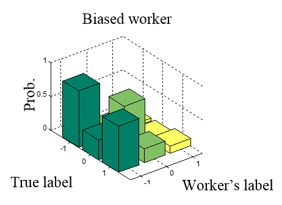
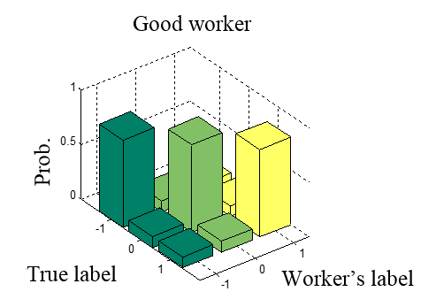
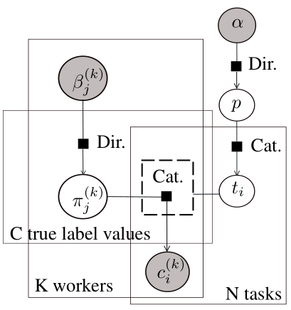
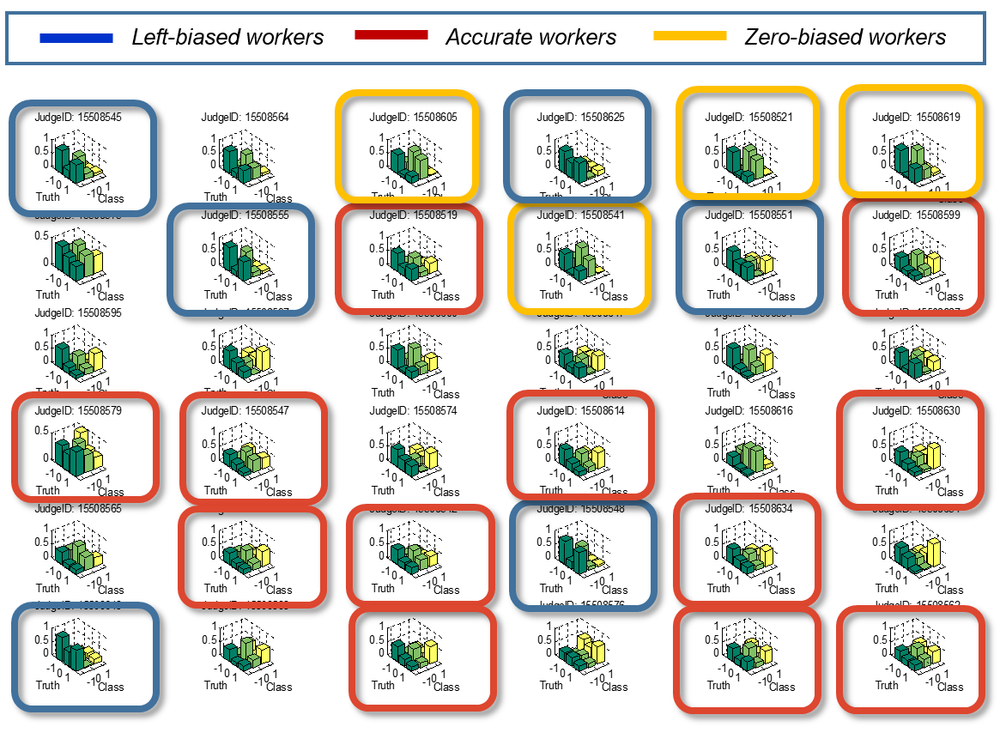
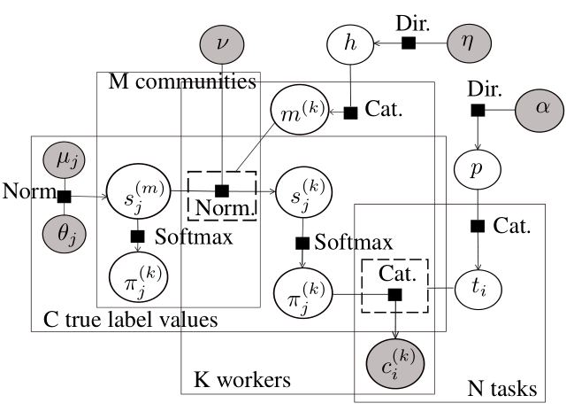

[Infer.NET user guide](index.md) : [Tutorials and examples](Infer.NET tutorials and examples.md)

## Community-Based Bayesian Classifier Combination

We're going to discuss how to use Infer.NET to implement the Community-based Bayesian Classifier Combination (ComminityBCC) model for aggregating crowd-sourced labels described in the paper:
 
_Matteo Venanzi, John Guiver, Gabriella Kazai, Pushmeet Kohli, and Milad Shokouhi, [Community-Based Bayesian Aggregation Models for Crowdsourcing](https://www.microsoft.com/en-us/research/publication/community-based-bayesian-aggregation-models-for-crowdsourcing/?from=http%3A%2F%2Fresearch.microsoft.com%2Fapps%2Fpubs%2Fdefault.aspx%3Fid%3D214612), in Proceedings of the 23rd International World Wide Web Conference, WWW2014 (Best paper runner up), ACM, April 2014_
 
This models is designed to work in a typical crowdsourcing scenario where we wish to classify a number of items based on a set of noisy labels that were provided by multiple crowd workers with varying levels of expertise, skills and attitudes. To obtain the set of accurate aggregated labels, we must be able to assess the accuracies and biases of each worker who contributed labels. Ultimately, these estimates of the workers’ accuracy should be integrated within the process that infers the items’ true labels. Prior work on the data aggregation problem in crowdsourcing led to an expressive representation of a worker’s accuracy in the form of a latent worker _confusion matrix_. This matrix expresses the probability of each possible labeling outcome for a specific worker conditioned on each possible true label of an item. For example, by looking at this matrix we can figure out whether the worker is biased towards a particular label range. See the example below with confusion matrices for three-point scale labels (-1,0,1).




A standard framework to learn the latent worker’s confusion matrix is the Bayesian Classifier Combination model (_H.C. Kim and Z. Ghahramani. Bayesian classier combination. International Conference on Articial Intelligence and Statistics, pages 619-627, 2012_). This model assumes that there are _K_ workers classifying _N_ objects (or tasks) among _C_ possible labels. These counts are shown in the corresponding plates (the rectangles) of the factor graph illustrated below; arrows are included to show the generative flow.



Recall that plates represent parts of the graphical model which are duplicated - if _N_ is the size of a plate, there are _N_ copies of all factors and variables within the plate. In Infer.NET, plates are represented by ranges:

```csharp 
Range n = new Range(N);
Range k = new Range(K);
Range c = new Range(C);
```

We also have another range _kn_ that is set up to represent the jagged intersection of the worker/task plates; workers typically judge only a small subset of the tasks, and a jagged range is a syntax which allows you to specify this. Then, after creating an array of task counts, `WorkerTaskCount`, with values given by the number of tasks labelled by each worker (observed at run-time) the _kn_ ranges are initialized as follows: 

```csharp 
VariableArray<int> WorkerTaskCount = Variable.Array<int>(k)
Range kn = new Range(WorkerTaskCount[k]);
```

Then, the generative model of BCC attempts to explain the observed worker's labels as a random draw from a categorical distribution with parameters specified by the rows of the worker's confusion matrix. Specifically, each row is selected by the true task's label, which is an unobserved random variable. In Infer.NET, this process can be coded as follows: 

```csharp 
using (Variable.ForEach(k))
{
  trueLabel = Variable.Subarray(trueLabel, WorkerTaskIndex[k]))
  trueLabel.SetValueRange(c)
  using (Variable.ForEach(kn))
  {
    using (Variable.Switch(trueLabel[kn]))
    {
      WorkerLabel[k][kn] = Variable.Discrete(WorkerConfusionMatrix[k][trueLabel[kn]]);
    }
  }
}
```

For a more efficient implementation, we use the subarray factor to extract the sub-set of tasks labelled by the user from the `taskLabel` array, which is faster than using the full array of task labels.
 
In CommunityBCC, we make a further modelling step by adding a latent worker type variable, which we call _community_. Communities are represented by confusion matrices that encode similarity patterns among the workers’ confusion matrices. Thus, we assume that the workers’ confusion matrices are not completely random, but rather that they tend follow some underlying clustering patterns – such patterns are readily observable by plotting the confusion matrices of workers as learned by BCC. See this example from a dataset with three-point scale labels (-1, 0, 1):



The CommunityBCC model is designed to encode the assumptions that (i) the crowd is composed by an unknown number of communities, (ii) each worker belongs to one of these communities and (iii) each worker’s confusion matrix is a noisy copy of their community’s confusion matrix. More formally, we assume that there are _M_ communities of workers. Each community _m_ has a score matrix `CommunityScoreMatrix[m]` representing the un-normalized log probabilities of the community’s confusion matrix `CommunityConfusionMatrix[m]`. This means that `CommunityConfusionMatrix[m]` is equal to the softmax of `CommunityScoreMatrix[m]`. Then, each worker has a community membership `Community[k]` and a score matrix, `WorkerScoreMatrix[k]`, that represent the log probabilities of the worker's confusion matrix, `WorkerConfusionMatrix[k]`. To relate workers to their communities, the model assumes that the worker's score matrix is a Gaussian draw from the community's score matrix, which is then converted into a discrete probability vector representing the worker's confusion matrix through the softmax factor. The factor graph of the model is shown below.



To implement this model in Infer.NET, we need to add a community range to the BCC ranges:

```csharp
Range m = new Range(M);
```

Then, we code the steps of the generative process of CommunityBCC as follows:

```csharp
using (Variable.ForEach(k))
{
  using (Variable.Switch(Community[k]))
  {
    ScoreMatrix[k] = Variable.VectorGaussianFromMeanAndPrecision(
                          CommunityScoreMatrix[Community[k]],
                          NoiseMatrix);
  }

   WorkerConfusionMatrix[k] = Variable.Softmax(WorkerScoreMatrix[k]);
   using (Variable.ForEach(kn))
   {
     using (Variable.Switch(trueLabel[kn]))
     {
      WorkerLabel[k][kn] = Variable.Discrete(WorkerConfusionMatrix[k][trueLabel[kn]]);
     }
   }
}
```

Notice that the row of the worker’s confusion matrix, `ConfusionMatrix[k]`, is used to generate the worker’s label in the same way as described above for BCC. At this point, we can observe a data set encoded as a matrix of task indices (i.e., the indices of the tasks labelled by the workers) and worker’s labels:

```csharp
WorkerTaskIndex.ObservedValue = taskIndices;
WorkerLabel.ObservedValue = workerLabels;
```

Finally, we run inference on this model in the standard way by creating an inference engine and calling `Infer`.

```
WorkerConfusionMatrix = Engine.Infer<Dirichlet[][]>(ConfusionMatrix);
TrueLabel = Engine.Infer<Discrete[]>(TrueLabel);
CommunityScoreMatrix = Engine.Infer<VectorGaussian[][]>(CommunityScoreMatrix);
CommunityConfusionMatrix = Engine.Infer<Dirichlet[][]>(CommunityConfusionMatrix);
Community = Engine.Infer<Dirichlet>(Community);
```

### How to find the number of communities

For a given data set, we can find the optimal number of communities using standard model selection. In particular, we can perform a model evidence search over a range of community counts. So, if we assume that the community count lies within a range of _1..X_ communities, we can run CommunityBCC by looping over this range and compute the model evidence of each community count using the Infer.NET engine as follows:

```csharp
double logEvidence = Engine.Infer<Bernoulli>(Evidence).LogOdds;
```

Take a look at computing model evidence for model selection in Infer.NET [here](Computing model evidence for model selection.md). Then, we can select the optimal number of communities by looking at the community count with the maximum model evidence.
 
### How to set the other hyper-parameters

In addition to the community count, the model has other hyper-parameters that need to be set for training:

```csharp 
// Precision of the noisification factor generating a worker's score matrix
double NoisePrecision 
// Per-community on and off-diagonal values of mean of community score-matrix prior
Tuple<double, double>[] ScoreMeanParameters 
// Per-community precision of community score-matrix prior
double[] ScorePrecisionParameters
// Parameter of community membership prior
double CommunityPseudoCount
// Parameter of true label prior
double BackgroundLabelProb
```

You can set these hyper-parameters at run time using `ObservedValue`. As with community counts you can use model evidence to guide these settings. For training on our data sets, the `BackgroundLabelProb` and the `CommunityPseudoCount` are set uninformatively with normalized uniform probabilities across the number of labels and communities, respectively and the `NoisePrecision = 5`. For the parameters of the community score matrices we provide two ways of specifying the mean `ScoreMeanParameters` and the precision `ScorePrecisionParameters` of their multivariate Gaussian prior. Specifically, you can either use `ObservedValue` or indirectly set the values of the communities confusion matrices and infer the communities score matrices by calling the method `GetScoreMatrixPrior()`. The latter (which uses the BCC hyper-parameter `InitialWorkerBelief`) is useful since the communities confusion matrices are usually more interpretable than the communities score matrices.

### Evaluation

We tested this model on four different crowd-sourced datasets and our results show that this model provides a number of advantages over BCC, Majority Voting (MV) and Dawid and Skene’s Expected Maximization (EM) method. Firstly, its community reasoning enables a two-ways transfer learning between workers and communities that makes the model more robust against sparse label sets, i.e., sets that contains only a few labels per worker and task. As a result, CommunityBCC converges faster to the highest classification accuracy using less labels. Secondly, the model provides useful information about the number of latent worker communities with their individual confusion matrices and the community membership of each worker. The full set of results and more details about this model can be found in the paper.
 
Take a look at the full code (details below) and let us know your experiences in using this model.

### Full code for this model: 

The full C# code can be viewed in the [file](CodeSamples/CommunityBCCSourceCode.cs). This code includes classes for `BCC`, `CBCC` , the classes for handling their posteriors (`BCCPosteriors` and `CBCCPosteriors`), the worker’s label (`Datum`), and a `Data mapping` class. The latter provides a parser for data files in the format `<workerID, taskID, label, goldLabel (optional)>`. This class automatically computes the label range and ensures that mappings between these entities and model indices are handled safely and consistently. There is also an active learning class (`ActiveLearning`) that provides the functions to reproduce an iterative labelling selection process with `enums` for the various task selection methods (`TaskSelectionMethod`) and worker selection methods (`WorkerSelectionMethod`). The code includes a class to collect the results (`Results`) and the main class (`Program`) to run the experiments of the paper. If you want to try out this model, you must download the Infer.NET libraries from here and link them to your visual studio solution that runs this program. You must also provide a data set in a csv file with rows in the format specified above. Finally, note that if your data set is large you may want to configure your Visual Studio project to target x64 to avoid hitting 32 bit memory limits. 