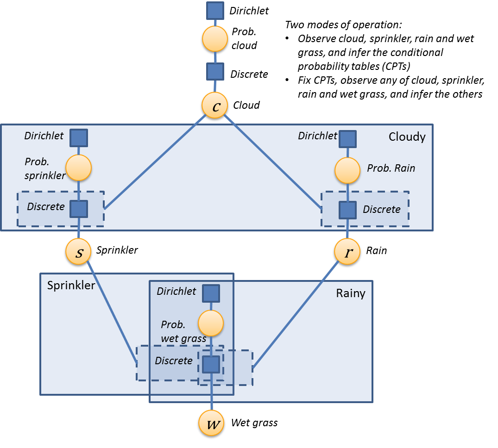

---
layout: default 
--- 
[Infer.NET user guide](index.md) : [Tutorials and examples](Infer.NET tutorials and examples.md)

## Wet grass/sprinkler/rain example

This example shows how to construct a discrete Bayesian network in Infer.NET and how to learn the parameters of the model (the conditional probability tables) from data. You can find the code for this example in the [**Examples Browser**](The examples browser.md) and [src/Tutorials/WetGrassSprinklerRain.cs](https://github.com/dotnet/infer/tree/master/src/Tutorials/WetGrassSprinklerRain.cs). The model is Kevin Murphy's [wet grass/sprinkler/rain example](http://www.cs.ubc.ca/~murphyk/Bayes/bnintro.html).

Although all the variables in this example can only take on two values, the code is written in a way that is easily extendable to multiple states. The model is encapsulated in a class **WetGrassSprinklerRainModel** whose constructor defines the Infer.NET model. The model is defined in a way that all parameters are treated as random variables with priors settable at run time. The model class also has two static methods **AddChildFromOneParent**, and **AddChildFromTwoParents** which are general building blocks for discrete Bayesian networks and which you can incorporate into your model classes. These methods can be extended to more than two parents---see the forum thread [How define a model with a variable dependent more than two](https://social.microsoft.com/Forums/en-US/7e27e90e-3461-4aa3-b640-8f0893faba95/how-define-a-model-with-a-variable-dependent-more-than-two-migrated-from?forum=infer.net).

There are three modes of operation:

1.  The parameters are exactly known - in this case the priors on the parameters are irrelevant as the parameters are directly observed. We can then query the model in a variety of ways.
2.  The parameters are unknown, and we want to infer the parameters from observations on the primary variables
3.  The parameters are known with uncertainty (for example through Bayesian inference), and we want to query the model in the presence of that uncertainty

These 3 cases are called in succession in the main program for this example. (1) and (3) are just illustrated for querying about Prob(Rain) under various assumptions; similar queries can be built up straightforwardly.

A simpler less general implementation of this model, which does not address parameter learning, can be found on the [community forum](http://social.microsoft.com/Forums/en-US/infer.net/thread/dcffcf8d-fb15-4236-98fd-9d4a5b19e03a).

Here is a factor graph of this model:

