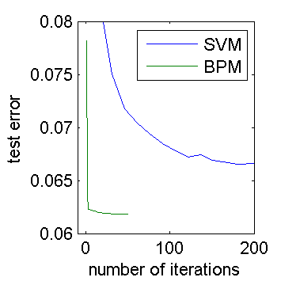
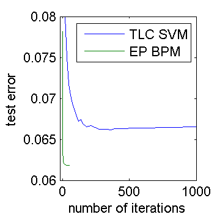
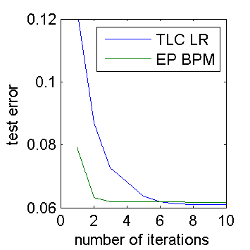

---
layout: default 
--- 
[Infer.NET user guide](index.md) : [Infer.NET development](Infer.NET development.md)

## Efficiency of Infer.NET for the Bayes Point Machine 

In an effort to optimize the performance of Infer.NET for classification problems, I've implemented a version of the Bayes Point Machine (BPM) by hand, and ran some experiments comparing it to the Infer.NET generated code and to some of the algorithms included in TLC. Of course, the classifiers in TLC aren't the same as a BPM but they provide an independent benchmark of how well we are doing on classification performance. To compare a BPM solver to an SVM or LR solver, you cannot just look at speed, but rather speed vs. accuracy and I will do that below.
 
The experiment setup is as follows. I generated a synthetic dataset of size n=1000 training points in d=100 dimensions where the features and weights are standard normal (i.e. dense features). The labels are drawn from a logistic regression model (note this is different from the BPM assumption). The BPM uses a factorized posterior (as in Exchange) with standard normal prior on the weights. Infer.NET is always used in pre-compiled mode, i.e. the Infer.NET generated code is compiled as part of the project. The code is compiled for x64 in Release mode and run on a single thread with the debugger off.
 
Let's start with speed. I'm going to measure speed as "weight updates per millisecond". Since d=100, processing a single data point requires 100 weight updates. Processing 10 data points requires 1000 weight updates. So an algorithm that can do 1000 weight updates per millisecond can process 10 data points per millisecond. To measure this quantity, I looked at how the time changed as you vary the number of iterations in the algorithm. Thus any fixed startup costs are ignored.
 
The following algorithms are compared: 

1. original: the original EP code output by the model compiler
2. edited: the generated code is edited to use .NET arrays instead of DistributionArrays and to allocate fewer message arrays, but the message operators are left intact
3. hand-written: all operations are inlined and hand-optimized - this should be close to the best possible performance achievable in single-threaded C#
4. TLC SVM: The SVM solver in TLC using the Pegasos algorithm, which is essentially stochastic gradient descent. It is implemented in pure C#.
5. TLC LR: The LogisticRegression solver in TLC using L-BFGS. It is implemented in unmanaged C++ and MKL.
6. C# LR: A modified version of TLC LR to use pure C#.

| Algorithm | weight updates per millisecond |
|--------------------------------------------|
| original BPM | 6800   | 
| edited BPM   | 8900   | 
| hand-written | 40000  |
| TLC SVM      | 190100 | 
| TLC LR       | 120000 |
| C# LR        | 231000 |

We see that optimizing the generated code alone (without changing the message operators) only gives a marginal speed improvement. The hand-written BPM is about 6x faster than the generated code, and the TLC SVM is another 5x faster than that. The speed of SVM here is not due to any cleverness in the TLC implementation but due to the simplicity of the Pegasos algorithm itself. EP is doing a lot more work per weight update, in order to get improved accuracy. So an EP update is not equivalent to a Pegasos update. For a fair comparison, we need to look at how accuracy varies with the number of updates. Interestingly, my C# LR implementation is much faster than the one in TLC (and gives the same answers).
 
For the accuracy evaluation, it is important to realize that SVM has a parameter lambda that controls the amount of regularization, and this parameter has a huge effect on accuracy. (BPM and LR have no such parameter---changing the prior variance has very little effect on accuracy.)  For simplicity, I rigged the experiment in favor of SVM by picking the lambda that gave best test accuracy. Pegasos has other options such as batch size and projection but these didn't make any difference to accuracy. I measured accuracy only using test error; I didn't consider calibration or uncertainty.
 
The results for BPM vs. SVM are shown below. Both figures show the same information, zoomed differently. In the figures, an "iteration" means one full sweep through the data, i.e. n*d weight updates. The test error is averaged over 100 random datasets. Pegasos is a randomized algorithm, so its test error curve is noisy (more trials could have smoothed it out). 
 
 

We see that EP reaches a lower error than SVM, which is to be expected in this setup. The surprising thing is that EP converges far faster than Pegasos does. Pegasos needs about 200 iterations to converge. For EP to reach the same test error as Pegasos, it only needs 2 iterations. That's a 100x advantage in convergence rate, dwarfing the 5x disadvantage in time per iteration. So we're pretty safe with EP versus Pegasos, even without doing any performance optimizations.
 
Note that if you run Infer.NET versus TLC out of the box without tuning any parameters, then TLC will appear to run much faster. This is because Infer.NET conservatively runs 50 iterations of EP, while TLC uses an optimistic default setting of 50k steps, which corresponds to 50 iterations in the above experiment. When applied to the above experiment, TLC will be nowhere near convergence and Infer.NET will be far past convergence.
 
Another thing to consider is that if n >> d then you may need less than one iteration to reach convergence. The BPM code above would suffer here since it always performs at least one full iteration. Of course, you could easily change the BPM code to run in online mode and stop before the full dataset is processed.
 
The accuracy curve for BPM vs. LR is shown below. Here we have zoomed in even further to only the first 10 iterations. We see that LR achieves slightly higher accuracy (as expected from the design of the experiment) but EP converges about 2.5x faster than L-BFGS. From the numbers above, we know that a good LR implementation runs 6x faster than EP, so this gives LR an overall speed advantage of 2.5x when you only measure test error.

This investigation has turned up some ways that we could speed up BPM. Optimizing memory allocation is not so useful, but creating new specialized message operators may help a lot. I also noticed during the experiments that EP takes longer to converge if the weight prior variance is different from the truth. If one is solving many similar classification problems, then tuning the prior variance as you go along could be helpful speed-wise. Of course, this assumes that you stop EP at the optimal number of iterations, which is an open problem that has not been addressed here (for either algorithm).