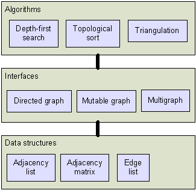
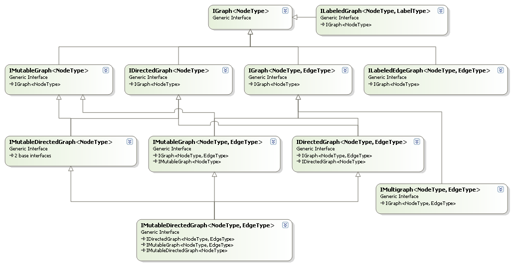

---
layout: default 
--- 
[Infer.NET user guide](index.md) : [Infer.NET development](Infer.NET development.md)

## Graph library

A graph is a mathematical concept consisting of nodes and edges. Graphs are used throughout computer science and especially machine learning. The Infer.Net graph library provides data structures for representing graphs and algorithms for operating on graphs. The data structures and algorithms are carefully separated by a set of interfaces, which allow the same graph algorithm to operate on a variety of graph representations. This layering structure is depicted below: 



### Concepts

Conceptually, a graph is a set of nodes and a collection of edges. An edge consists of two endpoints which may be ordered (directed edge) or unordered (undirected edge). In the directed case, the first node is called the source and the second node is the target. Two edges with the same endpoints in the same direction are called parallel. If there are no parallel edges, then the graph is called a simple graph, otherwise it is called a multi-graph. In a simple graph, the edges form a set, otherwise they form a bag (a general collection). Unlike edges, the nodes always form a set; this is essential for determining the endpoints of an edge. In some graphs, a node may not have any edges; for this reason, we have to include the set of nodes in the definition of a graph (otherwise it would suffice to specify the edges).

#### Interfaces

The graph interface is the distinguishing feature of this graph library compared to others you might find on the internet. The two main features are:

*   It has been designed specifically for .Net 2.0. 
*   It allows efficient access to a wide variety of different graph implementations. 

The common graph interface is important so that you don't have to re-implement each graph algorithm on each graph type. However, the interface must be simple enough that any data structure can implement it efficiently. In particular, it should not be necessary to allocate temporary objects in order to do simple tasks, like determining if a particular edge is present, or counting the number of neighbors of a vertex.

Conceptually, a graph is a set of nodes and a collection of edges. An edge consists of two endpoints that may be ordered (directed edge) or unordered (undirected edge). In the directed case, the first node is called the source and the second node is the target. Two edges with the same endpoints in the same direction are called parallel. If there are no parallel edges, then the graph is called a simple graph, otherwise it is called a multi-graph. In a simple graph, the edges form a set; otherwise, they form a bag (or general collection). Unlike edges, the nodes always form a set; this is essential for determining the endpoints of an edge. In some graphs, a node may not have any edges; for this reason, we have to include the set of nodes in the definition of a graph (otherwise it would suffice to specify the edges).

At first glance, it may seem like the graph interface could be `ICollection<Node>` together with `ICollection<Edge>`. There are two problems with this. First, the operations we want to perform on graphs go beyond the standard collection interfaces. Besides the typical collection operations such as counting edges and testing for presence of an edge, we often want to manipulate subcollections of nodes and edges, such as the set of edges with a given endpoint, or the set of nodes neighboring a given node. These subcollections are all linked in the sense that if we delete an edge from the graph, it should disappear from all the subcollections. The second problem is that graph data structures are not necessarily composed of fine-grained Node and Edge objects.

To understand the variety of graph data structures, consider the following two ways of representing a simple graph. The first way is a set-of-sets representation: the graph is a set of nodes, and each node stores a set of target nodes. This is also known as a singly-linked adjacency list. The second way is a Boolean matrix representation: the graph is a N by N matrix of Booleans, where N is the number of nodes and entry (i,j) indicates the presence of an edge between node i and node j. The first representation has explicit node objects while the second representation does not. Neither representation has explicit edge objects. The edges are implicit in the sense that there is no way to refer to an edge other than by its endpoints. Now consider a third graph representation: a list of pairs. Each pair represents an edge, and stores two node indices (ranging 1 to N). In this representation, there are explicit edge objects (if each pair is considered an object), but no node objects. Each of these representations has unique advantages for certain tasks, so we would like to support them all.

Generalizing from these examples, we see that a graph node can be represented either by:

*   an object in memory (storing a list of edges), or
*   a unique value (such as an index) which determines the node. 

To accommodate both cases, the graph interface treats nodes as opaque handles, which are obtained from the graph object and which only the graph knows how to interpret. So to get the targets of a given node, you call g.TargetsOf(node), providing a node handle and receiving a list of node handles. Of course, any particular graph type will have a specific way of addressing nodes, and if you are only interested in using that graph type, you can specialize your code on that node type. But the graph interface allows you to make your code more general.

Similarly to nodes, a graph edge can be represented by: 

*   a pair of nodes (as a value type), or 
*   an object in memory (storing a pair of nodes), or 
*   a unique value (such as an index) which determines the edge. This is useful in multi-graphs, where a pair of nodes is not sufficient to identify a unique edge. 

To accommodate these cases, the graph interface allows an edge to be addressed implicitly by a pair of node handles, or directly by an opaque edge handle obtained from the graph object.

The interface for a particular graph type is constructed by mixing together a set of basic interfaces, which define access to undirected edges, directed edges, mutation, etc. The interface hierarchy is shown below:



#### Attaching data to nodes and edges

Graph algorithms often need to associate data with nodes and edges of the graph. This data is often temporary. For example, depth-first search needs to mark nodes in order to avoid cycles. If we are representing nodes via explicit objects, then it might seem logical to add these markers as fields of the object. This is efficient since it puts all the node data in one place. But it has some potential drawbacks:

*   You must know at the time you allocate the graph that you are going to run depth-first search on it. 
*   You might want to run several depth-first search processes concurrently. 
*   Once the algorithm is complete, these fields are still there, taking up space. 
*   The graph representation might be a Boolean matrix, which does not have explicit node objects. 

In the case of a Boolean matrix, nodes are indexed 1 to N, so the logical solution is to store the markers in a separate array. Given a node index, we simply look up that position in the array. A separate array can be allocated and destroyed as needed, which solves the other problems above. The only problem is that we relied on the fact that nodes were indexed, which is not true for all graph types.

We solve this dilemma with an interface for creating and accessing graph data. For graphs which support this interface, you can call `CreateNodeData<Value>` and get back an `IDictionary<Node,Value>`. The `IDictionary` converts node handles into values, using the native representation of node handles for that graph type. So if the graph uses integer node handles, it allocates an array and returns an IDictionary which accesses that array. If the graph uses explicit node objects with an available field, it returns an IDictionary which accesses that field. As a last resort, the graph can create a hash table which stores a value for each node. The important thing is that the graph designer makes this decision, not the user. A similar approach allows data to be attached to edges.

#### Example program

```csharp
Graph<BasicNode> g = new Graph<BasicNode>();
BasicNode a = new BasicNode("a");
BasicNode b = new BasicNode("b");
BasicNode c = new BasicNode("c");
g.Nodes.Add(a);
g.Nodes.Add(a); // duplicate is ignored
g.Nodes.Add(b);
g.Nodes.Add(c);
g.AddEdge(a, b);
g.AddEdge(b, b); // self loop
g.AddEdge(b, c);
g.AddEdge(b, c); // double edge
Assert.IsTrue(g.Nodes.Contains(a));
Assert.IsTrue(g.ContainsEdge(a, b));
Assert.IsTrue(g.ContainsEdge(b, b));
Assert.AreEqual(4, g.EdgeCount());
Assert.AreEqual(1, g.NeighborCount(a));
Assert.AreEqual(2, g.NeighborCount(c));
Assert.AreEqual(1, g.TargetCount(a));
Assert.AreEqual(0, g.SourceCount(a));

Console.WriteLine("g Edges:");
foreach (BasicNode source in g.Nodes) {
  foreach (BasicNode target in g.TargetsOf(source)) {
    Console.WriteLine(" {0} -> {1}", source, target);
  }
}
Console.Write("SourcesOf(b):");
foreach (BasicNode source in g.SourcesOf(b)) {
  Console.Write(" {0}", source);
}
Console.WriteLine();
Console.Write("NeighborsOf(b):");
foreach (BasicNode node in g.NeighborsOf(b)) {
  Console.Write(" {0}", node);
}
Console.WriteLine();

g.RemoveNodeAndEdges(a);
Console.WriteLine("a removed");
Console.WriteLine("g Edges:");
foreach (BasicNode source in g.Nodes) {
  foreach (BasicNode target in g.TargetsOf(source)) {
    Console.WriteLine(" {0} -> {1}", source, target);
  }
}
Console.WriteLine("b.Sources:");
foreach (BasicNode source in g.SourcesOf(b)) {
  Console.WriteLine(" {0}", source);
}

g.RemoveEdge(b, c);
Console.WriteLine("(b,c) removed");
Console.WriteLine("g Edges:");
foreach (BasicNode source in g.Nodes) {
  foreach (BasicNode target in g.TargetsOf(source)) {
    Console.WriteLine(" {0} -> {1}", source, target);
  }
}
g.ClearEdgesOf(c);
Console.WriteLine("c edges cleared");
Assert.AreEqual(0, g.NeighborCount(c));
Console.WriteLine("g Edges:");
foreach (BasicNode source in g.Nodes) {
  foreach (BasicNode target in g.TargetsOf(source)) {
    Console.WriteLine(" {0} -> {1}", source, target);
  }
}
g.ClearEdges();
Assert.AreEqual(0, g.EdgeCount());
g.Clear();
```