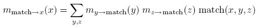
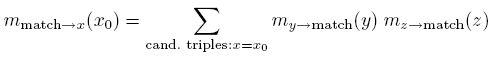

[Infer.NET user guide](index.md)

## How to add a new constraint

In this section we explain how to add a new constraint to Infer.NET, by means of following a simple example that has been used in a recent research project. Adding a constraint is a simple modification of [how to add a new factor and message operators](How to add a new factor and message operators.md), and so that page should be read first.

Note: to use a custom constraint in your model once it is created you must use `Variable.Constrain()`. See below for an example.

There are two steps for implementing a constraint factor. In the first step, we create a factor class, and in the second step, we create the corresponding operator class.

#### Example: the MatchTriples constraint

We wish to implement a constraint that constrains three integer variables (x,y,z) to take on one triple out of a set of candidate triples. For example, the candidate triples might be:

| **x** | **y** | **z** |
|-----------------------|
|   3   |   6   |   0   |
|   14  |   6   |   1   |
|   8   |   3   |   14  |
|   3   |   6   |   1   |

First we create the factor class and static method that represents the factor. This is a constraint factor, so there is no "result" produced by the factor, and hence the method is void. The factor takes as input the three integers x,y,z, and a set of candidate triples, one of which must match the triple (x,y,z). A `ConstraintViolatedException` is thrown if the (x,y,z) triple does not match one of the candidates.

```csharp
public static class MatchFactor  
{  
  public static void MatchTriples(int x, int y, int z, int[][] candidates)  
  {  
    bool match = false;  
    for (int i = 0; i < candidates.Length; i++)  
    {  
      if ((x.Equals(candidates[i][0]) && y.Equals(candidates[i][1])) &&  
           z.Equals(candidates[i][2]))  
      {  
        match = true;  
      }  
    }  

    if (!match)  
    {  
      throw new ConstraintViolatedException(  
        "The variables do not match one of the candidate sets.");  
    }  
  }  
}
```

#### EP messages

Next we create the corresponding operator class, and the message methods. Variational Message Passing does not make sense for this factor, so we only implement messages for Expectation Propagation and Gibbs sampling. x, y, z are each of type Variable<int\> in the model, and so the corresponding messages are Discrete (when the variables are unobserved). To support observed variables or samples one would need to add overloads for the cases where the incoming message type for one or more of x,y,z is int rather than Discrete. These are omitted to keep the page short. The candidate triples are not allowed to be random---they must always be observed. Therefore "candidates" has type int\[\]\[\].

```csharp
public static class MatchTriplesOp  
{  
  public static Discrete XAverageConditional(  
    Discrete y, Discrete z, int[][] candidates, Discrete result)  
  {  
    Vector resultProbs = result.GetWorkspace();  
    resultProbs.SetAllElementsTo(0.0);  
    for (int i = 0; i < candidates.Length; i++)  
    {  
      resultProbs[candidates[i][0]] += y[candidates[i][1]] * z[candidates[i][2]];  
    }  

    result.SetProbs(resultProbs);  
    return result;  
  }  

  public static Discrete YAverageConditional(  
    Discrete x, Discrete z, int[][] candidates, Discrete result)  
  {  
    Vector resultProbs = result.GetWorkspace();  
    resultProbs.SetAllElementsTo(0.0);  
    for (int i = 0; i < candidates.Length; i++)  
    {  
      resultProbs[candidates[i][1]] += x[candidates[i][0]] * z[candidates[i][2]];  
    }  

    result.SetProbs(resultProbs);  
    return result;  
  }  

  public static Discrete ZAverageConditional(  
    Discrete x, Discrete y, int[][] candidates, Discrete result)  
  {  
    Vector resultProbs = result.GetWorkspace();  
    resultProbs.SetAllElementsTo(0.0);  
    for (int i = 0; i < candidates.Length; i++)  
    {  
      resultProbs[candidates[i][2]] += x[candidates[i][0]] * y[candidates[i][1]];  
    }  

    result.SetProbs(resultProbs);  
    return result;  
  }  
}
```

The EP message from the MatchTriples factor to the integer variable x is implemented by the XAverageConditional method. In general EP messages are functions of all the incoming messages to the factor, and these are the method parameters Discrete x, Discrete y, and Discrete z. However, in this case there is no approximate projection in the EP message and only the y and z messages are actually used (therefore we omit the message from x in the XAverageConditional method). The formula is:



Here match(x,y,z) is the factor function itself, and is particularly simple in this case: it is 1 when the triple (x,y,z) matches a candidate, and 0 otherwise. The message formula simplifies (assuming there are no repeat candidates) to a simple incoming message weighted sum of the candidate triples:



This formula is implemented by taking the result buffer passed in by Infer.NET (using an argument with the special name "result") and accumulating the probabilities on the RHS. This avoids any unnecessary message allocation, and "result" is already of the correct size.

Notice that this factor cannot strictly enforce that the posterior distribution of (x,y,z) has non-zero probability only on the candidate triples. This is because EP is computing a fully factorized approximation over the variables in the model, and x,y,z are separate integer variables. We can only enforce that the marginal distributions are consistent with the constraint. 

One final implementation detail. The following line should be included in the assembly containing the operator class:

```csharp
[assembly: Microsoft.ML.Probabilistic.Factors.HasMessageFunctions]
```

#### Evidence contribution

If we wish to compute the overall model evidence, or we need to include the constraint inside a [gate](Branching on variables to create mixture models.md) of a mixture model, then we need to also implement the evidence contribution of the constraint factor. For EP, this method is called "LogEvidenceRatio". For Gibbs sampling, it is called "LogAverageFactor", and for VMP it is called "AverageLogFactor". For a constraint, LogEvidenceRatio returns the same value as LogAverageFactor, so we implement both:

```csharp
public static double LogAverageFactor(  
  Discrete x, Discrete y, Discrete z, int[][] candidates)  
  {  
    double result = 0.0;  
    for (int i = 0; i < candidates.Length; i++)  
    {  
      result += x[candidates[i][0]] * y[candidates[i][1]] * z[candidates[i][2]];  
    }  

    return Math.Log(result);  
  }  

  public static double LogEvidenceRatio(  
    Discrete x, Discrete y, Discrete z, int[][] candidates)  
    {  
      return LogAverageFactor(x, y, z, candidates);  
    }
```

#### Using the MatchTriples constraint

To use our newly created constraint factor in the model, we simply pass in the factor delegate to the Variable.Constrain() method. X, Y, and Z should be defined as Variable<int\> elsewhere in the model.

```csharp
Variable.Constrain(MatchFactor.MatchTriples, X, Y, Z, Candidates);
```
