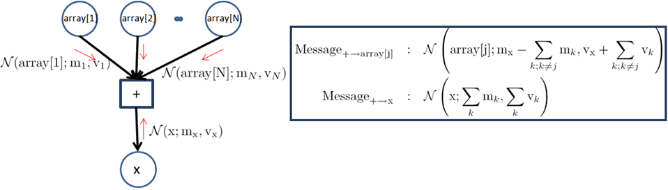

---
layout: default 
--- 
[Infer.NET user guide](index.md)

## How to add a new factor and message operators

In this section, we explain how to add a new factor to Infer.Net. For illustration, we create a new factor called 'Sum' that sums the elements of an array of doubles. To place a custom factor in your model once it is created, use `Variable<T>.Factor()` as described [on this page](Applying functions and operators to variables.md). For the Sum factor, the result variable's distribution type is Gaussian, which is assumed by default in Infer.NET. If the result variable's distribution type for your factor is not Gaussian or Bernoulli, then you will need to attach a [MarginalPrototype](Adding attributes to your model.md) attribute to the variable. For example, if the output of your factor should be assumed Gamma distributed, then you will need to attach a `MarginalPrototype(new Gamma())` attribute. 

### Step 1: Make a factor class

1\. Create a static class with your name of choice. In this example, we name the class as "MyFactor". If you plan on making a number of factors, they can all go in this one class.

```csharp
public static class MyFactor  
{  
}
```

2\. Create a static method that represents the factor. Here, we implement a method called "Sum".

```csharp
public static class MyFactor  
{  
  public static double Sum(double[] array)  
  {  
  }  
}
```

3\. This method should take ordinary values, not Variables. It implements the case where the factor's input parameters are known - in our case we can think of the factor getting an array of values and summing them.

```csharp
public static class MyFactor  
{  
  public static double Sum(double[] array)  
  {  
    double sum = 0;  
    for (int i = 0; i < array.Length; i++)  
    {  
      sum = sum + array[i];  
    } 
    return sum;  
  }  
}
```

4\. In our Sum example, if we receive an array of values, the sum is completely determined, i.e. the operation is deterministic. However, other factors are nondeterministic, i.e. they could produce a stochastic output even if the input is known. This includes all factors based on distributions such as Gaussian, Gamma, etc. For example, the Gaussian factor (**Factor.Gaussian**) is parameterised by mean and precision. Even if we fix mean and precision, we still have to sample from a Gaussian distribution to produce the output. In such cases the factor method must indicate the fact that it is sampling by attaching the \[Stochastic\] attribute.

Below is an example where we have slightly modified the Sum factor to add Gaussian noise.

```csharp
public static class MyFactor  
{  
  [Stochastic]   
  public static double SumWithNoise(double[] array)  
  {  
    double sum = Gaussian.Sample(0,1);  
    for (int i = 0; i < array.Length; i++)  
    {  
      sum = sum + array[i];  
    } 
    return sum;  
  }  
}
```

5\. (Optional) Customize parameter naming. Every factor has named parameters. In a graphical model these parameters can be thought of as edges. Each edge is named based on the name of the factor method and its parameter names. In our example, the edges therefore are called "Sum" and "array" by default. When defining your factor, you can override the defaults by attaching the ParameterNames attribute to your factor method:

```csharp
public static class MyFactor  
{
  [ParameterNames("Sum", "a")]  
  public static double Sum(double[] array)  
  {  
  }  
}
```

#### Step 2: Make an operator class

The operator class implements inference when factor arguments are stochastic. To implement the operator class, we need to first derive the messages that the factor will send to the variable nodes it's attached to. For our example of 'Sum' factor, we are interested in implementing expectation propagation when the incoming messages are 'Gaussian'. The figure below shows the factor graph and the messages that need to be sent from the 'Sum' factor. The notation on the right of this table implements these messages:



1\. Somewhere in the assembly, there must be an annotation that tells Infer.NET to look for message functions here. This annotation looks as follows:

```csharp
[assembly: Microsoft.ML.Probabilistic.Factors.HasMessageFunctions]
```

2\. Create a public static class with any name. Conventionally, this is the name of the factor followed by 'Op'. In our example, this class will be named SumOp.

```csharp
public static class SumOp  
{  
}
```

3\. Add a 'FactorMethod' attribute to tie the operator class to the factor that it is implementing. The syntax is: `[FactorMethod(typeof(name of factor class), "name of factor", typeof(first arg), typeof(second arg), ...))]`. The argument types are only needed to resolve overloads (if any).

```csharp
[FactorMethod(typeof(MyFactor), "Sum")]  
public static class SumOp  
{  
}
```

4\. Add declarations for operator methods. Each method is named \[recipient\]\[suffix\], for example if the recipient is "Sum" and the suffix is "AverageConditional", the function is named "SumAverageConditional". The recipient name is the name of the edge that connects the variable to the factor. This is automatically determined from the factor method and can be overridden as described above. The suffix is determined by the choice of the message passing algorithm: 'AverageConditional' for EP and Gibbs sampling, 'AverageLogarithm' for VMP. 

The parameters of the method are the incoming messages to the factor. The messages come from the variables that are attached to the factor. The parameter types are either distributions or ordinary values. They are not Variables. The parameter names in the method should match the parameter names of the factor (ignoring capitalization). Only include messages that are actually used to compute the output of the factor. The return type should always be a distribution type. 

In our running example, there are two edges ("array" and "sum") to the factor, and hence two recipients. Therefore, we need two message functions. Assuming Gaussian random variables, and using EP for inference, we can write the method declarations as below. The incoming message for "array" will be an object implementing `IList<Gaussian>`. In the case of ArrayAverageConditional, the return type can be any type implementing `IList<Gaussian>`. We implement this by making the method generic with type parameter `GaussianArray`. Infer.NET will automatically fill in this type parameter when it calls our method. (For a two-dimensional array, the interface would be `IArray2D<Gaussian>`.)

```csharp
[FactorMethod(typeof(MyFactor), "Sum")]  
public static class SumOp  
{   
  public static Gaussian SumAverageConditional(IList<Gaussian> array)   
  {  
  }  

  public static GaussianArray ArrayAverageConditional<GaussianArray>(GaussianArray array, Gaussian sum)   
    where GaussianArray : IList<Gaussian>  
  {  
  }  
}
```

5\. Implement the operator methods. For each inference algorithm we would like to implement, we need to work out the mathematics of message passing. For our Gaussian example, the messages to be passed are described in the figure above. 

We compute these messages using the GetMeanAndVariance method of the Gaussian class (this is faster than separate calls to GetMean and GetVariance). For SumAverageConditional, we return a Gaussian object. For ArrayAverageConditional, we must return a distribution over an array. To avoid creating this object ourselves, we add a special parameter called "result". Infer.NET will automatically fill in this parameter with a pre-allocated message of the correct size. All we need to do is fill in the contents of "result" and return it.  (The initial contents of "result" are undefined, so it is important that you do not read from result, only write to it.)

This code is not quite correct as it does not handle the special case where one element of the array is uniform. For simplicity of exposition, we omit checking for this.

```csharp
[FactorMethod(typeof(MyFactor), "Sum")]  
public static class SumOp  
{  
  public static Gaussian SumAverageConditional([SkipIfAnyUniform] IList<Gaussian> array)  
  {  
     double mean=0;   
     double variance=0;   
     double mean1;  
     double variance1; 
     for (int i = 0; i < array.Count; i++)  
     {  
        array[i].GetMeanAndVariance(out mean1, out variance1);  
        mean = mean + mean1;  
        variance = variance + variance1;  
     }     
     return new Gaussian(mean, variance);  
  }  

  public static GaussianArray ArrayAverageConditional<GaussianArray>([SkipIfUniform] GaussianArray array, [SkipIfUniform] Gaussian sum, GaussianArray result)  
    where GaussianArray : IList<Gaussian>  
  { 
    double mean, mean1; double variance, variance1; // get the mean and variance of sum of all the Gaussians  
    Gaussian to_sum = SumAverageConditional(array);  
    to_sum.GetMeanAndVariance(out mean, out variance);     // subtract it off from the mean and variance of incoming Gaussian from Sum  
    sum.GetMeanAndVariance(out mean1, out variance1);  
    mean = mean1 - mean;  
    variance = variance1 + variance;   
    for (int i = 0; i < array.Count; i++)  
    {  
      array[i].GetMeanAndVariance(out mean1, out variance1);  
      result[i] = new Gaussian(mean + mean1, variance - variance1);  
    }
    return result;  
  }  
}
```

6\. Add parameter annotations. Parameter annotations help Infer.NET create a good schedule for message updates. One common annotation is `[SkipIfUniform]`. This is attached if a uniform distribution for that parameter would force the output to be uniform. For the Sum factor, if any input is uniform, then the output is uniform, so we add `[SkipIfUniform]` to all operator method parameters corresponding to incoming messages. This instructs the scheduler to 'skip' the call to this method if the inputs are known to be uniform. Note this attribute does not guarantee that the method will never be called with a uniform argument, so we still need to handle this case in a fully robust implementation.

7\. Add overloads for observed variables. When a variable is observed, its incoming message will be a concrete value rather than a distribution. For this factor, we have two variables: "array" and "sum". If "array" is observed, Infer.NET will call our original factor method. When "sum" is observed, Infer.NET will look for an operator method accepting "`double sum`". We can implement this case in a lazy way by creating a Gaussian point mass for "sum" and calling back to the general method. Note that "`double sum`" does not need a parameter annotation since it is never uniform.

```csharp
public static GaussianArray ArrayAverageConditional<GaussianArray>([SkipIfUniform] GaussianArray array, double sum, GaussianArray result)  
    where GaussianArray : IList<Gaussian>  
  {
    return ArrayAverageConditional(array, Gaussian.PointMass(sum), result);  
  }
```

 This type of lazy overload is not actually required, since Infer.NET will automatically create a Gaussian point mass for "sum" if it didn't find this overload. However, we include it here for completeness.

In the case of a stochastic factor, such as SumWithNoise above, we would need to provide an overload of "SumAverageConditional" for the case when "array" is observed, since the original factor method (which performs sampling) is not suitable for message passing.

8\. Add methods for computing model evidence. These methods are needed whenever the factor is used inside of a gate (an If, Case, or Switch block). For EP, the method is called "LogEvidenceRatio". For Gibbs sampling, it is called "LogAverageFactor", and for VMP it is called "AverageLogFactor". These should be implemented for every pattern of observed variables or else Infer.NET will call the general version with point masses.

"LogAverageFactor" returns the logarithm of the average value of the factor, given distributions over the arguments. For a deterministic factor like Sum, the average value is simply the probability that the output is the correct function of the inputs. Since we already have a function to compute the distribution of the output given the inputs (this is the SumAverageConditional method), we just need to compute the probability that a draw from this distribution equals the actual value of the output. This is done by the GetLogProb and GetLogAverageOf methods on distribution types.

```csharp
public static double LogAverageFactor(double sum, [SkipIfAnyUniform] IList<Gaussian> array)  
{  
  Gaussian to_sum = SumAverageConditional(array);
  return to_sum.GetLogProb(sum);  
}

public static double LogAverageFactor([SkipIfUniform] Gaussian sum, [SkipIfAnyUniform] IList<Gaussian> array)  
{  
  Gaussian to_sum = SumAverageConditional(array);
  return to_sum.GetLogAverageOf(sum);
}
```

This technique also works for stochastic factors. Special care is only required if the output has a complex distribution that is projected by EP. You should not compute LogAverageFactor using the projected distribution; you must use the exact distribution. See the source code of ExpOp.LogAverageFactor for an example of this. 

"AverageLogFactor" is similar but computes the average value of the logarithm of the factor. For a deterministic factor, this is not very useful since it involves the logarithm of zero, therefore VMP defines the evidence contribution to be zero for deterministic factors.

"LogEvidenceRatio" is the evidence contribution for EP, which is defined in a unique way for Infer.NET. It is essentially the same as LogAverageFactor but with a correction term. Specifically, you take the logarithm of: the average value of the factor divided by the average value of the message sent to the output variable (if any). When the output variable is observed, then there is no message sent to it, so LogEvidenceRatio reduces to LogAverageFactor. Otherwise you need to compute the average value of the message (using GetLogAverageOf) and subtract this from LogAverageFactor. For the Sum factor, this simplifies mathematically, because the average value of the message to "sum" is exactly the same as the average value of the factor (in fact we used this trick to compute the average value of the factor above). Therefore the LogEvidenceRatio is zero when the output variable is not observed. The implementation of LogEvidenceRatio for the Sum factor boils down to:

```csharp
public static double LogEvidenceRatio(double sum, [SkipIfAnyUniform] IList<Gaussian> array) { return LogAverageFactor(sum, array); }  
  
[Skip]
public static double LogEvidenceRatio(Gaussian sum) { return 0.0; }
```

Here we have introduced the "Skip" annotation. This tells Infer.NET that the method returns an unimportant value (zero or a uniform distribution) and so does not need to be called. Infer.NET will not bother calling this method in the generated code. For an example of LogEvidenceRatio which is not zero, see the source code for ExpOp.LogEvidenceRatio.

9\. Optimize the code by sharing computations. There are two ways to share computations between message functions. The first way is to use the output of one message function in the computation of another message function. The second way is to compute auxiliary messages (these are called "buffers") and use their values across multiple message functions.

The Sum factor provides a nice illustration of the first approach. Notice that our implementation of ArrayAverageConditional and LogAverageFactor makes use of the message sent to "sum", and they recompute this message each time. We can save computation by re-using the message that was already sent to "sum" during the schedule. To refer to this message, simply add a parameter called "to_sum". The optimized implementations become:

```csharp
public static GaussianArray ArrayAverageConditional<GaussianArray>([SkipIfUniform] GaussianArray array, [SkipIfUniform] Gaussian sum, [Fresh] Gaussian to_sum, GaussianArray result)  
  where GaussianArray : IList<Gaussian>  
{
  double mean, mean1;
  double variance, variance1;
  // get the mean and variance of sum of all the Gaussians  
  to_sum.GetMeanAndVariance(out mean, out variance);    
  ... 
}

public static GaussianArray ArrayAverageConditional<GaussianArray>([SkipIfUniform] GaussianArray array, double sum, GaussianArray result)  
  where GaussianArray : IList<Gaussian>  
{  
  Gaussian to_sum = SumAverageConditional(array);
  return ArrayAverageConditional(array, Gaussian.PointMass(sum), to_sum, result);  
} 

public static double LogAverageFactor(double sum, [SkipIfAnyUniform] IList<Gaussian> array)
{
  Gaussian to_sum = SumAverageConditional(array);
  return to_sum.GetLogProb(sum);
}

public static double LogAverageFactor([SkipIfUniform] Gaussian sum, [Fresh, SkipIfUniform] Gaussian to_sum) 
{  
  return to_sum.GetLogAverageOf(sum);
}
```

Here we have introduced the "Fresh" annotation. This instructs Infer.NET that we want the message to be up-to-date with all of its dependencies, i.e. we want it to be fresh. Without this annotation, the scheduler may decide to call ArrayAverageConditional before calling SumAverageConditional, so that the message to sum would not be up-to-date when we execute ArrayAverageConditional. This might be acceptable for some message passing algorithms, but in this case it would lead to incorrect results. The annotation ensures that SumAverageConditional is updated first on each iteration. Notice that the overloads where "sum" is double cannot have a "to_sum" argument, because there will not be any message to "sum" in that schedule.
