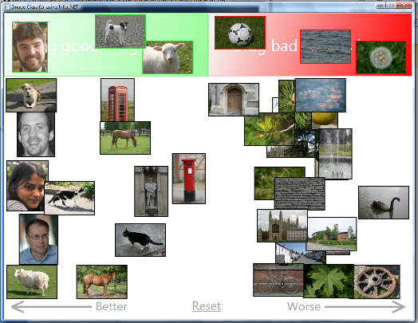

---
layout: default 
--- 
[Infer.NET user guide](index.md) : [Tutorials and examples](Infer.NET tutorials and examples.md)

Page 1 \| [Page 2](Image classifier model.md) \| [Page 3](Image classifier test model.md) \| [Page 4](Image classifier inference.md)

## Image classifier example

This example shows how to build a two-class Bayes point machine and apply it to an image classification problem. (A robust, general purpose implementation of a Bayes point machine classifier is described [here](Learners/Bayes Point Machine classifiers.md)). The Bayes point machine is general and could be used in many different applications - that code is described in detail later. First we discuss the application. When you run the application, the first thing you see is a window containing around 3 dozen images, and along the top of the window, a green area and a red area to drag the images. The user drags one or more images to the good or bad areas - each time this happens, you are creating a good (green) or bad (red) label for the particular image. These labelled images serve as examples, and the application learns from these examples and provides an assessment of the goodness or badness of all the unlabelled images. How far to the left or right an unlabelled image appears is a measure of the degree to which the classifier thinks it is good or bad.

Here is example where three example images have been dragged to the green area, and three to the red area. Each time an image is dragged, the model is updated, and the unlabelled images shift around.

Here, the left-hand images tend to be faces, animals and grass, and the right hand side is concentrating on roundness, water, and buildings. The overall colour in the image is encoded in the features and will also have an effect on the classification. The features that are used to represent the images are described in the next section.

#### Solution Files

This sample code along with a Visual Studio solution can be found in the [src\\Examples\\ImageClassifier folder](https://github.com/dotnet/infer/tree/master/src/Examples/ImageClassifier). The code files are in the ImageClassifier subfolder, and are as follows:

| | |
|-|-|
| BayesPointMachine.cs | The class that defines the Bayes Point Machine and provides methods for performing inference. This code is general and could be used in your own application if appropriate. |
| ClassifierView.xaml ClassifierView.xaml.cs | XAML code for defining the graphical interface, and handler code for handling user interaction with the interface. This code defines the ClassifierView class. |
| ItemsModel.cs | The class that manages the data items and runs the model for the application. This class is instantiated from ClassifierView.cs based on user actions, and itself calls into the Bayes Point Machine with the correct data. |
| Form1.cs, Form1.resx Form1Designer.cs | This form (which is not visible) is created on start-up and does all the one-time calculations such as loading the data, normalising the data, loading the images represented by the data, and creating the Bayes Point Machine. It also provides a background worker for training the model. |

There are also several data files which are contained in the Images subfolder. These are:  

| | |
|-|-|
| *.jpg | The raw image files. |
| labels.txt | The labels for each of the image files. Each image has been tagged with a subset of labels. The full label set is {face, building, tree, manmade, water, grass, bird, animal, apple, round, fountain, cat, flower, sheep, dog, horse, road, door}. |
| features.txt | The feature vectors for the images. Each feature vector comprises of two real numbers encoding the overall colour content in the image, addended with a vector of 1's and 0's encoding the presence or absence of a given tag. Finally a 1 is appended to each vector - this acts as a constant input which allows the model to learn an overall bias. We could also build this directly into the model, but it makes for a simpler model to have this appended to the data vector. |
| images.txt | A list of file names for the raw images. |

 
Page 1 \| [Page 2](Image classifier model.md) \| [Page 3](Image classifier test model.md) \| [Page 4](Image classifier inference.md)
