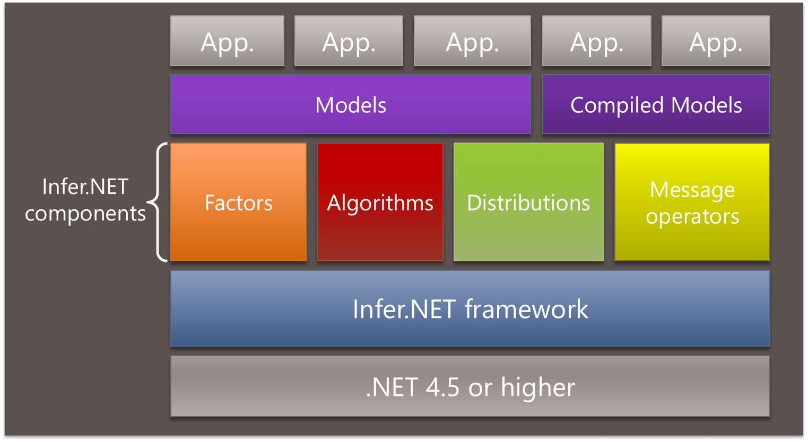

---
layout: default 
--- 
[Infer.NET user guide](index.md)

## Infer.NET component architecture

The Infer.NET architecture is entirely based around _inference components_. There are a large number of built-in components supplied with Infer.NET, but the main advantage of the component architecture is that you can also add your own. Components come in four types:

*   **Factors (and constraints)** \- the basic building blocks of models. 
    [Built-in factors](Factors and Constraints.md) | [Add a custom factor](How to add a new factor and message operators.md) | [Add a custom constraint](How to add a new constraint.md).
*   **Algorithms** \- the algorithms used to perform inference. Adding a custom algorithm is not yet supported since the internal API to do this is still changing frequently. 
    [Built-in algorithms](Working with different inference algorithms.md)
*   **Distributions** \- the distributions used to express uncertainty in a random variable. 
    [Built-in distributions](Distribution factors.md) | [Add a custom distribution](How to add a new distribution type.md)
*   **Message operators** \- these are the atomic operations of an algorithm. Typically, you need a message operator for each factor for each algorithm. 
    [Add custom message operators](How to add a new factor and message operators.md)

The diagram below shows how these components fit into the Infer.NET architecture.

