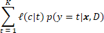
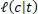
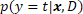

---
layout: default 
--- 
[Infer.NET user guide](../../../index.md) : [Learners](../../../Infer.NET Learners.md) : [Bayes Point Machine classifiers](../../Bayes Point Machine classifiers.md) : [The Learner API](../API.md)

## Prediction

Once a Bayes Point Machine classifier has been trained, you can use it to make predictions on unseen instances. The predictions produced by the Bayes Point Machine classifiers always come in the form of distributions over class labels, showing how certain or uncertain the classifier is. In most scenarios it is extremely useful to know this uncertainty. In medical diagnosis, for instance, you do not just want to know whether or not you have disease A or B or C. You really want to know how likely each possible disease is given your symptoms (and you may have symptoms of more than one disease!).

### Bulk prediction

Making predictions for a given set of instances, let's call it `testSet`, is simple:

```csharp
var predictions = classifier.PredictDistribution(testSet);
```

predictions will be returned as a collection of distributions. The type of a distribution is dependent on whether you use a binary or multi-class classifier and on whether data is delivered in native or standard format. In the latter case, when data is provided in standard format, the predicted distributions are of type `IDictionary<TStandardLabel, double>`. If a native data format mapping is used instead, predictions will be returned as a collection of `Bernoulli` or `Discrete` distributions (for binary and multi-class classification, respectively).

### Singleton prediction

For convenience, the Bayes Point Machine classifier also provides a method to make a prediction for a single instance. Dependent on the implementation of the classifier's mapping, this is either achieved by selecting the instance from the given set

```csharp
var prediction = classifier.PredictDistribution(23, testSet);
```

or, if the instance of interest contains all its feature values, by providing the entire instance object itself

```csharp
var prediction = classifier.PredictDistribution(instance);
```

In both cases, prediction will be either of type `Bernoulli` or `Discrete` (binary and multi-class classification of data in native format) or of type `IDictionary<TStandardLabel, double>` (standard data format).

Please note that features which have not been specified at the time of construction of the classifier (via its mapping) will be _ignored_ during prediction.

### Predictive point estimation

Even though there are compelling reasons for understanding how uncertain the classifier is about individual predictions, there are many circumstances in which a _precise_ classification is desired and one is required to _choose_ a particular class. If this is the case, it can be shown that the _optimal decision_ is to choose the class which minimizes



where  is the loss suffered for predicting the class with label  when in fact the actual true class has label , and where  is the probability of class  for given instance , as provided by  `PredictDistribution`` after the classifier has been trained on data .

Please note:

1.  The computation of the predictive distribution is a necessary intermediate step when choosing a particular class.
2.  The optimal class is not necessarily the most probable class.
3.  Changing the loss function does not require to re-compute the predictive distribution.

There are a number of loss functions  which may be used to make a precise classification. One of the most natural is arguably the 0/1 loss function which minimizes classification error. It is defined as 0 if  and as 1 otherwise. In many practical applications, the loss suffered may not be the same across all classes, in which case one may resort to using an asymmetric loss function. If classes have an inherent ordering, you may consider squared or absolute loss functions (note that the Bayes Point Machine [model](../Modelling.md) assumes that the classes have no ordering!).

Using the Bayes Point Machine classifiers, it is easy to get a precise classification, also known as a (predictive) point estimate, for a given instance or set of instances:

```csharp
var predictedLabel = classifier.Predict(instance);
```

or

```csharp
var predictedLabels = classifier.Predict(testSet);
```

By default, `Predict` minimizes classification error. To use a different kind of loss, you only need to change the `SetPredictionLossFunction` [setting](Settings.md).
