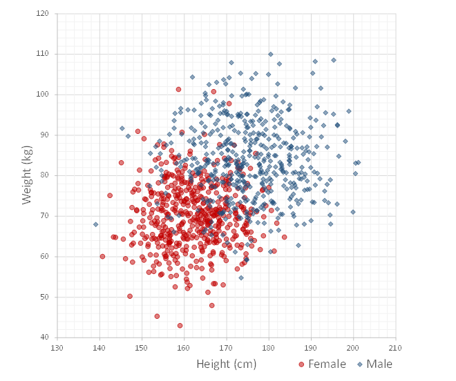
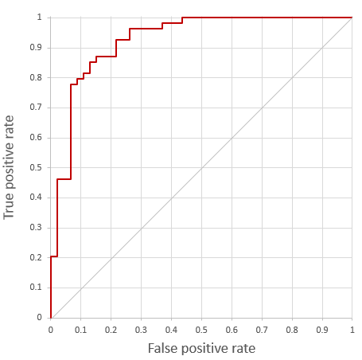

---
layout: default 
--- 
[Infer.NET user guide](../../index.md) : [Learners](../../Infer.NET Learners.md) : [Bayes Point Machine classifiers](../Bayes Point Machine classifiers.md)

## Gender prediction: A tutorial introduction

This tutorial provides a brief, step-by-step introduction on how to create, train and test a Bayes Point Machine classifier using the C# API.

If you just want to try out the Bayes Point Machine classifier and you can afford to provide data in a specific format in text files without worrying about ultimate performance, you may want to take a look at the [command-line runners](Runners.md).

### Predicting gender from height and weight

For the purposes of this tutorial, let's imagine that we would like to predict the gender of a person given their height and weight. Let's further assume that we already collected measurements for a sample of size N = 1000, and that we know the gender for each individual in the sample. The below figure visualizes the sample that we shall be dealing with here:



The sample contains the measurements for 508 women (red) and 492 men (blue). The average female height in the sample is 162cm and the average male height is 175.2cm. The average female weight is 70.1kg, the average male weight is 83.8kg. As one would expect, the figure shows considerable overlap in the measurements of both groups. This means that one cannot hope to perfectly discriminate between men and women given their height and weight.

Now, given this data, how likely is it that a person of height 183cm and weight 78kg is a woman?

One way to solve a problem like this is to create a _probabilistic model_. Infer.NET lets you specify a large variety of models. For the classification problem described, we have already specified a general and robust model for you, so you do not have to do that work. However, the model we created, the Bayes Point Machine (BPM) classifier, does make a number of assumptions that you may want to be aware of (see [The probabilistic model](Modelling.md)). If these assumptions are not satisfied in your case, you could consider creating a probabilistic model of your own which better fits your situation!

### Getting started in Visual Studio

In the following, we shall answer the above question using the Infer.NET Bayes Point Machine classifier. To do this, we will first have to set up a solution in Visual Studio:

1.  Open Microsoft Visual Studio.
2.  Click on "New Project" and pick "Console Application". Name your application "BayesPointMachineTutorial".
3.  Right-click on "References", choose "Add Reference..." and add the following three assemblies  

    *   Microsoft.ML.Probabilistic.Learners.dll
    *   Microsoft.ML.Probabilistic.Learners.Classifier.dll
    *   Microsoft.ML.Probabilistic.dll

    by browsing to the bin directory in the Infer.NET release.

### Data

Let's say we represent the data as follows. The height and weight of each person are stored in memory as instances of type Vector  (see `Microsoft.ML.Probabilistic.Math`) and the corresponding gender is lives in objects of type `string` whose values are either "Female" or "Male". The entire sample hence comprises an array of 1000 (dense) `Vector` objects and an array of 1000 objects of type `string`.

A word of _warning_:

1.  The Bayes Point Machine classifier model does not explicitly specify a _bias_. Adding a bias, however, is critical in many classification problems as it makes the Bayes Point Machine classifier invariant to a translation of the features (i.e. decision boundaries do not need to go through the feature origin any longer), thus crucially affecting prediction performance. A bias in the BPM classifier can be implemented by adding a feature that always has the value 1. If your classification data does not already contain such a constant feature, it is very likely you want to _add it_ to the feature vector.

2.  Training of the Bayes Point Machine classifier may exhibit _slow convergence_ if features (including the bias) are _highly correlated_.


In the present gender prediction example, let us hence use an augmented three-dimensional feature vector, containing not only the height and the weight of a person, but also an additional feature value of 1. Moreover, let us subtract the mean height and weight from the height and weight features. This removes the correlation between the bias and the height and weight, respectively.

### Mapping

Data can be stored in a variety of different formats. Typically the format of your data will be inconsistent with the type of data that a learner expects. This means that you have to convert the original data into the format of the learner. This is certainly a reasonable option for small test cases, but for large real-world data sets, it may be costly to do this conversion. Instead of forcing the input data to be of a fixed type, the Infer.NET learners provide you with a flexible mechanism which allows you to specify how the learner should consume their input data. This mechanism is called a _mapping_. A mapping defines how input data is passed to the Infer.NET learner. Since it lets you choose the most convenient format, it helps avoid unnecessary data conversions.

There are two different kinds of mappings available for the Bayes Point Machine classifier that are explained in more detail in [Mappings](API/Mappings.md). In our simple introductory example, the easiest way to map the above input data into a form that is understood by the Bayes Point Machine classifier is to implement the `IClassifierMapping` interface:

```csharp
///<summary>  
/// A mapping for the Bayes Point Machine classifier tutorial.  
///</summary>  
public class ClassifierMapping   
    : IClassifierMapping<IList<Vector>, int, IList<string>, string, Vector>  
{  
    public IEnumerable<int> GetInstances(IList<Vector> featureVectors)  
    {  
        for (int instance = 0; instance < featureVectors.Count; instance++)  
        {  
            yield return instance;  
        }  
    }  

    public Vector GetFeatures(int instance, IList<Vector> featureVectors)  
    {  
        return featureVectors[instance];  
    }  

    public string GetLabel(  
        int instance, IList<Vector> featureVectors, IList<string> labels)  
    {  
        return labels[instance];  
    }  

    public IEnumerable<string> GetClassLabels(  
        IList<Vector> featureVectors = null, IList<string> labels = null)  
    {  
        return new[] { "Female", "Male" };  
    }  
}
```

To implement the `IClassifierMapping` interface, we thus need to specify

*   which instances are present in the batch of data delivered to the classifier (`GetInstances`);
*   how to get the feature values for a given instance (`GetFeatures`);
*   how to get the ground truth label for a given instance (`GetLabel`);
*   the complete set of distinct class labels present in the data (`GetClassLabels`).

### Creating a Bayes Point Machine classifier

With this mapping in hand, it is now straightforward to create a Bayes Point Machine classifier:

```csharp
// Create the Bayes Point Machine classifier from the mapping  
var mapping = new ClassifierMapping();  
var classifier = BayesPointMachineClassifier.CreateBinaryClassifier(mapping);
```

### Training

We can use the classifier to learn and predict gender from height and weight. To train the Bayes Point Machine on our sample of 1000 artificially generated measurements, we write

```csharp
// Train the Bayes Point Machine classifier on the gender data  
classifier.Train(trainingSet.FeatureVectors, trainingSet.Labels);
```

where `trainingSet.FeatureVectors` is an array of type `Vector` which contains height and weight measurements as well as a bias and `trainingSet.Labels` is an array of strings indicating gender.

Note that you do not need to set any parameters, such as prior distributions over weights, to train the classifier. This is because the Bayes Point Machine is essentially _hyper-parameter free_! Not only does this avoid a misspecification of parameters, it also removes the need for time-consuming parameter tuning! Even better: it is not even necessary to normalize the input data as the Bayes Point Machine automatically adapts to the different scales in the observed features. All of this is made possible by _heavy-tailed prior distributions_ over weights (see the section on [modelling](Modelling.md) for more on this).

### Prediction

Having trained the Bayes Point Machine, we are able to predict gender for previously unseen height and weight measurements. In particular, we can answer our initial question of how likely it is that a person of height 183cm and weight 78kg is a woman.

To do so, we write

```csharp
// Making predictions on previously unseen data  
var predictions = classifier.PredictDistribution(testSet.FeatureVectors);
```

where `testSet.FeatureVectors` is an array containing a single Vector which consists of the _centred_ height and weight feature values for 183cm and 78kg (and a constant which acts as _bias_).

Calling `PredictDistribution` returns a (`Bernoulli`) distribution for each instance in the test set, reflecting the fact that we cannot usually be certain about the gender of a person given only her height and weight. In particular, we have

```
P(gender = 'Female' | height = 183cm, weight = 78kg) = 0.07
```

So someone who is 183cm tall and who weighs 78kg is female with a probability of 7% (based on the 1000 observations present in our training set).

In many situations, you may be required to choose a precise answer when making a prediction. Instead of calling `PredictDistribution`, you then simply call Predict. To get an answer for the first instance in the test set, we write

```csharp
// Making decisions  
string estimate = classifier.Predict(InstanceOfInterest, testSet.FeatureVectors);
```

Since the first instance in the test set corresponds to the person of height 183cm and weight 78kg, this yields

```
Male
```
Note that such a precise classification still requires the computation of the predictive distribution as an intermediate step. Moreover, the optimal precise answer is not necessarily the most probable class (more on this in [Prediction](API/Prediction.md)).

### Evaluation

To evaluate the predictions of a classifier we need to avail ourselves with some labelled data distinct from the training set. Let's therefore assume that we have access to a test set of 100 additional height and weight measurements together with their corresponding true gender records.

An evaluation is carried out via a `ClassifierEvaluator`, which can be created as follows:

```csharp
// Create an evaluator for mapping  
var evaluatorMapping = mapping.ForEvaluation();  
var evaluator =   
    new ClassifierEvaluator<IList<Vector>, int, IList<string>, string>(  
        evaluatorMapping);
```

A `ClassifierEvaluator` follows the learner design and requires the specification of `IClassifierEvaluatorMapping` mapping. Fortunately, we can easily create a `IClassifierEvaluatorMapping` from the previously implemented `IClassifierMapping` by calling the `ForEvaluation` extension method on it.

`ClassifierEvaluator` provides many of the evaluation metrics that are popular in classification. For instance, to compute the number of classification errors and the area under the receiver-operating characteristic (ROC) curve, we can write

```csharp
// Evaluate on test set  
var predictions = classifier.PredictDistribution(testSet.FeatureVectors);  
IEnumerable<string> estimates = classifier.Predict(testSet.FeatureVectors);  

double errorCount = evaluator.Evaluate(  
    testSet.FeatureVectors, testSet.Labels, estimates, Metrics.ZeroOneError);  

double areaUnderRocCurve = evaluator.AreaUnderRocCurve(  
    "Female", testSet.FeatureVectors, testSet.Labels, predictions);
```

which yields

```
Accuracy = 0.85  
AUC = 0.926
```

`ClassifierEvaluator` also allows you to get the receiver operating characteristic curve itself (for "Female"  as the designated positive class):

```csharp
IEnumerable<Pair<double, double>> rocCurve =   
    evaluator.ReceiverOperatingCharacteristicCurve(  
        "Female", testSet.FeatureVectors, predictions);
```



To find out more about classification evaluation, click [here](API/Evaluation.md).

### Summary and overview over remaining sections

We have given a very brief overview of the Infer.NET Bayes Point Machine learner, a Bayesian classifier which does not require parameter tuning or feature normalization. In particular, we have seen how to

*   create a Bayes Point Machine classifier from a data mapping;
*   train it;
*   make predictions on previously unseen data;
*   make decisions based on the predictions; and
*   evaluate the predictions using different performance metrics.

In the following section, [Learner API](API.md), we will discuss these features in more detail. We will also describe many features that we have not dealt with in this introduction, such as

*   multi-class classification;
*   incremental training;
*   batched (i.e. limited-memory) training;
*   evidence computation;
*   serialization; and
*   settings.

[Section 3](Modelling.md) then explains the probabilistic model underlying the Bayes Point Machine classifier. [Section 4](Runners.md) provides an overview of the command-line runner modules which allow you to use the Bayes Point Machine classifier without writing any code.
