---
layout: default 
--- 
[Infer.NET user guide](../../index.md) : [Learners](../../Infer.NET Learners.md) : [Bayes Point Machine classifiers](../Bayes Point Machine classifiers.md)

## The Bayes Point Machine: A probabilistic model for classification

We are interested in finding a general and robust procedure to predict the class  to which an instance of interest belongs, given relevant feature values  of this instance and the information in , the training set of observed class labels and corresponding feature values.

It can be shown that the only coherent solution to the classification problem is to provide the predictive distribution 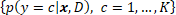 over classes, conditional on  and . In the following we provide a direct specification of the predictive distribution 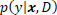 based on a set of assumptions. The derived classification model thus falls into the _discriminative_ paradigm.

### Binary classification

For simplicity, we will start by describing the model for the case of two class labels 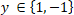. The model is defined by the following assumptions:

**Assumption 1: The feature values  are always fully observed.**

This means that it must _always_ be possible to compute _all_ feature values. If features are missing for some instances, you will either have to fill in the missing values in a pre-processing step, or use a different model for classification.

**Assumption 2: The order of instances does not matter.**

That is, instances are assumed to be _exchangeable_. As a result of this assumption, the predictive distribution 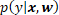 is characterized, for any given , by the same _latent_ parameters , also referred to as _weights_.

If the predictive distribution varies with time, for example in the stock market, then you will need to expand  to include time information or use a different model for classification (such as a time-series model).

**Assumption 3: The predictive distribution is a _linear discriminant_ function.**

We assume the predictive distribution to have a parametric density of the form

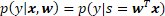

where  is called the score of the instance.

**Assumption 4: Additive Gaussian noise.**

To allow for _measurement_ and _labelling error_, we add Gaussian noise to the score:

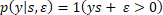 with  and 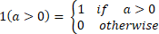

This is also known as a _probit regression_ model.

The model up to this point, represented as a factor graph, is depicted below:

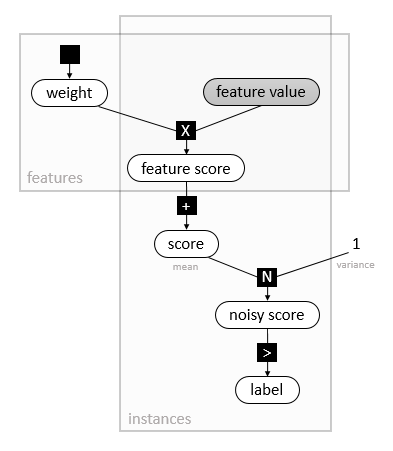

**Assumption 5: Factorized heavy-tailed prior distributions over weights .**

Finally, by specifying the prior distribution 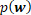, we complete the probabilistic model for the Bayes Point Machine classifier. We use a _heavy-tailed_ prior, a normal distribution whose precision is itself a mixture of Gamma-Gamma distributions  (as illustrated in the factor graph below, where  denotes a Gamma density for given shape and rate). Compared with a Gaussian prior, the heavy-tailed prior is more _robust towards outliers_, i.e. feature values which are far from the mean of the weight distribution, 0. It is _invariant to rescaling_ the feature values, but not invariant to their shifting (to achieve the latter, the user must add a _bias_ \- a constant feature value - for all instances). Due to the factorized structure of , features should be as _uncorrelated_ as possible.

### Multi-class classification

The multi-class model is very similar to the described binary Bayes Point Machine model. Instead of a single linear discriminant function, there are now  functions with their respective weight vectors  and scores 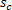, one for each class 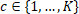. The maximum (noisy) score then determines the class .

**Assumption 6: Class labels have no inherent ordering.**

The multi-class model _assumes_ that the class labels have _no inherent ordering_, and is thus invariant to permuting the set of labels. If the labels in your problem have an order, then you can still use this model, even though you might benefit from a different model.

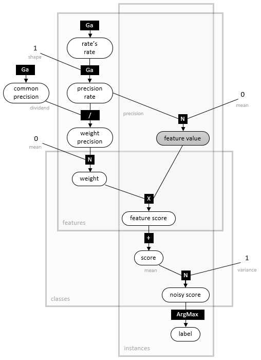

With appropriate _symmetry-breaking_, using the multi-class model with 2 classes is equivalent to the binary model described above. However, an exception will be thrown if you try this. Finally, the _computational cost of prediction_ in the multi-class model is quadratic in the number of classes , making it less ideal a choice where  is large.

### Source code

The Infer.NET code for the previously described classification models lives in the `Learners/ClassifierModels` project. The project uses the Infer.NET compiler to generate dedicated training and prediction algorithms from the models.

### References

*   Herbrich, R., Graepel, T. and Campbell, C. (2001). [Bayes Point Machines](http://jmlr.org/papers/v1/herbrich01a.html). _Journal of Machine Learning Research_ **1**, 245-279.
*   Minka, T. (2001). [Expectation Propagation for approximate Bayesian inference](https://tminka.github.io/papers/ep/). _Uncertainty in Artificial Intelligence_, 2001, 362-369.
