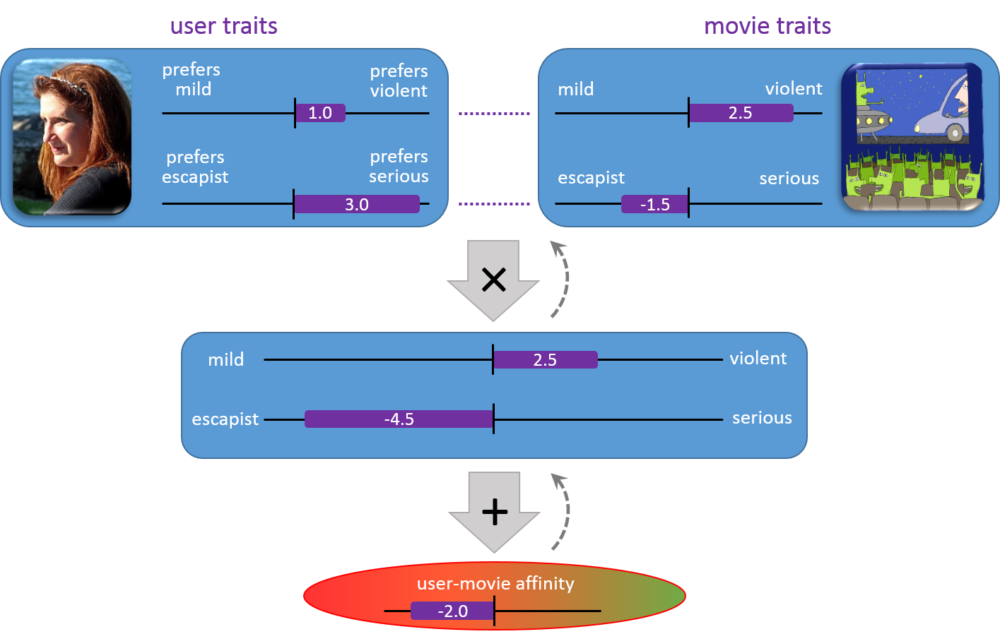

[Learners](../Infer.NET Learners.md) : [Matchbox recommender](../Matchbox recommender.md)

## Introduction

The aim of a recommendation system is to recommend one or more "items" to "users" of the system. Examples of an item could be a movie, restaurant, book, or song, etc. A user could be a person, group of persons, or other entity that can express preferences.

There are two major types of recommender systems. The first is the content-based approach, which makes use of descriptions (feature vectors) for both users and items. Users may be described by properties such as age and gender, and items may be described by properties such as author and manufacturer. Typical examples of content based recommendation systems can be found in the social matchmaking sites. The second approach is collaborative filtering, which uses only identifiers of the users and the items and obtains implicit information about these entities from a (sparse) matrix of ratings given by the users to the items (example given in the diagram below). We can learn about a user by the items they have rated and the users who have rated items in common with them.

The Matchbox recommender combines the two approaches described above, and therefore is considered a hybrid recommender. When a user is relatively new to the system, predictions are improved by making use of the feature information about the user, thus addressing the well-known "cold-start" problem. However, once we have a sufficient number of ratings from a particular user we can make fully personalized predictions for the them based on their specific ratings rather than on their features.

A detailed explanation of the Matchbox model is given later in the documentation, but here we will introduce the basic concepts. This model attempts to map the users and items to a low-dimensional latent space called the "trait space". A fixed number of "traits" is learned for each user and item. The traits can be thought of as implicitly learned features and are not to be confused with the user and item features, which are explicitly supplied (user age and gender or item author and manufacturer). The model is only provided only with the number of traits to use, and it defines their meaning such that it can best explain the data. A simple example is given below.

Let's consider the movie recommendation scenario and set the number of traits to 2. It turns out that here the model is likely to define the two traits as "movie violence" and "movie seriousness". The provided rating is generated by the inner product of the two traits. On the one axis we have how much a user prefers violent movies which is matched with how violent the movie is. On the other axis we have how much a user prefers serious movies, which is matched with how serious the movie is. Note that during training the ratings are given and Infer.NET is used to infer the user and item traits, while in prediction the traits are given and the affinity between a user and an item is computed as the inner product of their corresponding traits.

 Once we have the users and items mapped to the low-dimensional trait space, we can do one of four things. As explained above, we can compute the affinity between a user and an item, threshold it to some value and make a rating prediction. We can also compute all such affinities between a given user and all items, order them from high to low affinity, and thus produce a list of item recommendations. Instead of computing the affinity between users and items, we can also compute the affinity between an item and other items. Since they live in the same trait space, the inner product is computed in a similar way. By doing this, we can produce a list of items related to a given item. Similarly, in the social scenario, we can produce a list of users related to a given user. Note that in this setup two items are considered "related" if they are likely to be rated similarly by a random user, and two users are "related" if they are likely to rate similarly a random item.

Note that this simplified example only touches a part of the model parameters - the traits. A full description of the model can be found in the [Model](Model.md) section.
