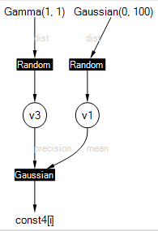

---
layout: default 
--- 
[Infer.NET user guide](index.md) : [Tutorials and examples](Infer.NET tutorials and examples.md)

## Tutorial 3: Learning a Gaussian

This tutorial shows how to use _ranges_ to deal with large arrays of data, and how to visualise your model.

You can run the code in this tutorial either using the [Examples Browser](The examples browser.md) or by opening the Tutorials solution in Visual Studio and uncommenting the lines to execute [LearningAGaussian.cs](https://github.com/dotnet/infer/blob/master/src/Tutorials/LearningAGaussian.cs) and [LearningAGaussianWithRanges.cs](https://github.com/dotnet/infer/blob/master/src/Tutorials/LearningAGaussianWithRanges.cs).  Code is also available in [F#](https://github.com/dotnet/infer/blob/master/test/TestFSharp/GaussianwithRanges.fs) and [Python](https://github.com/dotnet/infer/blob/master/test/TestPython/test_tutorials.py).

### Thinking big

Because real world applications involve large amounts of data, Infer.NET has been designed to work efficiently with large arrays. To exploit this capability, you need to use a `VariableArray` object rather than an array of `Variable` objects. This tutorial demonstrates the performance difference between these two options.

In this example, our data will be an array of 100 data points sampled from a Gaussian distribution. This can be achieved using the handy Rand class in the **Microsoft.ML.Probabilistic.Math** namespace which has methods for sampling from a variety of distributions.
```csharp
// Sample data from standard Gaussian  
double[] data = new double[100];  
for (int i = 0; i < data.Length; i++)
  data[i] = Rand.Normal(0, 1);
```
The aim will be to estimate the mean and precision (inverse variance) of this data. To do this, we need to create random variables for each of these quantities and give them broad prior distributions:
```csharp
// Create mean and precision random variables  
Variable<double> mean = Variable.GaussianFromMeanAndVariance(0, 100);  
Variable<double> precision = Variable.GammaFromShapeAndScale(1, 1);
```
Now we need to tie these to the data. The simple, but inefficient, approach is to loop across the data observing each data element to be equal to a Gaussian random variable with mean **mean** and precision **precision**.
```csharp
for (int i = 0; i < data.Length; i++)  
{  
 Variable<double> x = Variable.GaussianFromMeanAndPrecision(mean, precision);  
 x.ObservedValue = data[i];  
}
```
We can now use an inference engine to infer the posterior distributions over **mean** and **precision**.
```csharp
InferenceEngine engine = new InferenceEngine();// Retrieve the posterior distributions  
Console.WriteLine("mean=" + engine.Infer(mean));  
Console.WriteLine("prec=" + engine.Infer(precision));
```
This complete program (**LearningAGaussian.cs**) executes and gives the correct answer. However, model compilation takes a large portion of the total time (around 1 second to compile and 0.5 seconds for inference). Worse, compilation time will scale linearly with the size of the array and so 1000 points would take ten times longer!  This is because the loop is being unrolled internally, which we need to avoid.

### A speed-up

To handle the array of data efficiently, we need to tell Infer.NET that the data is in an array. We must first create a **range** to indicate the size of the array. A range is a set of integers from 0 to N-1 for some N which can be created using **Range(N)** as follows:

```csharp
Range dataRange = new Range(data.Length).Named("n");
```

We can now use this range to create an array of variables 

```csharp
VariableArray<double> x = Variable.Array<double>(dataRange);
```

To refer to each element of the array, we index the array by the range i.e. we write **x\[dataRange\].** We can specify that each element of the array is drawn from Gaussian(**mean**, **precision**) using the code: 

```csharp
x[dataRange] = Variable.GaussianFromMeanAndPrecision(mean, precision).ForEach(dataRange);
```

Finally we attach the data to this array by setting its **ObservedValue**: 

```csharp
x.ObservedValue = data;
```

Notice that we have built the model _without_ using a loop, by using the **ForEach()** construct. In fact, by replacing the loop above, we get a new program (**LearningAGaussianWithRanges.cs**) which runs much faster - only 0.1s for compilation and 0.3s for inference - a 4x speed-up.

 

_**See also:** [Working with arrays and ranges](Arrays and ranges.md)_

Compare the two versions in the [Examples Browser](The examples browser.md) with _Timings_ selected to see this for yourself.

The general rule is: **"Use VariableArray rather than .NET arrays whenever possible."**

### Visualising your model

Infer.NET allows you to visualise the model in which inference is being performed, in the form of a _factor graph_. To see the factor graph, set the **ShowFactorGraph** property of the inference engine to true (or select Show: Factor Graph in the examples browser). The factor graph will then be displayed whenever a model is compiled. For the second model above, this gives something like:  



Random variables appear as circles, factors appear as filled squares, and observed variables or constants appear as bare text. The edges of the graph are labelled in grey to distinguish between different arguments of a factor. For example, the Gaussian factor has arguments named "mean" and "precision" which are labelled in grey (these names are separate from the variable names). The actual mean and precision variables are given the odd names "v1" and "v3" since no names were provided in the code. You can override these names by using **Named("newname")**, for example

```csharp
Variable<double> mean = Variable.GaussianFromMeanAndVariance(0, 100).Named("mean");
```

Below is the factor graph when **mean**, **precision** and **data** have been named. Naming variables gives them the correct name in generated code, error messages, and factor graphs. Names must be unique or you will get an exception when you try to run inference.


In the [Examples Browser](The examples browser.md), trying viewing the factor graph for the unrolled example above (**LearningAGaussian.cs**). You will see what effect unrolling has!

When you're ready, try the [next tutorial](Bayes Point Machine tutorial.md).
