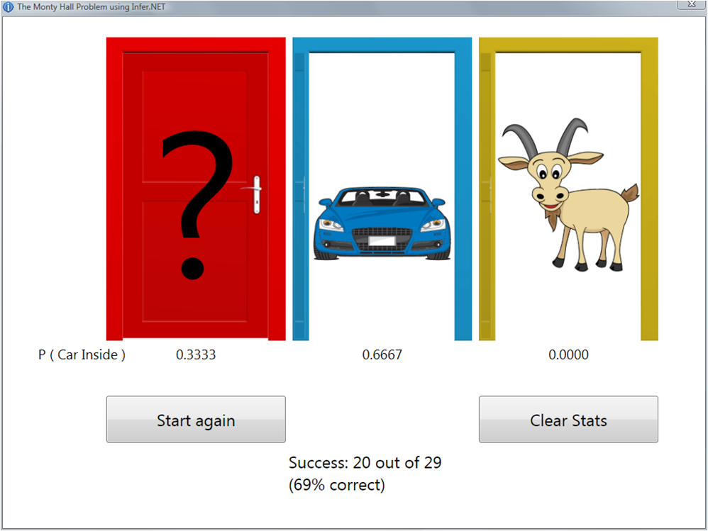

---
layout: default 
--- 
[Infer.NET user guide](index.md) : [Tutorials and examples](Infer.NET tutorials and examples.md)

## Monty Hall problem

This provides an Infer.NET implementation of the [Monty Hall problem](http://en.wikipedia.org/wiki/Monty_Hall_problem), along with a graphical user interface. The code and a Visual Studio solution can be found in the [src\\Examples\\MontyHall folder](https://github.com/dotnet/infer/tree/master/src/Examples/MontyHall).

