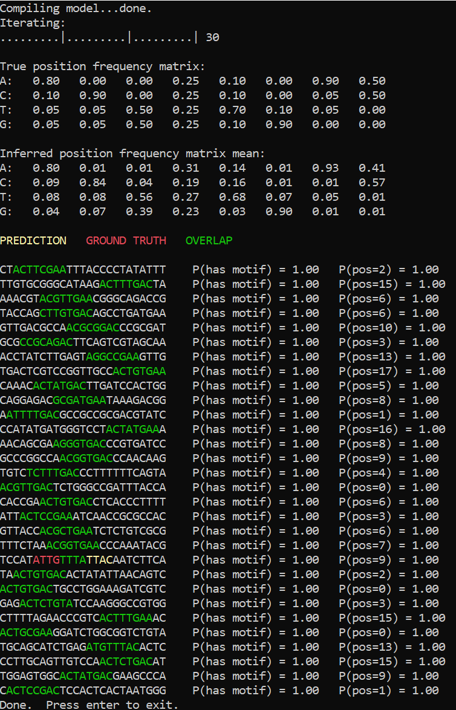
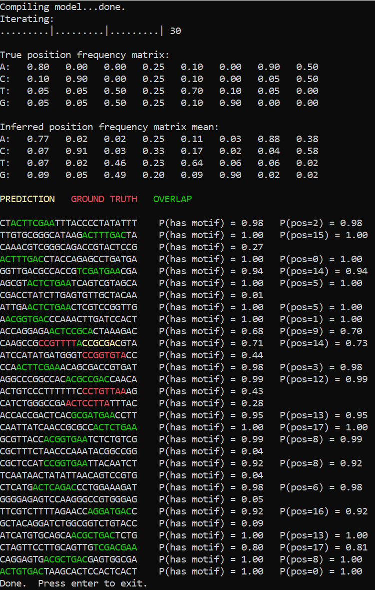

---
layout: default 
--- 
[Infer.NET user guide](index.md) : [Tutorials and examples](Infer.NET tutorials and examples.md)

## Strings Tutorial 3: Motif Finder

This page describes an experimental feature that is likely to change in future releases

In this tutorial we'll implement a simple model for finding motifs in nucleotide sequences, which constitutes an important problem in bioinformatics.

This sample code along with a Visual Studio project can be found in the [`src\Examples\MotifFinder`](https://github.com/dotnet/infer/tree/master/src/Examples/MotifFinder
) folder.

### What is a motif finder

In genetics, a [sequence motif](http://en.wikipedia.org/wiki/Sequence_motif) is a widespread pattern in a set of nucleotide or amino-acid sequences that is likely to have some biological significance. The problem of motif finding is to discover such a common pattern in a given set of sequences, that are usually known to share some common property. It can be then conjectured that the found shared pattern contributes to implementing that property. The pattern can slightly differ from sequence to sequence due to variance introduced by biological replication mechanisms, but nevertheless we expect to see some common structure. For instance, for the set of strings

```
CCTATCGA

TATGGTAA

AGATATAG

ATATTGCG
```

one can argue that the common pattern is TAT*G. Note that the 4-th character of the pattern varies between strings, so it may seem at first that the length of the motif is 3. However, since the 5-th character is always the same, the length of the motif is likely to be 5, the 4-th character being a point of variability.

In this tutorial, our job will be to define a generative model of nucleotide sequences (essentially, strings consisting of 'A', 'C', 'T' and 'G' characters) containing a motif, and then perform backward inference to determine the motif from the sequences.

### Basic model

The generative model we're going to use in this tutorial is as follows. For each sequence we'll first determine the position of the motif in it, assuming it's uniformly distributed across possible positions. We will then sample the nucleotides corresponding to the motif from the motif model, and the rest of the sequence from the background model. For the purpose of clarity, we'll also make a number of simplifying assumptions in this tutorial: all sequences will be of the same length, and the motif length will be assumed to be known in advance.

_**See also:** [Variable types and their distributions](Variable types and their distributions.md)_

We can define the model of a motif by a position frequency matrix. It is a matrix that for each position in the motif stores the probability of encountering a particular nucleotide at that position, and, so, serves as a generative model for the motif. This matrix can also be thought of as defining the structure of the pattern we're looking for, so inferring it will give us the distribution over the patterns possible in light of the data. Since we're going to infer the position frequency matrix, it is a random variable, and, therefore, needs a prior. Every row of the matrix is a probability vector defining a discrete distribution over the nucleotides, so we can use [Dirichlet](http://en.wikipedia.org/wiki/Dirichlet_distribution) distribution as a prior of a row. The `Dirichlet` distribution is a distribution over probability vectors. When used as a prior, it effectively specifies how many times a certain outcome (a particular nucleotide at a given motif position in our case) has been observed "in the past", before we got any data about the probability vector. These numbers, called pseudo-counts, can take any positive real value, not just integer values.

```csharp
Vector motifNucleobasePseudoCounts = PiecewiseVector.Constant(char.MaxValue + 1, 1e-6);  
motifNucleobasePseudoCounts['A'] = motifNucleobasePseudoCounts['C'] = motifNucleobasePseudoCounts['G'] = motifNucleobasePseudoCounts['T'] = 1.0;  

Range motifCharsRange = new Range(motifLength);  
VariableArray<Vector> motifNucleobaseProbs = Variable.Array<Vector>(motifCharsRange);  
motifNucleobaseProbs[motifCharsRange] = Variable.Dirichlet(motifNucleobasePseudoCounts).ForEach(motifCharsRange);
```

_**See also:** [Using sparse messages](using sparse messages.md)_

In this code **motifNucleobaseProbs** is the position frequency matrix, and **motifNucleobasePseudoCounts** is a `Dirichlet` pseudo-count vector shared between different positions. It should be noted that due to certain technical constraints all elements of a pseudo-count vector should be strictly positive, so we've used 1e-6 instead of zero for all letters that will never be present in data. We've also used a piecewise vector as the storage for the probabilities. It is currently the recommended format for storing vectors indexed by characters that are expected to be constant almost everywhere.

Our next step is to define variables for nucleotide sequences and motif positions in every sequence.

```csharp
var sequenceRange = new Range(SequenceCount);  
VariableArray<string> sequences = Variable.Array<string>(sequenceRange);  

VariableArray<int> motifPositions = Variable.Array<int>(sequenceRange);  
motifPositions[sequenceRange] = Variable.DiscreteUniform(SequenceLength - motifLength + 1).ForEach(sequenceRange);
```

Now we have all we need to define the generative process for a sequence. First, we will create a string variable containing the motif string for a particular sequence. We can do it by first sampling a character array using the position frequency matrix, and then converting this array to a string:

```csharp
var motifChars = Variable.Array<char>(motifCharsRange);  
motifChars[motifCharsRange] = Variable.Char(motifNucleobaseProbs[motifCharsRange]);  
var motif = Variable.StringFromArray(motifChars);
```

The **Variable.Char** method samples a character from the distribution induced by a given probability vector, and **Variable.StringFromArray** creates a string variable from an array of characters. Now that we have a motif string, we need to create the background part of the nucleotide sequence. To do that, we separately create variables for the background to the left and to the right of the motif, and then concatenate them to obtain the resulting sequence.

```csharp
var backgroundLengthRight = SequenceLength - motifLength - motifPositions[sequenceRange];  
var backgroundLeft = Variable.StringOfLength(motifPositions[sequenceRange], backgroundNucleobaseDist);  
var backgroundRight = Variable.StringOfLength(backgroundLengthRight, backgroundNucleobaseDist);  

sequences[sequenceRange] = backgroundLeft + motif + backgroundRight;
```

The **Variable.StringOfLength** method creates a random string which has the specified length. The second parameter of the method specifies a distribution over characters at a fixed position inside the string. If the parameter is not provided, the created string variable will have uniform distribution over all strings of the given length. This is not desirable in our case, since we want the background to contain 'A', 'C', 'T' and 'G' only. That is why we provide **backgroundNucleobaseDist**, a distribution which is uniform over the nucleotide letters. As a result, our background model assumes that the probability of seeing a particular nucleotide outside a motif is the same for all nucleotides. While this assumption doesn't usually hold in practice, it is a reasonable first approximation.

### Results

One way to test a model is to apply it to the data that has been generated using that model. It is in fact a very important test, one of the first a model developer should perform. Inference failure when observed data is known to follow the model may indicate a bad schedule, a bug in the model definition or even in the implementation of the inference engine itself. Another possibility is that the model in question has some pathology caused by, say, [non-identifiable variables](http://en.wikipedia.org/wiki/Identifiability).



Luckily, our motif finder doesn't have any such issues. The inference engine is able to reconstruct the position frequency matrix to a reasonable precision, and the inferred motif positions are mostly correct. The only error is caused by the background being more similar to the expected pattern than the motif itself.

### Motif presence and absence

_**See also:** [Branching on variables to create mixture models](Branching on variables to create mixture models.md)_

String random variables, as all other Infer.NET modeling elements, can be used with control flow statements to define mixtures. In order to try this, let's additionally assume that we expect some known percentage of sequences not to contain the pattern we're looking for: maybe the function shared by the sequences isn't always implemented in the same way, or some sequences got in the set by mistake. We can easily change the model to handle that by defining another array of random variables,

```csharp
VariableArray<bool> motifPresence = Variable.Array<bool>(sequenceRange);  
motifPresence[sequenceRange] = Variable.Bernoulli(MotifPresenceProb).ForEach(sequenceRange);
```

which will store whether the motif is present in a particular sequence. Now we can wrap the previous definition of **sequences\[sequenceRange\]** into

```csharp
using (Variable.If(motifPresence[sequenceRange]))
```

and add an alternative definition for the case when a sequence contains no motif:

```csharp
using (Variable.IfNot(motifPresence[sequenceRange]))  
{  
    sequences[sequenceRange] = Variable.StringOfLength(SequenceLength, backgroundNucleobaseDist);  
}
```

If we run inference on the data sampled from the model itself, for instance with 20% of sequences sampled from the background model, here is what we will get:



The number of errors has slightly increased due to the fact that motif strings that happen not to follow the expected pattern precisely can now be also interpreted as background. Nevertheless the position frequency matrix was inferred to a reasonable precision.

In this tutorial we had a brief introduction to another area where probabilistic models involving strings can be useful, bioinformatics. We saw how to define a complex model combining string, arrays, integer arithmetic and control flow statements.
