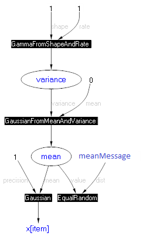

---
layout: default 
--- 
[Infer.NET user guide](index.md)

## Online learning

Bayesian inference makes it easy to update the parameters of a model as data arrives one at a time. In principle, you just use yesterday's posterior as today's prior. If the prior in your model has the same type as the posterior you are inferring, then this is straightforward. If the prior has a different type (for example it is specified using multiple factors and variables of its own), then you need a different approach. This document describes both methods.

As a concrete example, suppose you want to learn the mean of Gaussian as data arrives one at a time. If the prior for the mean is a fixed Gaussian distribution, then we are in the simple case. We’ll assume that the online learning is performed over a set of data batches, and the parameter _mean_ is shared across all of them. What you do after training on each data batch is to infer the posterior of _mean_ and plug it in as the new prior for the next batch. Thus, you can think of _meanPrior_ as the summary of what we’ve learnt “so far” (or “up to the current batch”).

When the prior is a more elaborate collection of factors and variables, you can no longer store your current knowledge in it in such a way. Suppose the variable _mean_ now has a Laplacian prior, i.e. a Gaussian distribution whose mean is zero but whose variance is drawn from a Gamma. The simple approach does not work here since the posterior will be projected onto a Gaussian but our desired prior is not Gaussian.

To process the batches sequentially, we need to add a new “accumulator” of our knowledge (an equivalent to what _meanPrior_ was used for in the non-hierarchical case). We’ll call this _meanMessage_. It stores the product of all messages sent to _mean_ by the previous batches. We’ll attach this variable to _mean_ by using the special factor _ConstrainEqualRandom_. This has the effect of multiplying _meanMessage_ into the posterior of _mean_. The resulting factor graph is shown below.



Initially, _meanMessage_ should be _Uniform_, since there are no previous batches. After each batch, you need to store there the message sent upward to _mean_, which also happens to be the marginal of _mean_ divided by its prior. Infer.NET has a special QueryType that gives you this ratio directly:

```csharp
meanMessage.ObservedValue = engine.Infer<Gaussian>(mean, QueryTypes.MarginalDividedByPrior);
```

However, you need to give the compiler a hint that you’ll be doing this:

```csharp
mean.AddAttribute(QueryTypes.MarginalDividedByPrior);
```

Here’s the complete code for online learning of a Gaussian with a Laplacian mean:

```csharp
Variable<int> nItems = Variable.New<int>().Named("nItems");  
Range item = new Range(nItems).Named("item");  
Variable<double> variance = Variable.GammaFromShapeAndRate(1.0, 1.0).Named("variance");  
Variable<double> mean = Variable.GaussianFromMeanAndVariance(0.0, variance).Named("mean");  
VariableArray<double> x = Variable.Array<double>(item).Named("x");  
x[item] = Variable.GaussianFromMeanAndPrecision(mean, 1.0).ForEach(item);  

Variable<Gaussian> meanMessage = Variable.Observed<Gaussian>(Gaussian.Uniform()).Named("meanMessage");  
Variable.ConstrainEqualRandom(mean, meanMessage);  
mean.AddAttribute(QueryTypes.Marginal);  
mean.AddAttribute(QueryTypes.MarginalDividedByPrior);  
InferenceEngine engine = new InferenceEngine();  

// inference on a single batch  
double[] data = { 2, 3, 4, 5 };  
x.ObservedValue = data;  
nItems.ObservedValue = data.Length;  
Gaussian meanExpected = engine.Infer<Gaussian>(mean);  

// online learning in mini-batches  
int batchSize = 1;  
double[][] dataBatches = new double[data.Length / batchSize][];  
for (int batch = 0; batch < dataBatches.Length; batch++)  
{  
    dataBatches[batch] = data.Skip(batch * batchSize).Take(batchSize).ToArray();  
}  
Gaussian meanMarginal = Gaussian.Uniform();  
for (int batch = 0; batch < dataBatches.Length; batch++)  
{  
    nItems.ObservedValue = dataBatches[batch].Length;  
    x.ObservedValue = dataBatches[batch];  
    meanMarginal = engine.Infer<Gaussian>(mean);  
    Console.WriteLine("mean after batch {0} = {1}", batch, meanMarginal);  
    meanMessage.ObservedValue = engine.Infer<Gaussian>(mean, QueryTypes.MarginalDividedByPrior);  
}  
// the answers should be identical for this simple model  
Console.WriteLine("mean = {0} should be {1}", meanMarginal, meanExpected);
```

This approach generalizes to any number of shared parameters. For each parameter, we store its upward messages in an accumulator, and attach the accumulator to the parameter via _ConstrainEqualRandom_.
