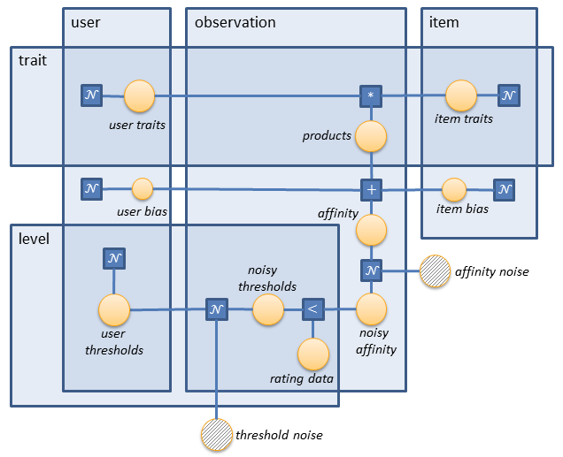
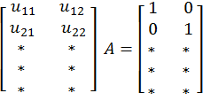

---
layout: default 
--- 
[Infer.NET user guide](index.md) : [Tutorials and examples](Infer.NET tutorials and examples.md)

## Recommender System

This tutorial shows how to build a [recommender system](http://en.wikipedia.org/wiki/Recommender_system) using Infer.NET. In particular, it implements the design developed by David Stern, Ralf Herbrich, and Thore Graepel described in their 2009 paper [](http://research.microsoft.com/pubs/79460/www09.pdf)_[Matchbox: Large Scale Online Bayesian Recommendations](http://research.microsoft.com/pubs/79460/www09.pdf)_.

You can run the code in this tutorial either using the [**Examples Browser**](The examples browser.md) or by opening the Tutorials solution in Visual Studio and executing **RecommenderSystem.cs**.

### The Stern-Herbrich-Graepel model

The problem being solved in this tutorial is the prediction of ratings that users are likely to assign to items. In this context _item_ is an abstraction, concrete examples of which include movies or products. Here we'll look at the so-called [collaborative filtering](http://en.wikipedia.org/wiki/Collaborative_filtering) approach, where all training data is given in terms of _(user id, item id, rating)_ triples without explicit user or item features.

Because of the possibly large number of users and items, as well as the high sparsity of the ratings, we'd want to use an algorithm that scales as _numUsers + numItems_, rather than _numUsers * numItems_. And this is the key in the Stern-Herbrich-Graepel design. In this model users and items are mapped to a low-dimensional _'trait space'_, where similarity can be efficiently measured. That is, each user and each item is represented by a trait vector. The reader might think of the trait vector elements as weights of particular features that are applicable to the corresponding user or item. These features are implicit, i.e. they are learned by the system, rather than manually being set. Similarity is then expressed in terms of the inner product of the user trait vector and the item trait vector. The sum of the elements of this product gives a score, which represents the affinity between the examined user and item. Of course, user and item biases should also be taken into account, and some noise should be added to the affinity.



The resulting affinity is a floating point number which needs to be converted into a rating value. This is achieved by using thresholds. The number of threshold levels (_numLevels_) is equal to the number of possible ratings minus one. For example, we only need one threshold for a binary rating. If this threshold is 5 and the affinity value is 8, then the rating is true. If the affinity is 3, then the rating is false. The model takes into account that different users might have different thresholds (i.e. the thresholds are personalised). Therefore, for each user we maintain a noisy threshold vector of dimensionality _numLevels_.

Ratings are represented by a bool vector, the dimensionality of which is _numLevels_. The number of trues in the vector indicates the rating value. For example, in a 3-star rating there are 2 threshold levels, and ratings are represented as follows:  
    - 1 star: (F, F)  
    - 2 stars: (T, F) or (F, T)  
    - 3 stars: (T, T)  
If the user threshold levels are sorted in ascending order, then each rating will have a unique bool vector representation - the one formed of zero or mores trues followed by zero or more falses. However, the model doesn't particularly impose such a requirement, and thus it's not included in our implementation.

### Model implementation

We'll implement the model in the following steps:  
    1\. Define the numbers and ranges of the arrays to be used. 
    2\. Define the latent variables, their priors, and hook them up. 
    3\. Initialise the priors. 
    4\. Represent the training data efficiently. 
    5\. Define the model by iterating over the training data. 

We start by fixing the sizes of the arrays used in the model and defining the ranges over them. We will consider 50 users, 10 items and a 3-star rating (i.e. 2 levels). We'll only use 2-dimensional trait vectors, but the reader should be aware that a larger number is usually required in practise. The number of traits should be chosen empirically based on the training data and the available computational resources. As to the size of the training data, we'll generate 100 _(user, item, rating)_ triples. And since we'll want to use the same model for training and making predictions, the value of _numObservations_ will need to be reset between the two. Therefore, it needs to be declared as a `Variable<int>` rather than a native int.

```csharp
// Define counts  
int numUsers = 50;  
int numItems = 10;  
int numTraits = 2;  
Variable<int> numObservations = Variable.Observed(100);  
int numLevels = 2;  

// Define ranges  
Range user = new Range(numUsers);  
Range item = new Range(numItems);  
Range trait = new Range(numTraits);  
Range observation = new Range(numObservations);  
Range level = new Range(numLevels);
```

We then define the latent arrays in the model. Their elements are all of type `int`. As to the user and item traits, they are variable jagged arrays with _numUsers_ and _numItems_ rows respectively, and _numTraits_ columns (one trait vector for each user and item). It's important to note that in Infer.NET this type of an array is defined as:

```csharp
Variable.Array(Variable.Array<double>(numColumns), numRows)  
```

rather than:  

```csharp
Variable.Array(Variable.Array<double>(numRows), numColumns)  
```

The return type of this operation is  

```csharp
VariableArray<VariableArray<double>, double[][]>  
```

In this case the second generic parameter (the array type) needs to be specified for technical reasons. For more information on jagged arrays, look at the [corresponding section](Jagged arrays.md) in the User Guide.

The user and item biases are simple 1-D arrays (one bias value for each user and item), and the user thresholds are represented by a _numUsers_ by _numLevels_ variable jagged array (one threshold vector for each user).

```csharp
// Define latent variables  
var userTraits = Variable.Array(Variable.Array<double>(trait), user);  
var itemTraits = Variable.Array(Variable.Array<double>(trait), item);  
var userBias = Variable.Array<double>(user);  
var itemBias = Variable.Array<double>(item);  
var userThresholds = Variable.Array(Variable.Array<double>(level), user);
```

The definition of the priors is analogous to the one of the latent variables, the only difference being the array type - this time it's Gaussian rather than double. That's because we draw these floating-point parameters from a normal prior.

```csharp
// Define priors  
var userTraitsPrior = Variable.Array(Variable.Array<Gaussian>(trait), user);  
var itemTraitsPrior = Variable.Array(Variable.Array<Gaussian>(trait), item);  
var userBiasPrior = Variable.Array<Gaussian>(user);  
var itemBiasPrior = Variable.Array<Gaussian>(item);  
var userThresholdsPrior = Variable.Array(Variable.Array<Gaussian>(level), user);
```

Now we need to connect the latent variables to their priors. As explained in the [Infer.NET 101](http://research.microsoft.com/en-us/um/cambridge/projects/infernet/docs/InferNet101.pdf) paper, this is referred to as the _statistical definition_ of the latent variables and is implemented using the `Variable.Random` factor. Because we work with arrays here, we'll need to iterate over each element of the latent variable arrays and statistically define it to its corresponding element in the prior distribution arrays. Note that we don't need to use `ForEach` in this case because ranges are used on both sides of the assignment.

```csharp
// Define latent variables statistically  
userTraits[user][trait] = Variable<double>.Random(userTraitsPrior[user][trait]);  
itemTraits[item][trait] = Variable<double>.Random(itemTraitsPrior[item][trait]);  
userBias[user] = Variable<double>.Random(userBiasPrior[user]);  
itemBias[item] = Variable<double>.Random(itemBiasPrior[item]);  
userThresholds[user][level] = Variable<double>.Random(userThresholdsPrior[user][level]);
```

The initial values of the priors need to be manually set. As to the trait prior, it can be a standard Gaussian(0, 1). In this small example we use the same distribution for the bias prior, but in practise a broader variance might be considered - like Gaussian (0, 10). We set the initial interval size between two user thresholds to 1, and we keep the thresholds zero-centred in the beginning. Thus, if we have 4 threshold levels, they will be -1.5, -0.5, 0.5, and 1.5. For easy initialisation of the priors, we use the static `ArrayIni`t method of the Infer.NET Util class. It has two parameters - the length of the array to be created and a .NET _Converter_ delegate. `ArrayInit` iterates over the range \[0; length) and converts each index into an array element.

```csharp
// Initialise priors  
Gaussian traitPrior = Gaussian.FromMeanAndVariance(0.0, 1.0);  
Gaussian biasPrior = Gaussian.FromMeanAndVariance(0.0, 1.0);  
userTraitsPrior.ObservedValue = Util.ArrayInit(numUsers, u => Util.ArrayInit(numTraits, t => traitPrior));  
itemTraitsPrior.ObservedValue = Util.ArrayInit(numItems, i => Util.ArrayInit(numTraits, t => traitPrior));  
userBiasPrior.ObservedValue = Util.ArrayInit(numUsers, u => biasPrior);  
itemBiasPrior.ObservedValue = Util.ArrayInit(numItems, i => biasPrior);  
userThresholdsPrior.ObservedValue = Util.ArrayInit(numUsers, u =>  
        Util.ArrayInit(numLevels, l => Gaussian.FromMeanAndVariance(l - numLevels / 2.0 + 0.5, 1.0)));
```

We should now choose how to represent the training data. As previously discussed, a rating matrix with _numUsers_ rows and _numItems_ columns is not an option. We could also maintain a list of rated items for each user or a list of rating users for each item. But we're looking for a representation which scales linearly with the number of observations. This is efficient in terms of memory usage and also suitable for online learning. Therefore, we internally maintain the training data as a list of (user, item, rating) triples, or actually as 3 equal-size variable arrays - one for users, items, and ratings.

```csharp
// Declare training data variables  
var userData = Variable.Array<int>(observation);  
var itemData = Variable.Array<int>(observation);  
var ratingData = Variable.Array(Variable.Array<bool>(level), observation);
```

Now that we have the latent variables, their priors, and the training data, it's time to build the model. We do that by iterating over each observation. Intermediate variables are defined locally for simplicity. That is, rather than maintaining an array of affinity values, we define a new affinity variable for each observation.

For each observation the current user id is `userData[observation]`, the item id is `itemData[observation]`, and the rating vector is `ratingData[observation][]`. Given this model data, we start by defining the product vector of the user and item traits. This is achieved by iterating over the trait range and computing the corresponding products. The product operator used here ('*') should be the one from Variational Message Passing. And since we use Expectation Propagation, special care needs to be taken when setting the compiler options for this operator (explained later in _Running inference and making predictions_). The reasons behind the need to use VMP multiplication are explained in the paper referenced in the beginning of this tutorial. After having the trait product vector, we sum up its elements by using the Sum factor. This sum plus the user and item biases for the current user and item gives us the affinity. We form a new variable from it - noisyAffinity, which is constructed from the already familiar GaussianFromMeanAndVariance factor. We set the noise level to 0.1 because of the small amount of data we work with, but in practise probably a choice of 1.0 might yield better results.

The noisy affinity should now be compared against the different levels of user thresholds. But since these thresholds might vary with time, some noise should be added here as well. Therefore, we create a new variable array - noisyThresholds, which is formed from the current user thresholds by adding some noise. We use a variance of 0.1 here again, but the developer should tune this parameter in accordance with their data. Now each of the rating levels (ratingData\[observation\]\[level\]) is formed by comparing the noisy affinity to the corresponding level of the noisy thresholds.

```csharp
// Model  
using (Variable.ForEach(observation)) {  
    VariableArray<double> products = Variable.Array<double>(trait);  
    products[trait] = userTraits[userData[observation]][trait] * itemTraits[itemData[observation]][trait];  

    Variable<double> bias = (userBias[userData[observation]] + itemBias[itemData[observation]]);  
    Variable<double> affinity = (bias + Variable.Sum(products)); Variable<double> noisyAffinity = Variable.GaussianFromMeanAndVariance(affinity, affinityNoiseVariance);  

    VariableArray<double> noisyThresholds = Variable.Array<double>(level);  
    noisyThresholds[level] = Variable.GaussianFromMeanAndVariance(userThresholds[userData[observation]][level], thresholdsNoiseVariance);  
    ratingData[observation][level] = noisyAffinity > noisyThresholds[level];  
}  
```

### Running inference and making predictions

Now that the model is in place, we can create an inference engine and make some predictions. The inference algorithm used is Expectation Propagation, but we need to call the implementation of the vector product operator from Variational Message Passing. This is achieved by setting the compiler option GivePriorityTo(typeof( GaussianProductOp_SHG09)).

```csharp
// Allow EP to process the product factor as if running VMP  
// as in Stern, Herbrich, Graepel paper. 
InferenceEngine engine = new InferenceEngine();  
engine.Compiler.GivePriorityTo(typeof(GaussianProductOp_SHG09));
```

We now use the inference engine to obtain the posteriors. These are then fed into the model as the new priors by using the `ObservedValue` property. Note that because we infer multiple distributions, temporary variables should be used here, rather than assigning the priors immediately and performing inference again. I.e. the following is **incorrect**:

```
userTraitsPrior.ObservedValue = engine.Infer<Gaussian[][]>(userTraits);  
itemTraitsPrior.ObservedValue = engine.Infer<Gaussian[][]>(itemTraits);  
...
```

Here is the correct way to implement it:

```csharp
// Run inference  
var userTraitsPosterior = engine.Infer<Gaussian[][]>(userTraits);  
var itemTraitsPosterior = engine.Infer<Gaussian[][]>(itemTraits);  
var userBiasPosterior = engine.Infer<Gaussian[]>(userBias);  
var itemBiasPosterior = engine.Infer<Gaussian[]>(itemBias);  
var userThresholdsPosterior = engine.Infer<Gaussian[][]>(userThresholds);  

// Feed in the inferred posteriors as the new priors  
userTraitsPrior.ObservedValue = userTraitsPosterior;  
itemTraitsPrior.ObservedValue = itemTraitsPosterior;  
userBiasPrior.ObservedValue = userBiasPosterior;  
itemBiasPrior.ObservedValue = itemBiasPosterior;  
userThresholdsPrior.ObservedValue = userThresholdsPosterior;
```

With the inferred priors in place, we can use the same model to make predictions. There are only a few minor modifications to be made. First, we need to reset the number of observations. In our example this will be the number of ratings to be inferred. We set it to 1 for the sake of simplicity. Second, we should reset the training data. As to the user and item data, we provide the arrays with the corresponding users and items to be matched. As to the rating data, it needs to be cleared (because it will all be inferred). This is achieved by using the `ClearObservedValue()` method. Finally, we can infer the ratings arrays (in our case only one). We call the Infer() method with a Bernoulli\[\]\[\] generic parameter, and the first element of the resulting jagged array is the predicted rating (represented as Bernoulli\[\]). In our example it contains the probabilities 0.6869 and 0.1147. This means that user 5 will most likely rate item 6 with 2 out of 3 stars.

```csharp
// Make a prediction  
numObservations.ObservedValue = 1;  
userData.ObservedValue = new int[] { 5 };  
itemData.ObservedValue = new int[] { 6 };  
ratingData.ClearObservedValue();  

Bernoulli[] predictedRating = engine.Infer<Bernoulli[][]>(ratingData)[0];  
Console.WriteLine("Predicted rating:");  
foreach (var rating in predictedRating) Console.WriteLine(rating);
```

### Resolving parameter ambiguity

The model explained in this example is symmetric. One way of coping with such problems was discussed in the [Mixture of Gaussians tutorial](Mixture of Gaussians tutorial.md) and explained in the [User Guide](customising the algorithm initialisation.md). It involves overriding the initialisation of the algorithm by specifying an initial marginal for some variables. We'll undertake another method here, which is to manually set some priors to a fixed value. We choose this approach because later we'll generate data from the model and we'll want to be able to compare the true parameters to the learned ones (explained later in the _Generating data from the model_ section).

The question now is how many traits we need to manually set. That is, what is the number of degrees of freedom in the model? Just to introduce the problem, consider a one-dimensional trait space with one user and one item. Let the learned means of these two traits be _`x`_ and _`y`_. We always draw the affinity from a function which builds on the product of _`x`_ and _`y`_, but _`xy = (-x)(-y)`_. So, the model can infer equally well _`(x, y)`_ and _`(-x, -y)`_. This can be solved by fixing the sign of either _`x`_ or _`y`_.

Let's now look at the broader picture. Consider a particular user vector _`u`_ and item vector _`v`_. The product of the two is then _`uTv`_. This is essentially equal to _**(Au)T(A-Tv)**_, where _**A**_ is some invertible _numTraits_ by _numTraits_ matrix. This means that if we take the whole _numUsers_ by _numTraits_ user trait matrix _`U`_ and multiply it by _`A`_, the result _`U' = UA`_ will be a valid _numUsers_ by _numTraits_ user trait matrix. Then, we need to multiply _`A-T`_ by the item trait matrix and the resulting products in the model will be the same. Also note that we can find such _`A`_ that the upper square part of _`U'`_ is the identity matrix.



This shows that in the traits there are _numTraits_ by _numTraits_ degrees of freedom. It doesn't really matter if we'll fix these in the user traits or in the item traits. So all we need to do in order to remove the ambiguity in the traits is to set the upper square part of any trait matrix to the identity matrix. Note how this will break the symmetry - all trait columns are different.

```csharp
// Break symmetry and remove ambiguity in the traits  
for (int i = 0; i < numTraits; i++) {    // Assume that numTraits < numItems  
    for (int j = 0; j < numTraits; j++) {  
        itemTraitsPrior.ObservedValue[i][j] = Gaussian.PointMass(0);  
    }  
    itemTraitsPrior.ObservedValue[i][i] = Gaussian.PointMass(1);  
}
```

### Generating data from the model

In order to make sure that the model is working properly, we generate data from it and compare the true parameters to the learned ones.

A simple model data generation can be found in the code of the Mixture of Gaussians example. The model parameters there are the means and precisions of the distributions to be learned, as well as the vector of mixture weights. So these are the ones that are explicitly set in the code. In the current example the set of true parameters is larger - it comprises the user and item traits, the user and item biases, and the user thresholds. We undertake a typical approach here, which is to sample these parameters from their priors.

```csharp
// Sample model parameters from the priors  
Rand.Restart(12347);  
double[][] userTraits = Util.ArrayInit(numUsers, u => Util.ArrayInit(numTraits, t => userTraitsPrior[u][t].Sample()));  
double[][] itemTraits = Util.ArrayInit(numItems, i => Util.ArrayInit(numTraits, t => itemTraitsPrior[i][t].Sample()));  
double[] userBias = Util.ArrayInit(numUsers, u => userBiasPrior[u].Sample());  
double[] itemBias = Util.ArrayInit(numItems, i => itemBiasPrior[i].Sample());  
double[][] userThresholds = Util.ArrayInit(numUsers, u => Util.ArrayInit(numLevels, l => userThresholdsPrior[u][l].Sample()));
```

Now when we have the true parameters, we can sample data from the model. We do that by repeating the whole model definition step by step and obtaining the final values. Since the parameters are fixed, we no longer work with probabilities. Therefore, the Infer.NET modelling API is not used here (i.e. there is no mention of the `Variable` class). The only stochastic parameter in the data generation is the noise, which we sample from fixed Gaussians.

The code in the data generation is semantically very similar to the one in the model definition. The only difference that might seem odd is the rejection of user-item pairs. Because here we don't iterate over all possible user-item combinations, we randomly generate only some number of them (_numObservations_). Thus, if a duplicate pair is generated, it should be rejected. This is implemented by encoding the pairs into integers and keeping track of the visited ones in a C# HashSet.

```csharp
// Repeat the model with fixed parameters  
HashSet<int> visited = new HashSet<int>();  
for (int observation = 0; observation < numObservations; observation++) {
      int user = Rand.Int(numUsers);  
      int item = Rand.Int(numItems); int userItemPairID = user * numItems + item; // pair encoding  
    if (visited.Contains(userItemPairID)) // duplicate generated {  
        observation--; // reject pair continue;  
    }  
    visited.Add(userItemPairID);
    double[] products = Util.ArrayInit(numTraits, t => userTraits[user][t] * itemTraits[item][t]);
    double bias = userBias[user] + itemBias[item];
    double affinity = bias + products.Sum();
    double noisyAffinity = new Gaussian(affinity, affinityNoiseVariance).Sample();
    double[] noisyThresholds = Util.ArrayInit(numLevels, l => new Gaussian(userThresholds[user][l], thresholdsNoiseVariance).Sample());  

    generatedUserData[observation] = user;  
    generatedItemData[observation] = item;  
    generatedRatingData[observation] = Util.ArrayInit(numLevels, l => noisyAffinity > noisyThresholds[l]);  
}
```

Since we generate the data from the model, we can compare the true parameters to the learned ones. For simplicity, we'll only look at the first 5 item traits. If we print these out right after data generation (the _true_ parameters) and print the itemTraitsPosterior's means right after inference (the _learned_ parameters), here's what we'll see:

| **true parameters** | **learned parameters** |
|:-------------------:|:----------------------:|
|   1.00      0.00    |      1.00      0.00    | 
|   0.00      1.00    |      0.00      1.00    |
|  -0.42      0.73    |     -0.23     -0.07    | 
|  -0.06     -0.03    |     -0.42     -0.04    | 
|   0.80     -0.92    |      0.04      0.86    |

This is obviously not a very good estimation. If we also printed out the variances here, we would notice that they are very broad. That is because there were too few observations in order to properly learn the parameters. If we increase the number of users to 200, the number of items to 200, and the number of observations to 20,000, then the results look much better:

| **true parameters** | **learned parameters** |
|:-------------------:|:----------------------:|
|   1.00      0.00    |      1.00      0.00    |
|   0.00      1.00    |      0.00      1.00    | 
|   0.44     -1.10    |      0.53     -0.97    | 
|  -0.38     -0.83    |     -0.39     -0.66    | 
|   0.11      0.68    |      0.10      0.85    | 

Please see the [Matchbox recommender Learner](Learners/Matchbox recommender.md) for a comprehensive implementation of a recommendation system.
