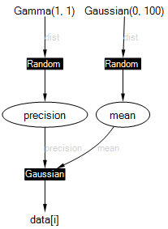

---
layout: default 
--- 
 
[Infer.NET user guide](index.md)

## The Infer.NET Modelling API

When using Infer.NET, you first define a probabilistic model to work with.  If you don't know what a probabilistic model is, or just need a refresher, take a look at [Resources and References](Resources and References.md).  The **Modelling API** (Application Programming Interface) allows you to create model variables and observations, and specify how these relate to each other.  To use the modelling API, you must import the **[Microsoft.ML.Probabilistic.Models](../apiguide/api/Microsoft.ML.Probabilistic.Models.html)** namespace.

Here is a simple example of using the modelling API to define a model for learning the mean and precision (inverse variance) of a Gaussian:

```csharp
Variable<double> mean = Variable.GaussianFromMeanAndVariance(0, 100);  
Variable<double> precision = Variable.GammaFromShapeAndScale(1, 1);  
VariableArray<double> data = Variable.Constant(new  double[] { 11, 5, 8, 9 });  
Range i = data.Range;  
data[i] = Variable.GaussianFromMeanAndPrecision(mean, precision).ForEach(i);
```

The factor graph for this model is shown below.

  
  

This example creates two random variables, **mean** and **precision** with Gaussian and Gamma priors. It also creates a constant array **data**; 'constant' here means that the values in this array will be compiled into the model and will not be changeable when we run the model. The range **i** ranges across the data indices from 0 to 3. The final line ties all of the above together by constraining the data points to be drawn from a Gaussian with mean **mean** and precision **precision**. Overall, this model provides a way to learn posterior distributions over the mean and precision of some data. To see how to run inference in this model, see [running inference](Running inference.md).

You can see from this example that the modelling API is accessed almost entirely through static methods on the [**Variable**](../apiguide/api/Microsoft.ML.Probabilistic.Models.Variable.html) class.  The following pages describe how various modelling tasks can be achieved using the modelling API:

*   [Creating variables](Creating variables.md)
*   [Applying functions and operators to variables](Applying functions and operators to variables.md)
*   [Attaching constraints to variables](Attaching constraints to variables.md)
*   [Working with arrays and ranges](Arrays and ranges.md)
*   [ForEach blocks](ForEach blocks.md)
*   [Jagged arrays](Jagged arrays.md)
*   [Indexing arrays by observed variables](Indexing arrays by observed variables.md)
*   [Branching on variables to create mixture models](Branching on variables to create mixture models.md)
*   [Repeat blocks](Repeat blocks.md)
*   [Computing model evidence for model selection](Computing model evidence for model selection.md)

Finally, note that the use of `Variable.Constant()` is a convenience for the early stages of model development. For efficiency, scalability, and flexibility, it is preferable the Observed value mechanism as described in [Creating variables](Creating variables.md).