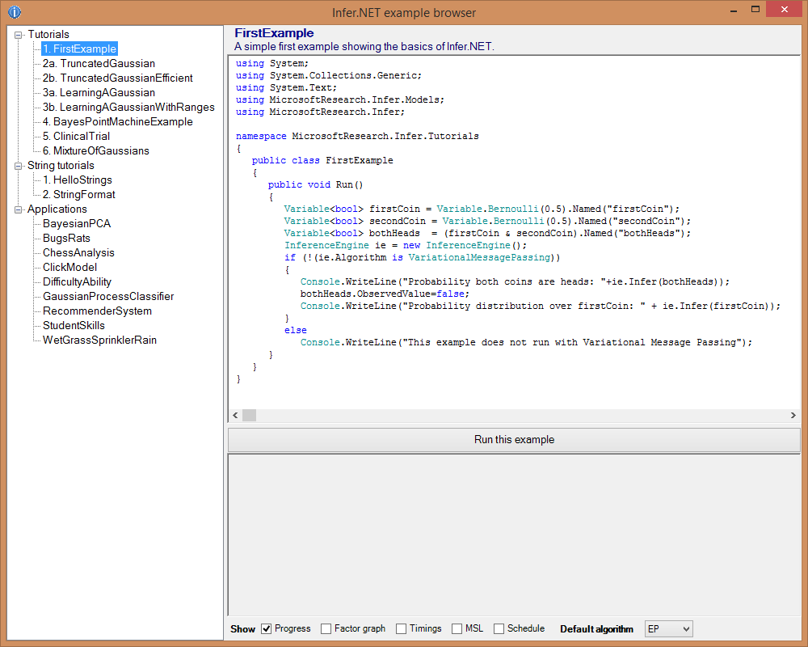

---
layout: default 
--- 
[Infer.NET user guide](index.md) : [Tutorials and examples](Infer.NET tutorials and examples.md)

## The Examples Browser

The Examples Browser provides a simple way of viewing and running the tutorials and examples included in Infer.NET. The Examples Browser is built by the Tutorials project in the Infer2.sln Visual Studio solution found in the repository root folder. After launching the project you will get a window that looks like this:

  

The window is divided into three panes:

*   **Example chooser** (left) - shows a list of examples grouped by topic. You can select an example by clicking.
*   **Code viewer** (top-right) - shows the source code for the example, along with a brief description.
*   **Example output** (bottom-right) - when "Run this example" is pressed, this window shows the output from the example. At the bottom, it also contains check boxes to control [settings on the inference engine](inference engine settings.md).