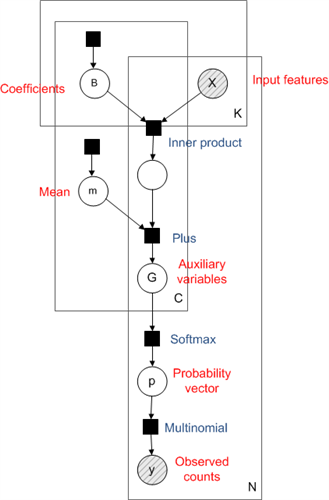
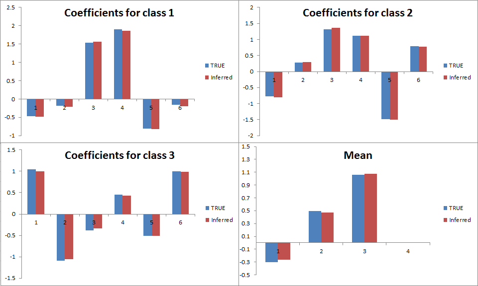
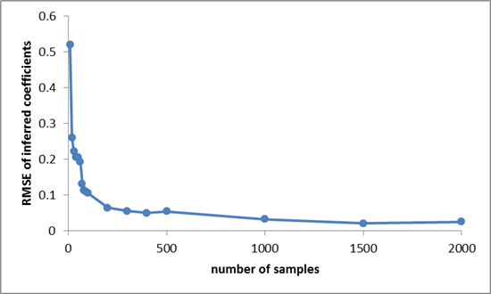

[Infer.NET user guide](index.md) : [Tutorials and examples](Infer.NET tutorials and examples.md)

## The softmax factor

The Infer.NET supports a number of new factors you may find useful when designing your models. Some of these features have been well tested, while others are still experimental and should be used with caution. How do you know which features are experimental I hear you ask? To answer just that question we have introduced [quality bands](Quality bands.md), which are assigned to every piece of functionality. By default you'll get a warning if your model is using any experimental features. For more information and guidance on quality bands take a look at the [user guide](index.md) and the [list of factors](list of factors and constraints.md). 

In this page I'll give one example of a new feature, the softmax factor, which lets you perform efficient [multinomial logistic regression](https://en.wikipedia.org/wiki/Multinomial_logistic_regression) using [Variational Message Passing](Variational Message Passing.md) (VMP). The inputs to the regression are continuous variables, and the output is categorical, i.e. belongs to one of _C_ classes. One example would be predicting what political party someone will vote for based on some known features such as age and income. Another would be classifying cancer type based on gene expression data.



Multinomial regression involves constructing a separate linear regression for each class, the output of which is known as an auxiliary variable. The vector of auxiliary variables for all classes is put through the softmax function to give a probability vector, corresponding to the probability of being in each class. The [factor graph](https://en.wikipedia.org/wiki/Factor_graph) for this model is shown below (see [Bayesian PCA](Bayesian PCA and Factor Analysis.md) for more on factor graphs).

Multinomial softmax regression is very similar in spirit to the multiclass Bayes Point Machine (BPM) which we also have as an example. The key differences are that where the BPM uses a _max_ operation constructed from multiple "greater than" factors, multinomial regression uses the softmax factor, and that where [Expectation Propagation](Expectation Propagation.md) is the recommended algorithm for the BPM (although VMP is now supported), [VMP](Variational Message Passing.md) is currently the only option when using the softmax factor. Two consequence of these differences is that multinomial regression scales computationally much better with the number of classes than the BPM (linear rather quadratic complexity) and it is possible to have multiple counts for a single sample. An example of where these differences would make multinomial regression appropriate would be predicting word counts in documents, based on some known features such as date of publication. The number of classes _C_ would be the size of the vocabulary, which could be very large, making the quadratic _O(C<sup>2</sup>)_ scaling of the BPM prohibitive. The outputs are counts rather than single class assignments, which are straightforward to model with multinomial regression using the multinomial factor. 

Now let's set up our model in Infer.NET. First we'll need ranges over the _C_ classes and _N_ samples. 

```csharp
var c = new Range(C);
var n = new Range(N);
```

Here I've used lower case to denote the Infer.NET ranges, and upper case to denote the (fixed) size of the range. We need a separate vector of coefficients B and mean _m_ for each class _c_. The coefficient vectors _B_ have length _K_, which is the number of features (inputs) to the model. 

```csharp
var B = Variable.Array<Vector>(c);
B[c] = Variable.VectorGaussianFromMeanAndPrecision(Vector.Zero(K),
PositiveDefiniteMatrix.Identity(K)).ForEach(c);
var m = Variable.Array<double>(c);
m[c] = Variable.GaussianFromMeanAndPrecision(0, 1).ForEach(c);
var x = Variable.Array<Vector>(n);
x.ObservedValue = xObs;
var yData = Variable.Array(Variable.Array<int>(c), n);
yData.ObservedValue = yObs;
var trialsCount = Variable.Array<int>(n);
trialsCount.ObservedValue = yObs.Select(o => o.Sum()).ToArray();
```

The variable `trialsCount` is simply the total count for each sample, which I've calculated on the fly here using a little [Linq](https://msdn.microsoft.com/en-us/library/bb397926.aspx) magic. We are now ready to write down the core of the model: we create the auxiliary variables _g_, pass them through the softmax factor, and use the resulting probability vectors in the multinomial factor. If you have an individual class assignment for each sample rather than counts you could use the Discrete rather than Multinomial factor.

```csharp
var g = Variable.Array(Variable.Array<double>(c), n);
g[n][c] = Variable.InnerProduct(B[c], x[n]) + m[c];
var p = Variable.Array<Vector>(n);
p[n] = Variable.Softmax(g[n]);
using (Variable.ForEach(n))
     yData[n] = Variable.Multinomial(trialsCount[n], p[n]);
```

A problem we need to address here is that the model is not [identifiable](https://en.wikipedia.org/wiki/Identifiability) as we currently have it set up. You can see this because adding a constant value to all the auxiliary variables g will not change the output of the prediction. To make the model identifiable we enforce that the last auxiliary variable (corresponding to the last class) will be zero, by [constraining](Constraints.md) the last coefficient vector and mean to be zero:

```csharp
Variable.ConstrainEqual(B[C - 1], Vector.Zero(K));
Variable.ConstrainEqual(m[C - 1], 0);
```

Finally we [run inference](Running inference.md) over the model:

```csharp
var ie = new InferenceEngine(new VariationalMessagePassing());
var bPost = ie.Infer<VectorGaussian[]>(B);
var meanPost = ie.Infer<Gaussian[]>(m);
```

A specific handling of the softmax factor is required because its input is deterministic: this is specified by the `GivePriorityTo` function. If you don't do this you'll get an error saying the input to the softmax function cannot be deterministic. For some factors multiple implementations are available with different characteristics: `GivePriorityTo` allows you to choose which version you would like to use. The default implementation for the softmax factor assumes the input is stochastic which allows a faster converging algorithm to be used. 

Let's test this model using synthetic data drawn from the same model with six features, four classes and a total count of ten per sample. For a sample size of 1000, the following plot shows the accuracy of the inferred coefficients and mean. We have recovered the coefficients really well: but of course we had quite a lot of data! Running 50 iterations of VMP took only three seconds.



A good sanity check is to see how the inference performance improves with increasing sample size. The following plot shows the improvement in the RMSE (root mean squared error) between the true and mean inferred coefficients. Of course, we would expect this to decrease as the number of samples increases because each sample gives us some more information to use. Indeed we see that this is the case: error rapidly decreases with sample size. Note the decreasing returns, which is typical of statistical estimation of unknown quantities: initially additional samples help us a lot, but once we have a reasonable amount of data, new samples don't tell us much we didn't already know. 



The code for this model is available at [MultinomialRegression.cs](https://github.com/dotnet/infer/blob/master/src/Tutorials/MultinomialRegression.cs)
 
The possibilities extend far beyond simple multinomial regression. The great thing about the softmax factor is that any time you want to model probability vectors with complex dependencies, you can model those dependencies in continuous space and map to probability vectors using the softmax factor. A model of this type in the machine learning literature is the [correlated topic model](http://www.cs.columbia.edu/~blei/papers/BleiLafferty2006.pdf), a version of [Latent Dirichlet Alocation](https://en.wikipedia.org/wiki/Latent_Dirichlet_allocation) where the document specific distributions over topics are represented as continuous vectors drawn from a learnt multivariate Gaussian, and are put through a softmax function to give valid probability distiributions.