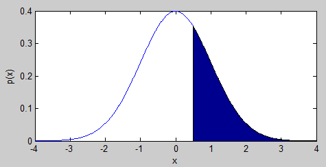

---
layout: default 
--- 
[Infer.NET user guide](index.md) : [Tutorials and examples](Infer.NET tutorials and examples.md)

## Tutorial 2: Truncated Gaussian

In the [previous tutorial](Two coins tutorial.md), you saw how to create random variables and infer their values. This tutorial shows how to change values in a model in a way that avoids unnecessary recompilation and significantly improves efficiency. You can run the code in this tutorial either using the [Examples Browser](The examples browser.md) or by opening the Tutorials solution in Visual Studio and uncommenting the lines to execute [TruncatedGaussian.cs](https://github.com/dotnet/infer/blob/master/src/Tutorials/TruncatedGaussian.cs) and [TruncatedGaussianEfficient.cs](https://github.com/dotnet/infer/blob/master/src/Tutorials/TruncatedGaussianEfficient.cs).  Code is also available in [F#](https://github.com/dotnet/infer/blob/master/test/TestFSharp/TruncatedGaussian.fs) and [Python](https://github.com/dotnet/infer/blob/master/test/TestPython/test_tutorials.py).

### Clipping that Gaussian

In this example, we look at how to create a variable with a truncated or clipped Gaussian distribution. This plot shows the type of distribution we are trying to create:



The blue line shows a Gaussian distribution with mean zero and variance one. The shaded area is the Gaussian distribution truncated at **x=0.5**.

We can achieve this using what we learned in the [previous tutorial](Two coins tutorial.md), by creating a random double variable with a Gaussian prior but now we also need to add a _constraint_ constraining it to be greater than 0.5. This can be achieved with the following code:

```csharp
Variable<double> x = Variable.GaussianFromMeanAndVariance(0, 1).Named("x"); 
Variable.ConstrainTrue(x > 0.5);
```

If we now use the inference engine to infer the distribution over **x**, the result will depend on the inference algorithm we use. If we use expectation propagation, the result will be the Gaussian distribution closest to the shaded area above, in terms of moment matching. The following code achieves this, 

```csharp
InferenceEngine engine = new InferenceEngine(); 
engine.Algorithm = new ExpectationPropagation(); 
Console.WriteLine("Dist over x=" + engine.Infer(x));
```

to give

```
Dist over x=Gaussian(1.141, 0.2685)
```

which is the moment-matched Gaussian distribution. To check this, you can run the following Matlab code:
```
x = randn(1e7,1); x = x(x>0.5); \[mean(x) var(x)\] 
```
### Doing it again, and again...

Suppose you want to investigate what happens if you change the truncation threshold to values other than 0.5. The simplest way to do this is to place all of the above code in a loop:

```csharp
for (double thresh = 0; thresh <= 1; thresh+=0.1)
{ 
  Variable<double> x = Variable.GaussianFromMeanAndVariance(0, 1).Named("x");
  Variable.ConstrainTrue(x > thresh); 
  InferenceEngine engine = new InferenceEngine();  
  engine.Algorithm = new ExpectationPropagation();  
  Console.WriteLine("Dist over x given thresh of "+thresh+"=" + engine.Infer(x));  
}
```

This will give the output

```
Dist over x given thresh of 0=Gaussian(0.7979, 0.3634)  
Dist over x given thresh of 0.1=Gaussian(0.8626, 0.3422)  
Dist over x given thresh of 0.2=Gaussian(0.9294, 0.3221)  
Dist over x given thresh of 0.3=Gaussian(0.9982, 0.3031)  
Dist over x given thresh of 0.4=Gaussian(1.069, 0.2853)  
Dist over x given thresh of 0.5=Gaussian(1.141, 0.2685)  
Dist over x given thresh of 0.6=Gaussian(1.215, 0.2527)  
Dist over x given thresh of 0.7=Gaussian(1.29, 0.238)  
Dist over x given thresh of 0.8=Gaussian(1.367, 0.2241)  
Dist over x given thresh of 0.9=Gaussian(1.446, 0.2112)  
Dist over x given thresh of 1=Gaussian(1.525, 0.1991)
```

This is the correct answer but if you run this code you will notice a small delay before each line is printed out. This is because the model is being re-compiled on every run through the loop - for details read about [how Infer.NET works](how Infer.NET works.md). We can make this code much more efficient by making the threshold a Variable and changing its observed value. Observed values can be modified after the model has been compiled, so that changes in their values can be incorporated quickly without any overhead cost.

To create a variable for the threshold, we write: 

_**See also:** [Creating variables](Creating variables.md)_

```csharp
Variable<double> threshold = Variable.New<double>().Named("threshold");
```

It is normal to provide a name for the variable, which should be the name of the variable in your code. You can now use this variable directly in the constraint expression:

```csharp
Variable<double> x = Variable.GaussianFromMeanAndVariance(0, 1).Named("x"); 
Variable.ConstrainTrue(x > threshold);
```

Notice that we have not yet set the value of **threshold**. If we tried to infer **x** at this point, we would get an exception with the message "Variable 'threshold' has no definition". To set the value of a variable, we set its **ObservedValue** property. In this case, we set the value inside the loop and then call **Infer(x)**:

```csharp
InferenceEngine engine = new InferenceEngine(); 
engine.Algorithm = new ExpectationPropagation(); 
for (double thresh = 0; thresh <= 1; thresh += 0.1) 
{ 
  threshold.ObservedValue = thresh; Console.WriteLine("Dist over x given thresh of " + thresh + "=" + engine.Infer(x)); 
}
```

When this code is executed, it gives the same output as above but _much_ more quickly. Try running each version in the [Examples Browser](The examples browser.md), with Show Timings checked, and compare the speed - a typical result is that the total time changes from 1.5s to 150ms, a tenfold speed-up.

The general rule is:  
**"Observed values should be used for any quantity that needs to be changed between multiple runs of inference."**

Now, on to the [next tutorial](Learning a Gaussian tutorial.md)!
