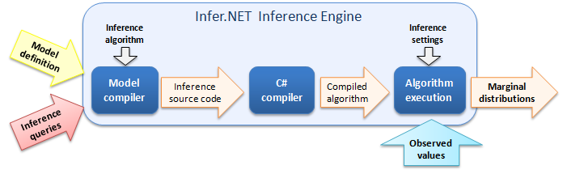

---
layout: default 
--- 
[Infer.NET user guide](index.md)

## How Infer.NET works

Infer.NET works by _compiling_ a model definition into the source code needed to compute a set of inference queries on the model. The diagram below summarises the inference process. 

The steps are:

1.  The user creates a **model definition** (using [the modelling API](The Infer.NET modelling API.md)) and specifies a set of **inference queries** relating to the model. 
      
    
2.  The user passes the model definition and inference queries (see [Running Inference](Running inference.md)) to the **model compiler**, which creates the source code needed to perform those queries on the model, using the specified inference algorithm. This source code can be written to a file and used directly if required. 
      
    
3.  The source code is compiled to create a **compiled algorithm**. This can be manually executed to get fine-grained [control of how inference is performed](Controlling how inference is performed.md), or automatically executed via the Infer method. 
      
    
4.  Using a set of **observed values** (such as arrays of data), the inference engine executes the compiled algorithm, according to the user-specified settings, so as to produce the marginal distributions requested in the queries. This can be repeated for different settings of the observed values [_without_ recompiling the algorithm](Truncated Gaussian tutorial.md).
    

To learn how to define a model in Infer.NET, go to [The Infer.NET modelling API](The Infer.NET modelling API.md).